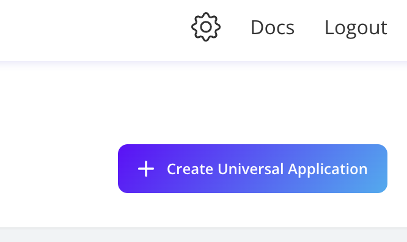
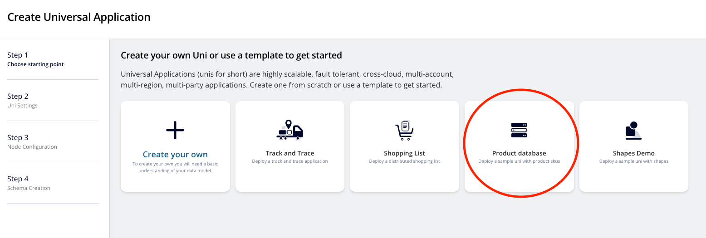
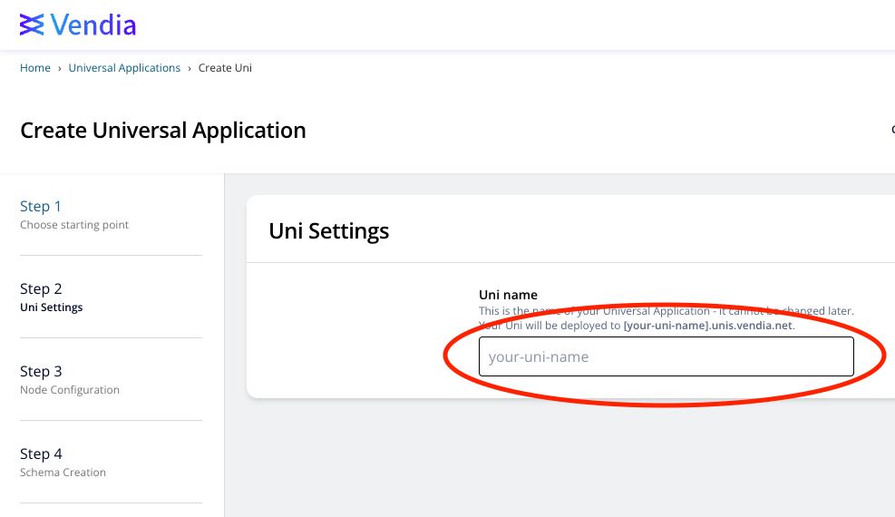
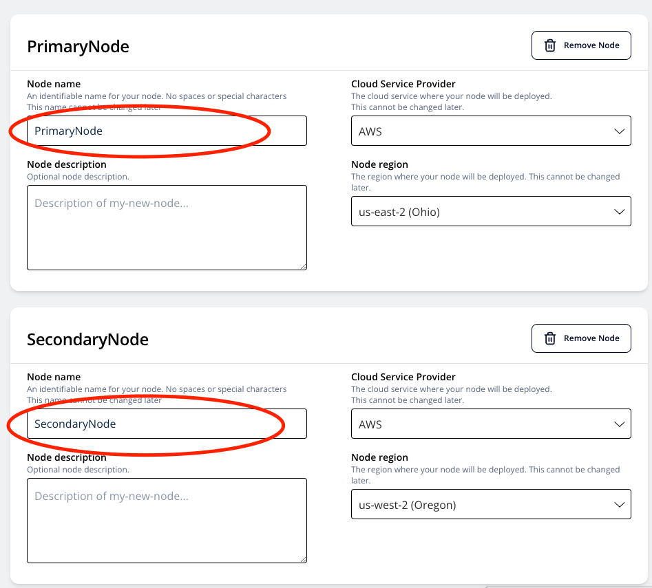
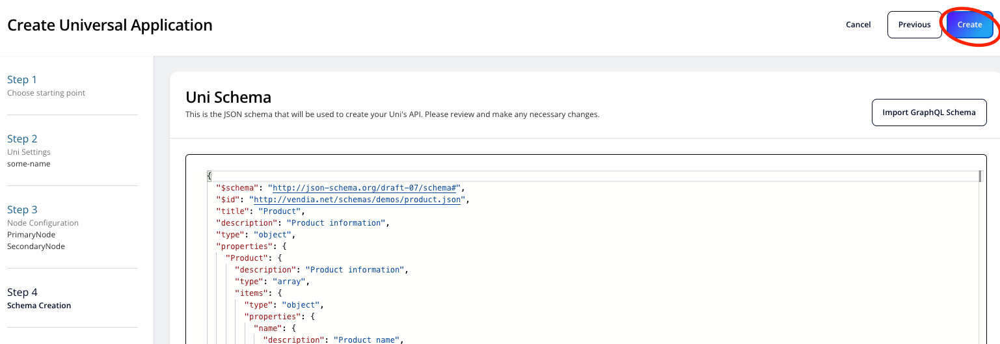

<p align="center">
  <a href="https://vendia.net/">
    
  </a>
</p>

# Purpose
This README.md is meant to help you setup your environment to test out all of the notification options Vendia Share offers. **Please complete all the prerequisites before going to each example links**.

# Prerequisites
* Know what Vendia Notifications do. Or check our docs [here](https://www.vendia.com/docs/share/integrations#outbound)
* Create a [Vendia Share account](https://share.vendia.net/)
* Create a [Amazon Web Services account](https://aws.amazon.com/free)
* Install [Node.js](https://nodejs.org/en/download/)
* Install the Vendia Share [Command Line Interface (CLI)](https://www.vendia.net/docs/share/cli)
* Install [Git Client](https://git-scm.com/downloads)

# Uni Creation

Unis can be created through both [Vendia Share UI](https://share.vendia.net/) or our [Share CLI](https://www.vendia.com/docs/share/cli).

## Creation Through UI
1. login to [Vendia share](https://share.vendia.net).
2. Click on + Create Universal Application bottom.

3. For the purpose of this demo, choose Product database.

4. Enter your uni name in the format `test-<your-uni-name>` and click next.

5. Enter your node info as follows:
- Name first node `PrimaryNode`, pick AWS as your cloud provider, choose node regio to be `us-east-2(Ohio)`, and then click "add another node" at the bottom.
- Name second node `SecondaryNode`, pick AWS as your cloud provider, choose node region to be `us-west-2(Oregon)`, and then click `Next`.

6. Use the default schema generated for Product database and Click `Create`.

It takes about 5 minutes for your environment to be ready. Once you see the status of your nodes become `Running`, you can then proceed to the next steps. 

## Creation Through CLI
1. Assuming you are in the current folder where this README file is, change directories to `uni_configuration`
``` 
cd uni_configuration
```
2. Create your own copy of the `registration.json.sample` file, removing the `.sample` suffix
```
cp registration.json.sample registration.json
```
3. Edit the `registration.json` file changing
    * `name` - keep the `test-` prefix but make the remainder of the name unique
    * `userId` - on both nodes should match your Vendia Share `userId` (i.e. your email address)
4. Create the Uni
```
 share uni create --config registration.json
```

Wait about 5 minutes for the Uni to reach a `Running` state.

***Note:*** If you take a look at the information we have inside the `registration.json` file and the `schema.json` file, you'll notice that we are essentially doing the exactly same thing as the UI creation step. Notice that all configurations provided are identical.

# Pick the Tool of Your Preference
Once all the notes are in `running` status, choose one of the examples below and continue.


## Success Notifications
Notifications emitted when the node commits a new block. Includes a summary of the transactions included in the block.

| Example                                                          | Programming Languages | Description                                                   |
| :--------------------------------------------------------------- | :-------------------- | :------------------------------------------------------------ |
| [Email](success-notification/email/README.md)                    | GraphGL               | Setting up e-mail notifications using both the UI and GraphQL |
| [Kinesis Firehoses](success-notification/aws-firehose/README.md) | GraphQL               | Receive notifications through Kinese Firehoses                |
| [Lambda Functions](success-notification/aws-lambda/README.md)    | JavaScript, GraphQL   | Handle notifications using Lambda Functions                   |
| [SQS Queues](success-notification/aws-sqs/README.md)             | GraphQL               | Putting notification messages into SQS queues                 |
| [Webhooks](success-notification/webhooks/README.md)              | GraphQL               | Integrate notification with webhooks                          |
        

## Error Notifications
Notifications emitted when an asynchronous transaction cannot be committed within the retry policy. Includes the full details of the original transaction.

| Example                                                     | Programming Languages | Description                                                   |
| :---------------------------------------------------------- | :-------------------- | :------------------------------------------------------------ |
| [Email](error-notification/email/README.md)                 | GraphGL               | Setting up e-mail notifications using both the UI and GraphQL |
| [Lambda Functions](error-notification/aws-lambda/README.md) | JavaScript, GraphQL   | Handle notifications using Lambda Functions                   |
| [SQS Queues](error-notification/aws-sqs/README.md)          | GraphQL               | Putting notification messages into SQS queues                 |
| [Webhooks](error-notification/webhooks/README.md)           | GraphQL               | Integrate notification with webhooks                          |