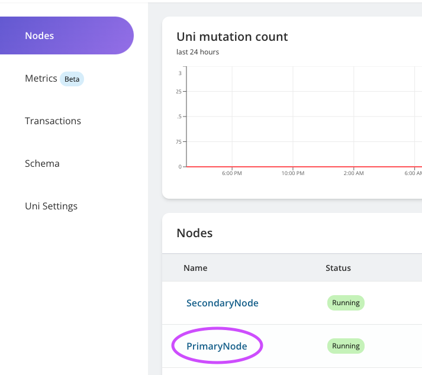
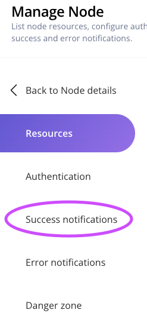
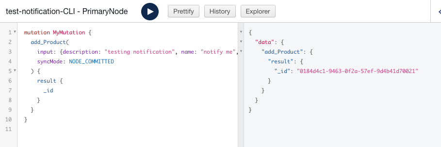

<p align="center">
  <a href="https://vendia.net/">
    
  </a>
</p>

# Receive Success Notifications Through Kinesis Data Firehose

## Purpose
This is a guide on how to set up success notifications on Amazon Kinesis Data Firehose. Note that all notification examples include 2 parts: UI Setup & GraphQL setup. Readers don't have to go through both cases.

# Prerequisites
* Completed the setup in accordance with this [README.md](../../README.md)
* AWS account with enough access to create firehose and adding subscription for SNS
* AWS CLI v2.8.7 Note: Versions are not hard requirement but could potentially cause issues.
* Basic knowledge of Amazon Kinesis Data Firehose, S3, and IAM.
* A firehose delivery stream created with Source: `Direct Put` and Destination: `Amazon S3`. A working policy sample can be found [here](firehose-policy-sample.json). The Vendia source ARN in the Json file can be found in step 4.

## UI Setup
1. Click on the Uni you created. If you created according to previous guide, it should be named something like this `test-<your-uni-name>`


2. Click on the Node you need notification for. In this case, let's choose `PrimaryNode`.


3. On Node detail page, click on `Manage Node`


4. Copy the SNS Topic ARN for later use:


5. On `Manage Node` page, click on `Success Nofitifications` tab:



6. Add your firehose arn in success notification tab.


7. Before you subscribe to Vendia's SNS, you are going to need to create a AWS subscription role for next step. Use below sample policies to create the role.
* [Permission Policy](subscription-permission-policy.json)
* [Trust Relationships](trust-relationship.json)

Copy the ARN of this role for future use.

8. Subscribe to the topic from your AWS CLI:

```
aws sns subscribe 
--protocol firehose \
--topic-arn <vendia-sns-topic-arn> \
--notification-endpoint "<your-firehose-arn>" \
--region <your-vendia-node-region> \
--attributes SubscriptionRoleArn=<your-role-arn-created-in-step-7>

{
    "SubscriptionArn": "<Subscription-Arn>"
}
```

9. Your notification setup is completed. Now let's [VALIDATE](#notification-validation) it's working properly.

## GraphQL Setup

1. Go to `PrimaryNode`'s detail page and click on `GraphQL Explorer`: 


2. 

```
mutation MyMutation {
  updateVendia_Settings(
    input: {aws: {blockReportFirehoses: "<your-firehose-arn>"}}
    syncMode: NODE_LEDGERED
  ) {
    result {
      _owner
    }
  }
}

```

* You should get response that looks like this:


3. Before you subscribe to Vendia's SNS, you are going to need to create a AWS subscription role for next step. Use below sample policies to create the role.
* [Permission Policy](subscription-permission-policy.json)
* [Trust Relationships](trust-relationship.json)

Copy the ARN of this role for future use.

4. Subscribe to the topic from your AWS CLI:

```
aws sns subscribe 
--protocol firehose \
--topic-arn <vendia-sns-topic-arn> \
--notification-endpoint "<your-firehose-arn>" \
--region <your-vendia-node-region> \
--attributes SubscriptionRoleArn=<your-role-arn-created-in-step-7>

{
    "SubscriptionArn": "<Subscription-Arn>"
}
```

5. Your notification setup is completed. Now let's [VALIDATE](#notification-validation) it's working properly.

## Notification Validation
To ensure our notification is working properly, we just have to create a new block in our Uni. Basically that means any changes is fine. For the purpose of our validation, let's use GraphQL Explorer for this task.

<!-- step 1 and 2 are reusable for all examples -->

1. Go to `PrimaryNode`'s detail page and click on `GraphQL Explorer`: 


<!-- Two step 2s are provided for success and error cases respectively -->

2. Clear your GraphQL explorer editor. Copy this piece of GraphQL code and paste it into the editor. Then click the start button.
```
mutation MyMutation {
  add_Product(
    input: {description: "testing notification", name: "notify me", price: 1.5, size: M, sku: "54321"}
    syncMode: NODE_COMMITTED
  ) {
    result {
      _id
    }
  }
}
```
* It should look like this:



3. Since we chose our firehose destination as S3, go to S3 to see if any files are recieved. A successful result looks like this:


4. Here's a sample file content:


5. You are able to use mutation id to get more information and use this notification to trigger other activities. But that will be outside the scope of this guide. Enjoy your data sharing journey!

# Additional Resources

* https://www.vendia.com/docs/share/integrations