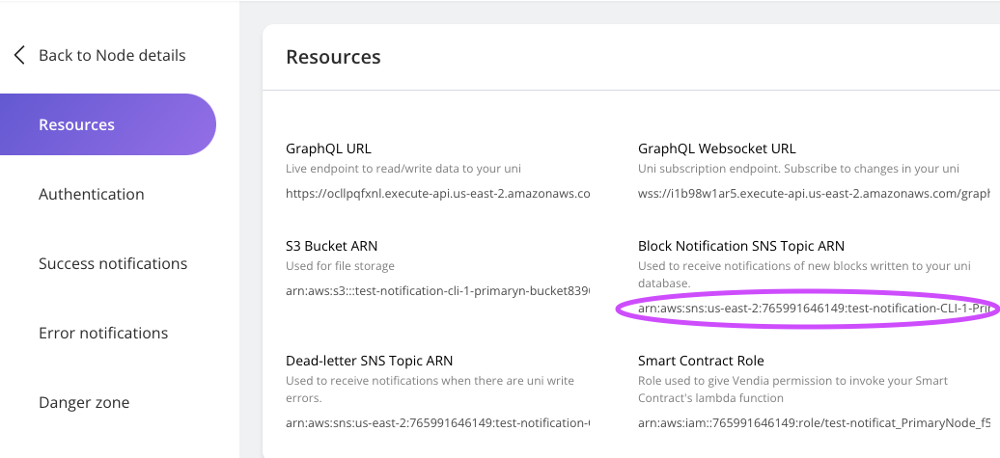
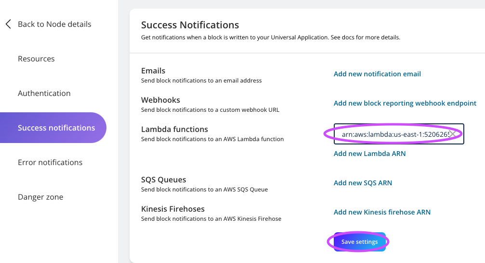
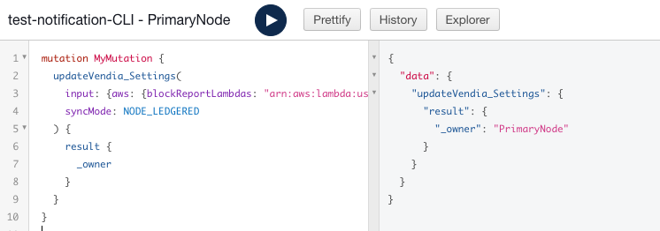
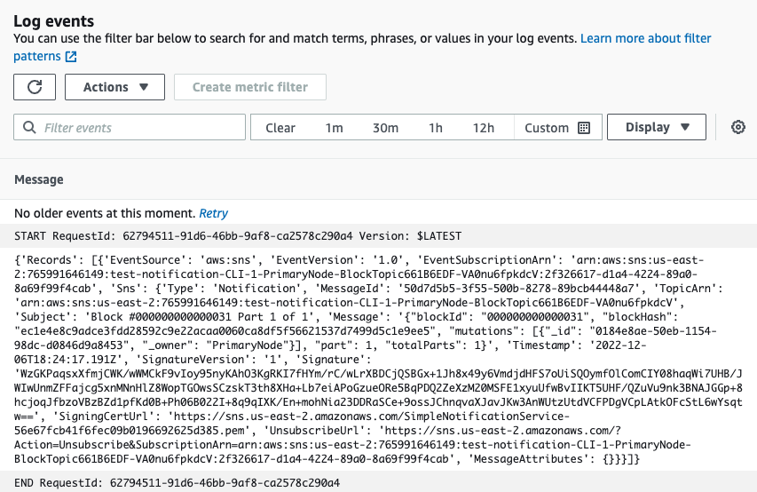

<p align="center">
  <a href="https://vendia.net/">
    
  </a>
</p>

# Handle Success Notifications with AWS Lambda

## Purpose
This is a guide on how to set up success notifications on aws lambdas. Note that all notification examples include 2 parts: UI Setup & GraphQL setup. Readers don't have to go through both cases.

# Prerequisites
* Completed the setup in accordance with this [README.md](../../README.md)
* AWS account with enough access to create lambda functions and adding permissions
* AWS CLI v2.8.7 Note: Versions are not hard requirement but could potentially cause issues.
* Python 3.10.8
* Basic knowledge of AWS lambda
* A lambda function that responds with event itself. The handler should look like this:
  
```
import json

def lambda_handler(event, context):
    print(event)
    return {
        'statusCode': 200,
        'body': json.dumps(event)
    }
```

## UI Setup
1. Click on the Uni you created. If you created according to previous guide, it should be named something like this `test-<your-uni-name>`


2. Click on the Node you need notification for. In this case, let's choose `PrimaryNode`.


3. On Node detail page, click on `Manage Node`


4. Copy the SNS Topic ARN for later use:



5. Add permission to your lambda function using your AWS CLI:
```
aws lambda add-permission \
--function-name <your-lambda-arn> \
--statement-id lambda-notification \
--action lambda:InvokeFunction \
--principal sns.amazonaws.com \
--source-arn <SNS-topic-ARN>

Fielding explained:
#  --function-name can be found on your aws account.
#  --statement-id is a optional id forfuture identification.
#  --action Leave as is.
#  --principal Leave as is.
#  --source-arn is ARN copied in last step.
```

* A success response should look like this:
```
{
  "Statement": [
    {
      "Sid": "lambda-block-notification",
      "Effect": "Allow",
      "Principal": {
        "Service": "sns.amazonaws.com"
      },
      "Action": "lambda:InvokeFunction",
      "Resource": "arn:aws:lambda:****************************",
      "Condition": {
        "ArnLike": {
          "AWS:SourceArn": "arn:aws:sns:aws-region:**********************"
        }
      }
    }
  ]
}
```

6. On `Manage Node` page, click on `Success Nofitifications` tab:


7. Add your lambda function in success notification tab.



8. Subscrib to the topic from your AWS CLI:

```
aws sns subscribe \
--protocol lambda \
--topic-arn <SNS-topic-ARN> \
--notification-endpoint <your-lambda-arn> \
--region aws-region

Fielding explained:
# --topic-arn is copied from step 4.
# notification-endpoint is found on your aws account lambda section.
# --region is your Vendia node region.
```

9. Your notification setup is completed. Now let's [VALIDATE](#notification-validation) it's working properly.

## GraphQL Setup

1. Go to `PrimaryNode`'s detail page and click on `GraphQL Explorer`: 


2. 

```
mutation MyMutation {
  updateVendia_Settings(
    input: {aws: {blockReportLambdas: "<your-lambda-function-arn>"}}
    syncMode: NODE_LEDGERED
  ) {
    result {
      _owner
    }
  }
}
```

* You should get response that looks like this:



3. Subscrib to the topic from your AWS CLI:

```
aws sns subscribe \
--protocol lambda \
--topic-arn <SNS-topic-ARN> \
--notification-endpoint <your-lambda-arn> \
--region aws-region

Fielding explained:
# --topic-arn is copied from step 4.
# notification-endpoint is found on your aws account lambda section.
# --region is your Vendia node region.
```

4. Your notification setup is completed. Now let's [VALIDATE](#notification-validation) it's working properly.

## Notification Validation
To ensure our notification is working properly, we just have to create a new block in our Uni. Basically that means any changes is fine. For the purpose of our validation, let's use GraphQL Explorer for this task.

<!-- step 1 and 2 are reusable for all examples -->

1. Go to `PrimaryNode`'s detail page and click on `GraphQL Explorer`: 


<!-- Two step 2s are provided for success and error cases respectively -->

2. Clear your GraphQL explorer editor. Copy this piece of GraphQL code and paste it into the editor. Then click the start button.
```
mutation MyMutation {
  add_Product(
    input: {description: "testing notification", name: "notify me", price: 1.5, size: M, sku: "54321"}
    syncMode: NODE_COMMITTED
  ) {
    result {
      _id
    }
  }
}
```
* It should look like this:


3. Go to your AWS cloud watch to check your lambda function log. If you see events passing through then it means your setup is successful. It should look something like this:




4. You are able to use mutation id to get more information and use this notification to trigger other activities. But that will be outside the scope of this guide. Enjoy your data sharing journey!

# Additional Resources

* https://www.vendia.com/docs/share/integrations