<p align="center">
  <a href="https://vendia.net/">
    
  </a>
</p>

# Send Success Notifications to AWS SQS

## Purpose
This is a guide on how to set up success notifications to AWS SQS. Note that all notification examples include 2 parts: UI Setup & GraphQL setup. Readers don't have to go through both cases.

# Prerequisites
* Completed the setup in accordance with this [README.md](../../README.md)
* AWS account with enough access to create sqs queue and adding permissions
* Basic knowledge of AWS sqs
* A sqs queue with a policy looking like this:

```
{
  "Version": "2008-10-17",
  "Id": "__default_policy_ID",
  "Statement": [
    {
      "Sid": "__owner_statement",
      "Effect": "Allow",
      "Principal": {
        "AWS": "<your-aws-account-number>"
      },
      "Action": ["SQS:*"],
      "Resource": "<your-sqs-queue-arn>"
    },
    {
      "Sid": "SendMessagesFromMyNode",
      "Effect": "Allow",
      "Principal": {
        "AWS": "arn:aws:iam::<vendia-node-aws-account>:root"
      },
      "Action": "SQS:SendMessage",
      "Resource": "<your-sqs-queue-arn>"
    },
    {
      "Sid": "AllowSubscriptionConfirmationMessage",
      "Effect": "Allow",
      "Principal": {
        "AWS": "*"
      },
      "Action": "SQS:SendMessage",
      "Resource": "<your-sqs-queue-arn>",
      "Condition": {
        "ArnLike": {
          "aws:SourceArn": "<vendia-sns-topic-arn>"
        }
      }
    }
  ]
}

Fields Expalined:
<your-aws-account-number> - This is your AWS account number. Can be easily found when you sign on to AWS at top right of your UI.
<your-sqs-queue-arn> - You can copy this either after your queue is created, or it will be in this format: arn:aws:sqs:<aws-region>:<aws-account-number>:<sqs-queue-name>
<vendia-node-aws-account> - Though not officially shown on Vendia Share, you can find it on resource page's topic ARNs.
<vendia-sns-topic-arn> - this can be found under resoure page on your node. Refer to below iamge.

```
Circled is `<vendia-node-aws-account>`. Note that `<vendia-node-aws-account>` is also in side this string. In this case it's `76599164149`.
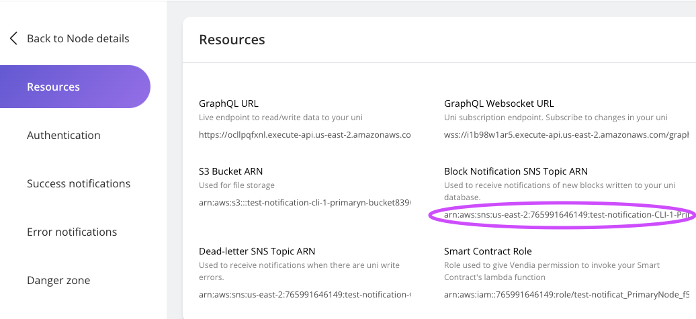


## UI Setup
1. Click on the Uni you created. If you created according to previous guide, it should be named something like this `test-<your-uni-name>`
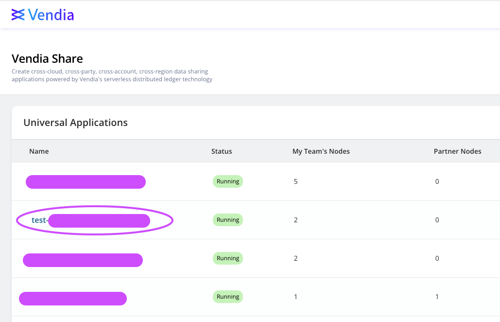

2. Click on the Node you need notification for. In this case, let's choose `PrimaryNode`.
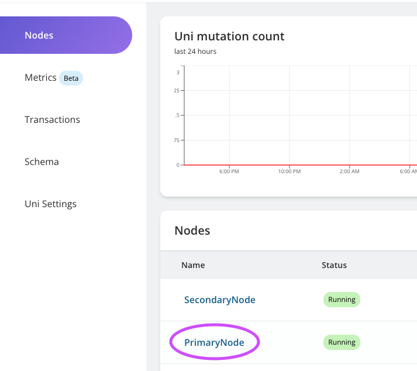

3. On Node detail page, click on `Manage Node`
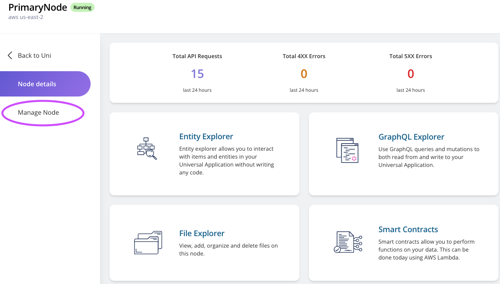

4. On `Manage Node` page, click on `Success Nofitifications` tab:

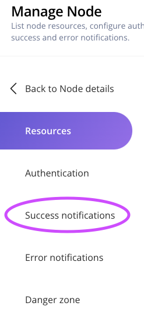

5. Add your AWS sqs ARN in success notification tab and save settings.

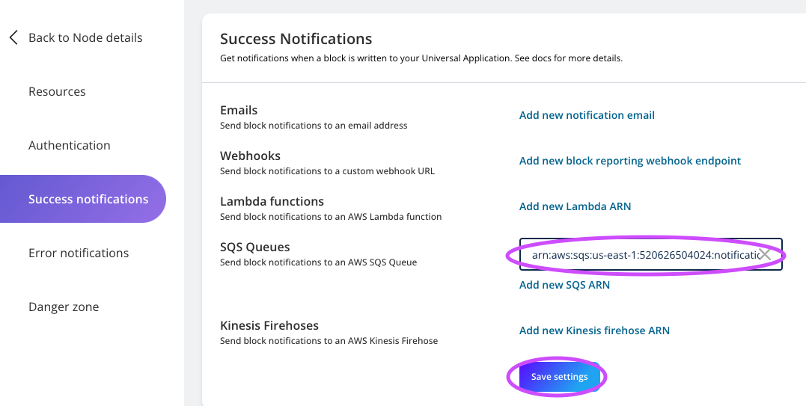

6. On your AWS sqs page, you should see there's a message coming in:

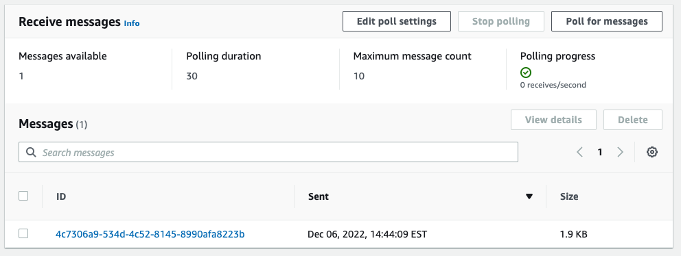

7. Open up the message and check it's body. You should see a field that says `SubscribeURL`. Copy & paste this URL on your browser:

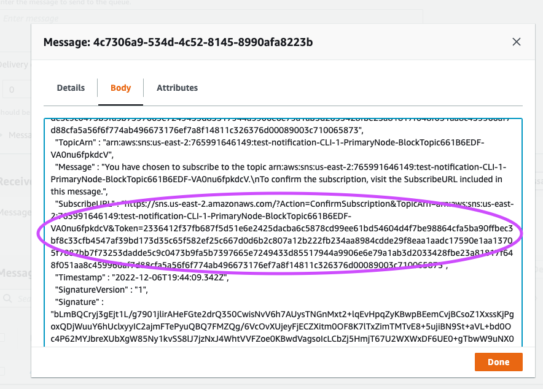

8. After going to the URL, you should see a subscription confirmation like this:

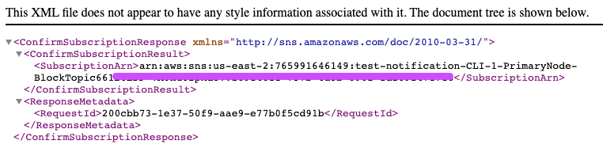

9. Your notification setup is completed. Now let's [VALIDATE](#notification-validation) it's working properly.

## GraphQL Setup

1. Go to `PrimaryNode`'s detail page and click on `GraphQL Explorer`: 

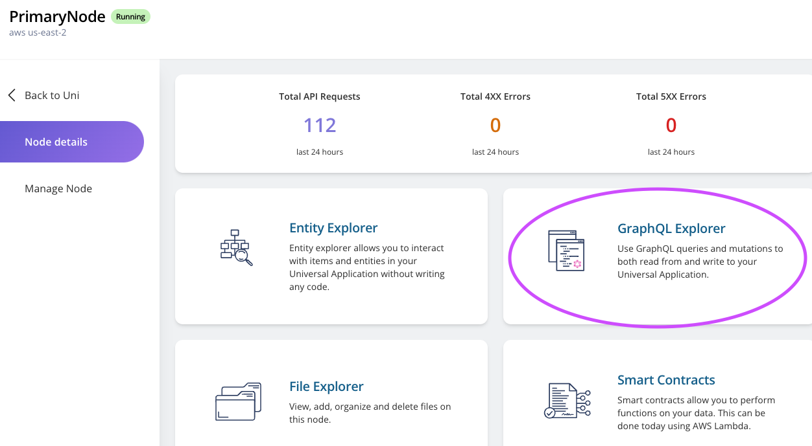

2. Clear your GraphQL explorer editor. Copy this piece of GraphQL code, replace `<your-sqs-arn>` to your info, and paste it into the editor. Then click the start button.

```
mutation MyMutation {
  updateVendia_Settings(
    input: {aws: {blockReportSQSQueues: "<your-sqs-arn>"}}
    syncMode: NODE_LEDGERED
  ) {
    result {
      _owner
    }
  }
}
```

3. On your AWS sqs page, you should see there's a message coming in:


4. Open up the message and check it's body. You should see a field that says `SubscribeURL`. Copy & paste this URL on your browser:


5. After going to the URL, you should see a subscription confirmation like this:


6. Your notification setup is completed. Now let's [VALIDATE](#notification-validation) it's working properly.

## Notification Validation
To ensure our notification is working properly, we just have to create a new block in our Uni. Basically that means any changes is fine. For the purpose of our validation, let's use GraphQL Explorer for this task.

1. Go to `PrimaryNode`'s detail page and click on `GraphQL Explorer`: 


2. Clear your GraphQL explorer editor. Copy this piece of GraphQL code and paste it into the editor. Then click the start button.
```
mutation MyMutation {
  add_Product(
    input: {description: "testing notification", name: "notify me", price: 1.5, size: M, sku: "54321"}
    syncMode: NODE_COMMITTED
  ) {
    result {
      _id
    }
  }
}
```
* It should look like this:

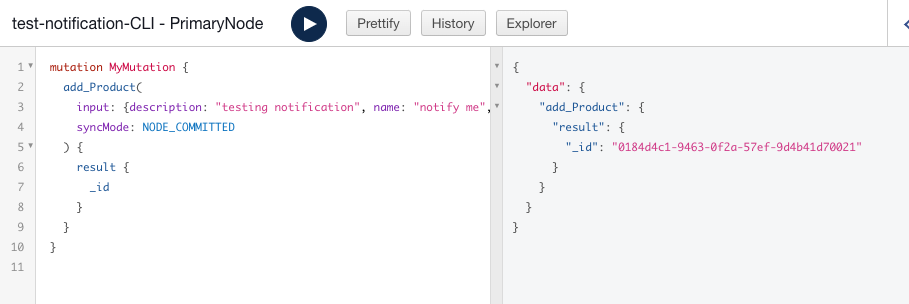

3. You should see more messages came in on your AWS sqs queue:

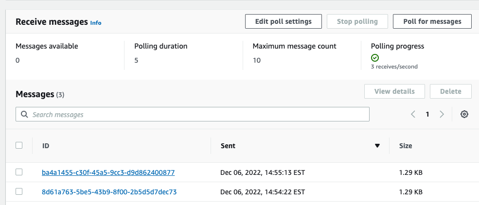

4. Click on the newest message and you should see the body of the message shows is about mutation.

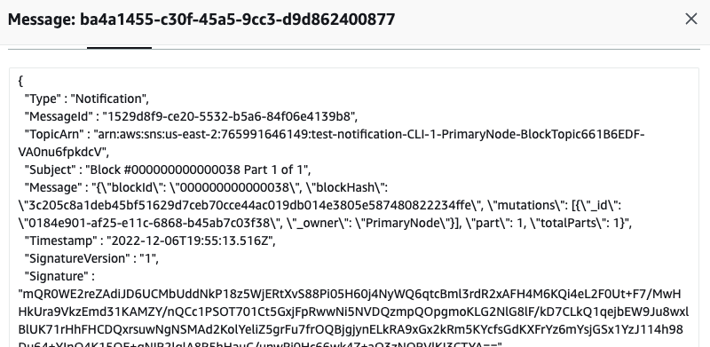

5. You are able to use mutation id to get more information and use this notification to trigger other activities. But that will be outside the scope of this guide. Enjoy your data sharing journey!

# Additional Resources

* https://www.vendia.com/docs/share/integrations