<p align="center">
  <a href="https://vendia.net/">
    
  </a>
</p>

# Receive Success Notifications Through E-mail

## Purpose
This is a guide on on how to set up success notifications to e-mails. Note that all notification examples include 2 parts: UI Setup & GraphQL setup. Readers don't have to go through both cases.

# Prerequisites
* Completed the setup in accordance with this [README.md](../../README.md)
* An e-mail account that can receive AWS e-mails (This is important as some country's e-mail providers block external e-mails)

## UI Setup
1. Click on the Uni you created. If you created according to previous guide, it should be named something like this `test-<your-uni-name>`
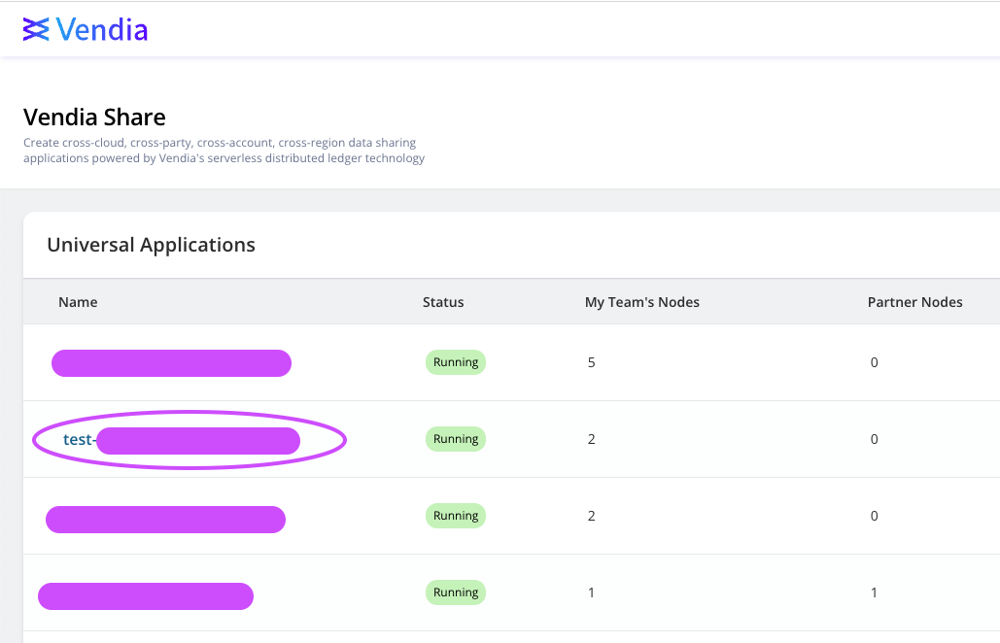

2. Click on the Node you need notification for. In this case, let's choose `PrimaryNode`.
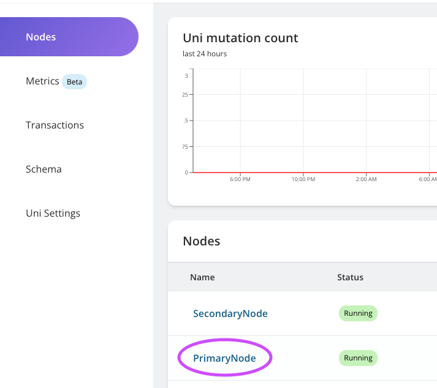

3. On Node detail page, click on `Manage Node`
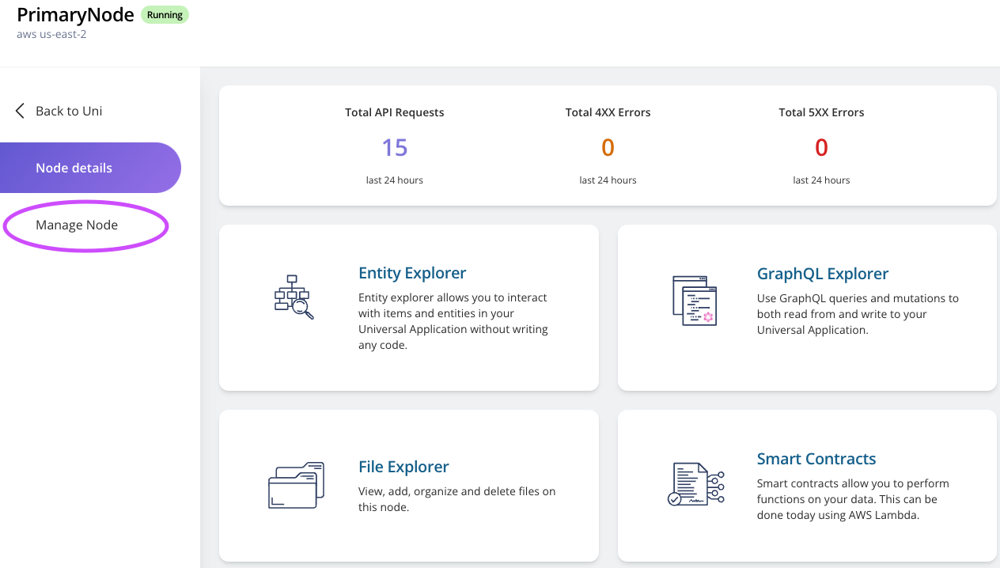

4. On `Manage Node` page, click on `Success Nofitifications` tab:

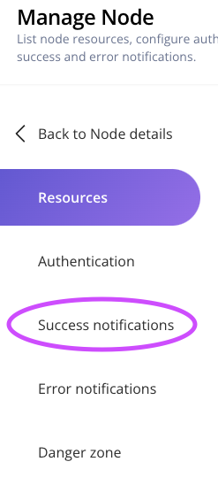

5. Once you've reached `Success Notification` tab, enter your e-mail and click on `Save settings`:
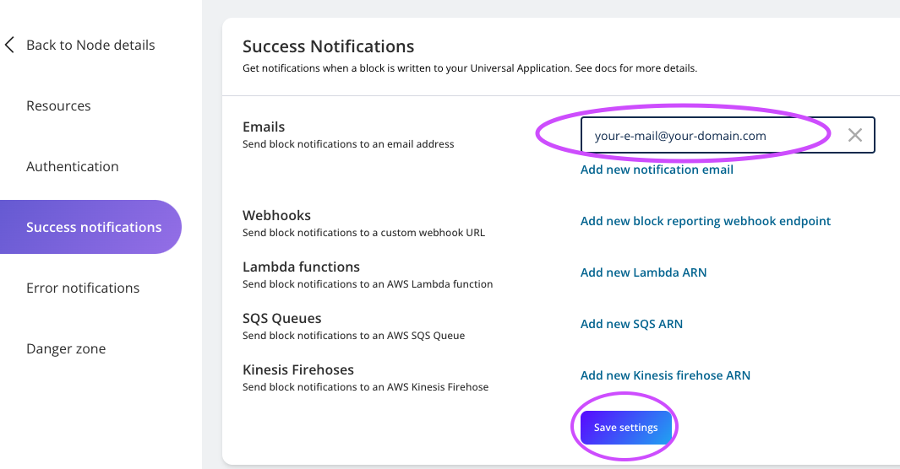


6. Wait for a few seconds and check your e-mail and look for Subject: `AWS Notification - Subscription Confirmation`. (**Make sure you did not block AWS e-mails and check spam folder if you don't see it**) Check the e-mail and click on `Confirm subscription`. The e-mail looks like this:
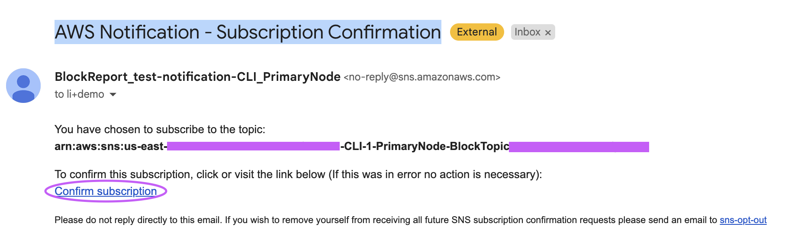

7. You should see a subscription confirmation like this:
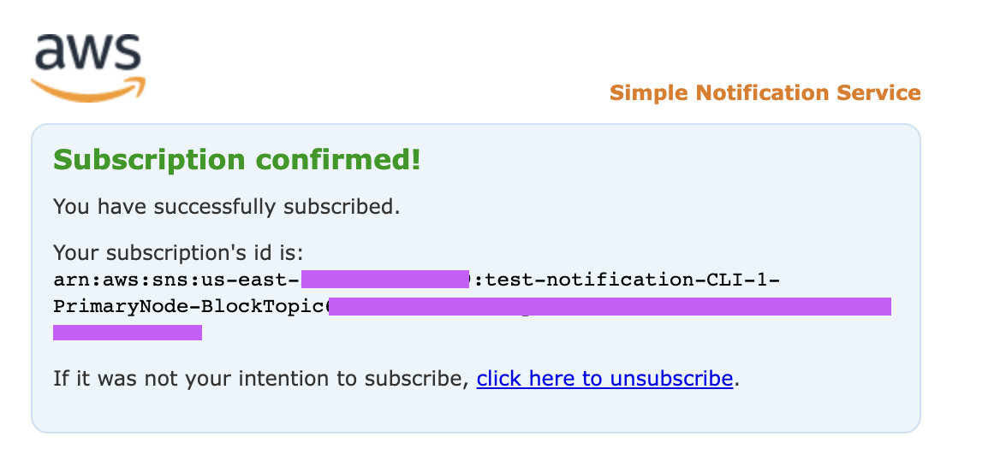

8. Your notification setup is completed. Now let's [VALIDATE](#notification-validation) it's working properly.

## GraphQL Setup

1. Go to `PrimaryNode`'s detail page and click on `GraphQL Explorer`: 

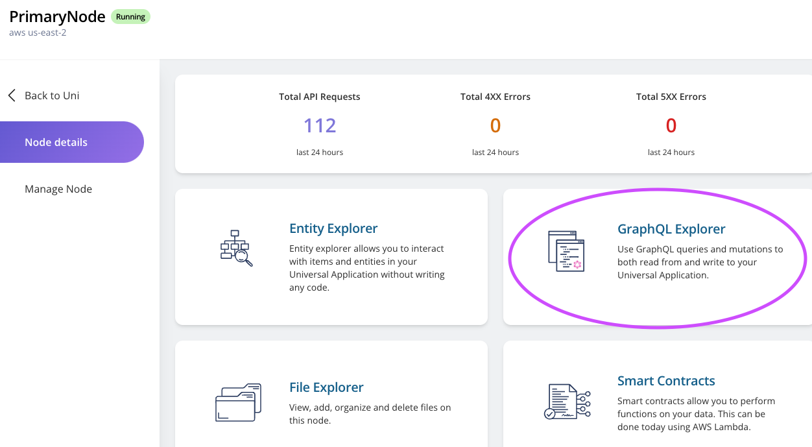

2. Clear your GraphQL explorer editor. Copy this piece of GraphQL code, replace `<your-name>@<your-domain>` to your info, and paste it into the editor. Then click the start button.
```
mutation MyMutation {
  updateVendia_Settings(
    input: {blockReportEmails: "<your-name>@<your-domain>"}
    syncMode: NODE_LEDGERED
  ) {
    result {
      _owner
    }
  }
}
```
* You should get response that looks like this:
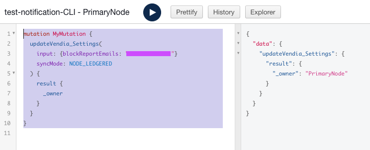

3. Wait for a few seconds and check your e-mail and look for Subject: `AWS Notification - Subscription Confirmation`. (**Make sure you did not block AWS e-mails and check spam folder if you don't see it**) Check the e-mail and click on `Confirm subscription`. The e-mail looks like this:


4. You should see a subscription confirmation like this:


5. Your notification setup is completed. Now let's [VALIDATE](#notification-validation) it's working properly.

## Notification Validation
To ensure our notification is working properly, we just have to create a new block in our Uni. Basically that means any changes is fine. For the purpose of our validation, let's use GraphQL Explorer for this task.

1. Go to `PrimaryNode`'s detail page and click on `GraphQL Explorer`: 


2. Clear your GraphQL explorer editor. Copy this piece of GraphQL code and paste it into the editor. Then click the start button.
```
mutation MyMutation {
  add_Product(
    input: {description: "testing notification", name: "notify me", price: 1.5, size: M, sku: "54321"}
    syncMode: NODE_COMMITTED
  ) {
    result {
      _id
    }
  }
}
```
* It should look like this:

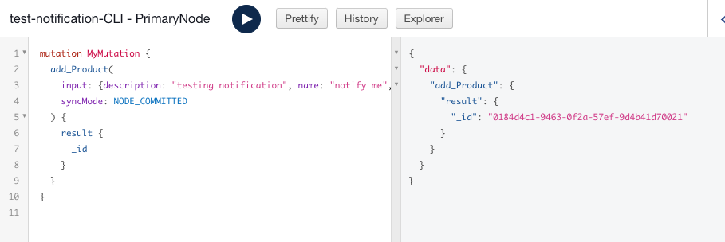

3. Check your e-mail and find subject in this format: `Block #000000000000000001 Part x of y`. The e-mail content looks like below: 
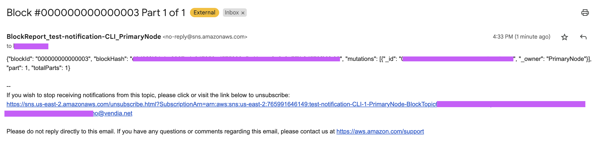


4. You are able to use mutation id to get more information and use this notification to trigger other activities. But that will be outside the scope of this guide. Enjoy your data sharing journey!

# Additional Resources

* https://www.vendia.com/docs/share/integrations