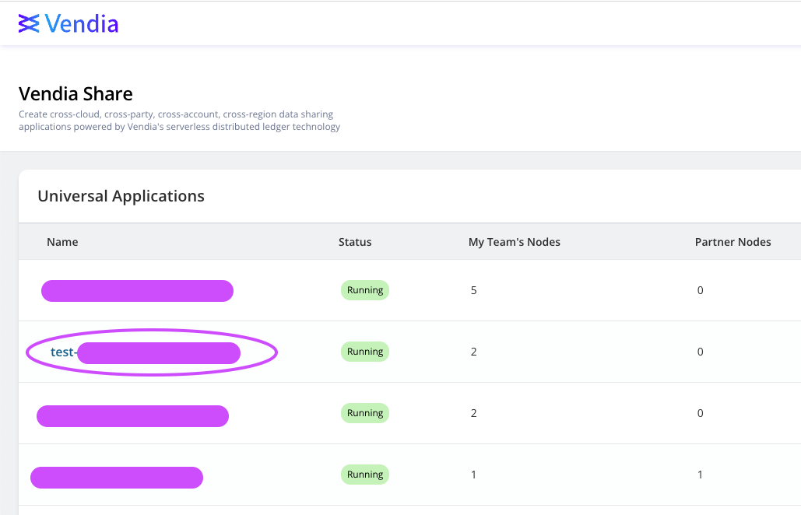
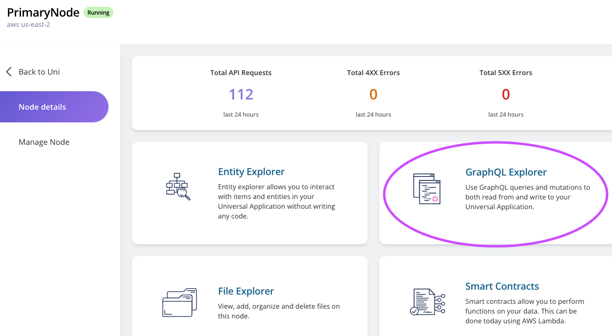

<p align="center">
  <a href="https://vendia.net/">
    
  </a>
</p>

# Integrate Success Notification With Webhooks

## Purpose
This is a guide on on how to set up success notifications to webhooks.

# Prerequisites
* Completed the setup in accordance with this [README.md](../../README.md)
* Internet access to [webhook.site](https://webhook.site). Copy the url shown on as below. Note: Keep the page open to wait for the requests coming in.


## UI Setup
1. Click on the Uni you created. If you created according to previous guide, it should be named something like this `test-<your-uni-name>`


2. Click on the Node you need notification for. In this case, let's choose `PrimaryNode`.


3. On Node detail page, click on `Manage Node`


4. On `Manage Node` page, click on `Success Nofitifications` tab:


5. On `Success Notification` tab, paste your webhook url copied from last step as below and click on `Save settings`:


6. Wait for a few seconds and check your [webhook.site](https://webhook.site). A `POST` request should come in for subscription confirmation. You will have to subscript by going to the `SubscribeURL` link within the request body.


7. After going to the URL, you should see a subscription confirmation like this:

* Note: **You can use method of your choice to do this, not necessarily on a browser.**

8. Your notification setup is completed. Now let's [VALIDATE](#notification-validation) it's working properly.

## GraphQL Setup

1. Go to `PrimaryNode`'s detail page and click on `GraphQL Explorer`: 



2. Clear your GraphQL explorer editor. Copy this piece of GraphQL code, replace `https://<your-webhook-endpoint>` with the URL you copied from [webhook.site](https://webhook.site), and paste it into the editor. Then click the start button.
```
mutation MyMutation {
  updateVendia_Settings(
    input: {blockReportWebhooks: "https://<your-webhook-endpoint>"}
    syncMode: NODE_LEDGERED
  ) {
    result {
      _owner
    }
  }
}

```
* You should get response that looks like this:


3. Wait for a few seconds and check your [webhook.site](https://webhook.site). A `POST` request should come in for subscription confirmation. You will have to subscript by going to the `SubscribeURL` link within the request body.


4. After going to the URL, you should see a subscription confirmation like this:

* Note: **You can use method of your choice to do this, not necessarily on a browser.**

5. Your notification setup is completed. Now let's [VALIDATE](#notification-validation) it's working properly.

## Notification Validation
To ensure our notification is working properly, we just have to create a new block in our Uni. Basically that means any changes is fine. For the purpose of our validation, let's use GraphQL Explorer for this task.

1. Go to `PrimaryNode`'s detail page and click on `GraphQL Explorer`: 


2. Clear your GraphQL explorer editor. Copy this piece of GraphQL code and paste it into the editor. Then click the start button.
```
mutation MyMutation {
  add_Product(
    input: {description: "testing notification", name: "notify me", price: 1.5, size: M, sku: "54321"}
    syncMode: NODE_COMMITTED
  ) {
    result {
      _id
    }
  }
}
```
* It should look like this:


3. Check webhook.site you opened previously, you should see a new `POST` request came in that looks like this: 


4. You are able to use mutation id to get more information and use this notification to trigger other activities. But that will be outside the scope of this guide. Enjoy your data sharing journey!

# Additional Resources

* https://www.vendia.com/docs/share/integrations