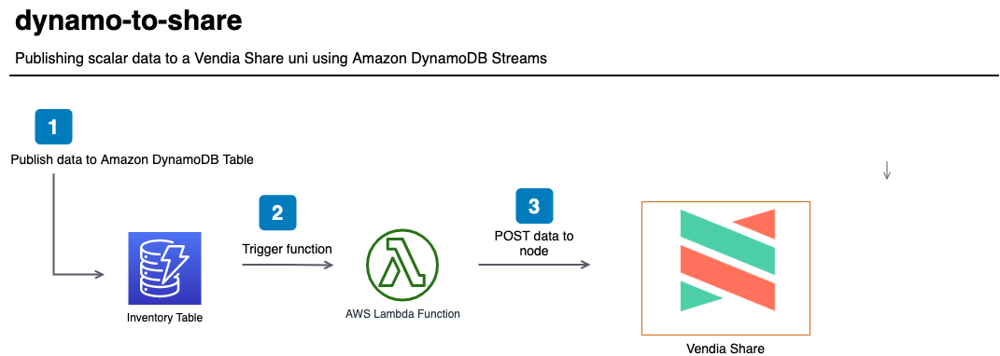

<p align="center">
  <a href="https://vendia.net/">
    
  </a>
</p>

# dynamo-to-share

This example will demonstrate how to send scalar data from [Amazon DynamoDB Streams](https://docs.aws.amazon.com/amazondynamodb/latest/developerguide/Streams.html) to a [Vendia Share Uni](https://vendia.net/docs/share/dev-and-use-unis).

Why? Couldn't we just publish data from an application to a Vendia Share Uni directly?

**Absolutely!**

It is possible to use the GraphQL APIs associated with each node of your Uni. However, you may already have an application that is publishing data to an existing data store like Amazon DynamoDB. The purpose of this example is to demonstrate that Vendia Share can complement existing data stores - there is no need to perform a wholesale migration to take advantage of the benefits of Vendia Share.

We will deploy the example using the [Vendia Share Command Line Interface (CLI)](https://vendia.net/docs/share/cli) and the [AWS Serverless Application Model (SAM)](https://docs.aws.amazon.com/serverless-application-model/latest/developerguide/what-is-sam.html). Serverless resources like a [Amazon DynamoDB](https://aws.amazon.com/dynamodb/) table and [AWS Lambda](https://aws.amazon.com/lambda/) function will be deployed. Data changes to a DynamoDB table - inserts, updates, deletes - will be sent to a Lambda function. The Lambda function will read through the generated event in the stream and run the respective GraphQL query to insert, update, or delete data in the Uni.




# Pre-requisites

* [Python3](https://www.python.org/download)

* [AWS Serverless Application Model CLI](https://docs.aws.amazon.com/serverless-application-model/latest/developerguide/serverless-sam-cli-install.html)

* [AWS CLI version 2](https://docs.aws.amazon.com/cli/latest/userguide/install-cliv2.html)

* [Docker](https://docs.docker.com/install/)

* [Vendia Share CLI](https://vendia.net/docs/share/cli)


## Installing Python3 Dependencies

```bash
python3 -m venv venv
. venv/bin/activate
pip install pip --upgrade
pip install -r requirements.txt
```


## Clone the Repository

In order to use this example, you'll first need to clone the respository.


### Clone with SSH

```bash
git clone git@github.com:vendia/examples.git
```


### Clone with HTTPS

```bash
git clone https://github.com/vendia/examples.git
```


### Change to the dynamo-to-share Directory

```bash
cd examples/share/dynamo-to-share
```


# Deploying the Example Uni

This example will create a shared inventory, not unlike the Vendia Share [Inventory Management Quickstart](https://www.vendia.net/docs/share/quickstart/inventory-management). We will not populate our Uni with `initialState` and will, instead, populate our Uni with data from the [populate_dynamo.py](populate_dynamo.py).

If you are not already logged in to the share service you do so by running [`share login`](https://vendia.net/docs/share/cli/commands/login):

```bash
share login
```

The `share uni create` command can be used to deploy our uni. You will need to copy the file `registration.json.sample` to `registration.json`. Pick a unique `name` for your uni that begins with `test-` - by default all unis share a common namespace so here is your chance to get creative. Update the `userId` attribute of each node to reflect your Vendia Share email address.

```bash
cd uni_configuration
share uni create --config registration.json
```

The uni will take approximately 5 minutes to deploy. We can check on its status in the Vendia Share web application or with the `share` CLI.

**NOTE:** The name of your uni will be different. Adjust as appropriate.

```bash
share get --uni test-dynamo-to-share
```

Make note of the **DistributionCenter** node's graphqlApi `httpsUrl` and `apiKey`. Our serverless application will interact with **DistributionCenter** using this information.

Once the Uni is deployed we can deploy our serverless application.


# Deploying the Serverless Application


## Build

```bash
cd .. # If you're not already in the root of the dynamo-to-share example
sam build --use-container
```


## Deploy

Please run the following command for the first deployment of the application. Save the generated configuration file using the default name *samconfig.toml*. Use the stack name *csv-to-vendia-share* when prompted.

```bash
sam deploy --guided
```

Enter **dynamo-to-share** as the stack name. Specify the same AWS region as **DistributionCenter**. You will be prompted to enter data for the *ShareNodeUrl* and *ShareNodeApiKey*. Please use the values from the **DistributionCenter** Vendia Share node.

**NOTE:** The *ShareNodeApiKey* will not be displayed at the input. This is the intended behavior.

Subsequent deployments can use the command `sam deploy`. The values stored in *samconfig.toml* will be used.

**NOTE:** The generated DynamoDB table name will be listed as an *Output* to our `sam deploy` command. We will need it when we test our application.


# Testing the Solution

Once the serverless application is deployed, let's verify there is no data stored in our uni. Execute the following query from the **DistributionCenter** GraphQL Explorer.

```graphql
query listInventory {
  list_InventoryItems {
    _InventoryItems {
      _id
      itemName
      itemNumber
      quantity
      unitPrice
      tags
    }
  }
}
```


## Adding Data

Let's go ahead and publish data to our DynamoDB table. The script `populate_dynamo.py` will add a specified number of random products to our `InventoryTable`. Use the `InventoryTable` from our `sam deploy` **Outputs**. The example below will add *40* items to the `InventoryTable`.

```bash
# Update the INVENTORY_TABLE appropriately
INVENTORY_TABLE=dynamo-to-share-InventoryTable-123456789 \
AWS_PROFILE=your_aws_iam_profile \
AWS_REGION=region_you_deployed_to \
python populate_dynamo.py 40
```

After the data has been uploaded, you should see the resulting scalar data in both your and `InventoryTable` and your Uni. You can also view the CloudWatch logs for the `StreamProcessingFunction` function in order to see the execution details.

Execute the following query from the **DistributionCenter** GraphQL Explorer.

```graphql
query listInventory {
  list_InventoryItems {
    _InventoryItems {
      _id
      itemName
      itemNumber
      quantity
      unitPrice
      tags
    }
  }
}
```

It should return the items that were generated by `populate_dynamo.py`.


## Updating Data

Let's go ahead and update one of the records in the DynamoDB table. One of of the randomly generated items in my inventory has an `itemNumber` of `85424ab9-13d2-4e1b-b1bb-d9e1403d7364`.

**NOTE:** You will need to specify a valid `itemNumber`.


You can confirm the value in your Uni by running the following query:

```graphql
query listItem {
  list_InventoryItems(
    filter: {
      itemNumber: {
        eq: "85424ab9-13d2-4e1b-b1bb-d9e1403d7364"
      }
    }
  ) {
    _InventoryItems {
      _id
      itemName
      itemNumber
      quantity
      unitPrice
      tags
    }
  }
}
```


I can go back to my DynamoDB table and update the `itemName` to `DynamoDB Example`.


The update will be reflected in the Uni as well. Run the following query - filtered using the same `itemNumber` - and confirm the `itemName` has been updated to `DynamoDB Example`.

```graphql
query listItem {
  listInventoryItems(
    filter: {
      itemNumber: {
        eq: "305786fb-b6fe-4cec-bc1c-381bafef3f28"
      }
    }
  ) {
    InventoryItems {
      id
      itemName
      itemNumber
      quantity
      unitPrice
      tags
    }
  }
}
```


## Deleting Data

Let's go ahead and remove one of the records in the DynamoDB table. I will remove the item with an `itemNumber` of `305786fb-b6fe-4cec-bc1c-381bafef3f28`.


Once the record has been deleted from DynamoDB I can run the following query to confirm it has been removed from my Uni as well.

```graphql
query listItem {
  listInventoryItems(
    filter: {
      itemNumber: {
        eq: "305786fb-b6fe-4cec-bc1c-381bafef3f28"
      }
    }
  ) {
    InventoryItems {
      id
      itemName
      itemNumber
      quantity
      unitPrice
      tags
    }
  }
}
```


# Cleaning Up the Solution

Run the `cleanup.sh` script to remove all artifacts related to the solution, including the Vendia Share uni.

```bash
# Replace with proper values
./cleanup.sh test-dynamo-to-share \
--profile your_aws_iam_profile --region region_you_deployed_to
```
