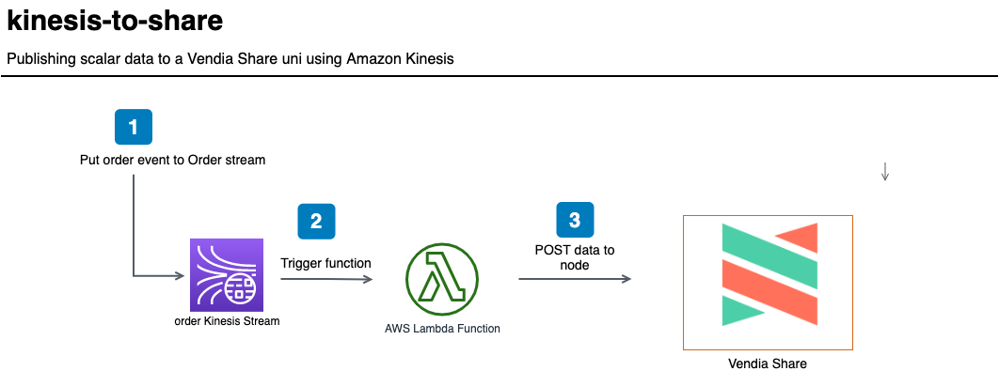

<p align="center">
  <a href="https://vendia.net/">
    
  </a>
</p>

# kinesis-to-share

This example will demonstrate how to publish data from [Amazon Kinesis Data Streams](https://aws.amazon.com/kinesis/) to a [Vendia Share Uni](https://vendia.net/docs/share/dev-and-use-unis).  The point is to illustrate that partners to a Uni can take advantage of existing services they may already use, like Amazon Kinesis, to share information with partners.  In our scenario, a **Consignee** is placing an order for goods that should be published to a Uni that is comprised of a **Consignee** and **Carrier**.  In our scenario, the **Consignee** uses an order system that integrates with Amazon Kinesis.

We will deploy the example using the [Vendia Share Command Line Interface (CLI)](https://vendia.net/docs/share/cli) and the [AWS Serverless Application Model (SAM)](https://docs.aws.amazon.com/serverless-application-model/latest/developerguide/what-is-sam.html).  Serverless resources like a [Kinesis](https://aws.amazon.com/kinesis/) stream and [AWS Lambda](https://aws.amazon.com/lambda/) function will be deployed.  Data will be published to a Kinesis stream via [generator.py](generator.py), a Python3 script.  This, in turn, will trigger a Lambda function to parse order data and publish it to our node in the Vendia Share Uni.



# Pre-requisites

* [Python3](https://www.python.org/download)

* [AWS Serverless Application Model CLI](https://docs.aws.amazon.com/serverless-application-model/latest/developerguide/serverless-sam-cli-install.html)

* [AWS CLI version 2](https://docs.aws.amazon.com/cli/latest/userguide/install-cliv2.html)

* [Docker](https://docs.docker.com/install/)

* [Vendia Share CLI](https://vendia.net/docs/share/cli)

## Clone the Repository

In order to use this example, you'll first need to clone the respository.

### Clone with SSH

```bash
git clone git@github.com:vendia/examples.git
```

### Clone with HTTPS

```bash
git clone https://github.com/vendia/examples.git
```

### Change to the kinesis-to-share Directory

```bash
cd examples/share/kinesis-to-share
```

## Installing Python3 Dependencies

```bash
python3 -m venv venv
. ./venv/bin/activate
pip install pip --upgrade
pip install -r requirements.txt
```

# Deploying the Example Uni

This example will create a Uni to store attributes regarding shipments.

If not already logged in to the share service do so by running [`share login`](https://vendia.net/docs/share/cli/commands/login):

```bash
share login
```

The `share uni create` command can be used to deploy our Uni.  You will need to copy the file `registration.json.sample` to `registration.json`.  Pick a unique `name` for your uni that begins with `test-` - by default all Unis share a common namespace so here is your chance to get creative.  Update the `userId` attribute of each node to reflect your Vendia Share email address.

```bash
cd uni_configuration
share uni create --config registration.json
```

The Uni will take approximately 5 minutes to deploy.  We can check on its status in the Vendia Share web application or with the `share` CLI.

**NOTE:** The name of your Uni will be different.  Adjust as appropriate.

```bash
share get --uni test-kinesis-to-share
```

Make note of the **Consignee** node's graphqlApi `httpsUrl` and `apiKey`.  Our serverless application will interact with **Consignee** using this information.

Once the Uni is deployed we can deploy our serverless application to parse the stream data and publish it to our **Consignee** node.

# Deploying the Serverless Application

The default serverless application deploys a [Kinesis](https://aws.amazon.com/kinesis/) stream with a Lambda function subscriber that will be triggered when a new order is added from a fictitious source application.

## Build

```bash
cd .. # If in the uni_configuration directory
sam build --use-container
```

## Deploy

```bash
sam deploy --guided
```

You will be prompted to enter several pieces of data:

* *kinesis-to-share* as the stack name.  If you use a different name you will need to update the `STACK_NAME` variable in the [cleanup.sh](cleanup.sh) script.

* *AWS Region* should match the same region as the **Consignee** Vendia Share node

* *ShareNodeUrl* from the **Consignee** Vendia Share node

* *ShareNodeApiKey* from the **Consignee** Vendia Share node

Subsequent deployments can use the command `sam deploy`.  The values stored in *samconfig.toml* will be used.

Please make note of the `OrderStream` output from the `sam deploy` command. We will need it to test our solution.

# Testing the Solution

## Verify There Is No Data in the Uni

Once the serverless application is deployed, let's verify there is no data stored in our Uni.  Execute the following query from the **Consignee** GraphQL Explorer.

```graphql
query listShipments {
  list_ShipmentItems {
    _ShipmentItems {
      _id
      orderDate
      dueDate
      shipmentStatus
      shipperName
      shipperAddress
      shipperCity
      shipperState
      shipperPostalCode
      shipperPhone
      shipperEmail
      consigneeName
      consigneeAddress
      consigneeCity
      consigneeState
      consigneePostalCode
      consigneePhone
      consigneeEmail
      purchaseOrder
      location
    }
  }
}
```


## Publish Events to our Order Stream

You can publish a sample event to our **Order stream** using a Python3 script [generator.py](generator.py).  Please replace `kinesis-to-share-OrderStream-random-value` with the output returned from `sam deploy`.

```bash
AWS_PROFILE=your_profile_name AWS_REGION=region_of_kinesis_stream python3 generator.py kinesis-to-share-OrderStream-random-value
```

This script will publish data to our **Order stream** every 5 seconds.  It will trigger a AWS Lambda function to be invoked.  The function will parse the order data and POST it to the **Consignee** GraphQL endpoint.

## Verify There Is Data in the Uni

Now that we've sent over to our **Order bus**, we should have updated results in our Uni.  Execute the same query we ran earlier from the **Consignee** GraphQL Explorer.

```graphql
query listShipments {
  list_ShipmentItems {
    _ShipmentItems {
      _id
      orderDate
      dueDate
      shipmentStatus
      shipperName
      shipperAddress
      shipperCity
      shipperState
      shipperPostalCode
      shipperPhone
      shipperEmail
      consigneeName
      consigneeAddress
      consigneeCity
      consigneeState
      consigneePostalCode
      consigneePhone
      consigneeEmail
      purchaseOrder
      location
    }
  }
}
```


# Cleaning Up the Solution

Run the `cleanup.sh` script to remove all artifacts related to the solution, including the Vendia Share Uni.

```bash
# Replace with proper values
./cleanup.sh test-kinesis-to-share \
--profile your_aws_iam_profile --region region_you_deployed_to
```
