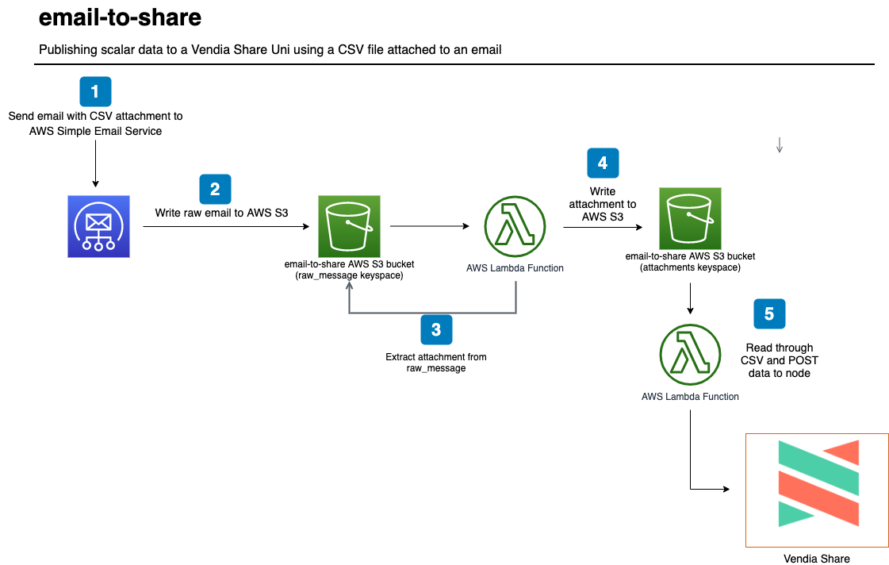

<p align="center">
  <a href="https://vendia.net/">
    
  </a>
</p>

# email-to-share

This example will demonstrate how to send scalar data from a comma-separated value (CSV) file attached to an email to a [Vendia Share Uni](https://vendia.net/docs/share/dev-and-use-unis).  The point is to illustrate that partners to a Uni do not necessarily need to be familiar with GraphQL queries and mutations to put data to a Uni - _emailing CSVs can work just fine_.

We will deploy the example using the [Vendia Share Command Line Interface (CLI)](https://vendia.net/docs/share/cli) and the [AWS Serverless Application Model (SAM)](https://docs.aws.amazon.com/serverless-application-model/latest/developerguide/what-is-sam.html).  Serverless resources like a [AWS S3](https://aws.amazon.com/s3/) bucket and [AWS Lambda](https://aws.amazon.com/lambda/) functions will be deployed.  CSV processing with AWS Lambda functions will be triggered by sending an email to a specified email address.  The Lambda functions will read through the raw email, parse the CSVs, and publish data in CSVs to a node's GraphQL endpoint.





Below are detailed instructions for processing email attachments and publishing the data to Vendia Share.

**NOTE:** This example assumes that you are using Amazon Route53 and Amazon SES has a verfied domain to receive email.  The [Serverless Application Model (SAM)](https://aws.amazon.com/serverless/sam/) template requires a verified domain to make the necessary configurations.  Please refer to the  [Amazon Simple Email Service Developer Guide](https://docs.aws.amazon.com/ses/latest/DeveloperGuide/receiving-email.html) for more information.

# Pre-requisites

* [Python3](https://www.python.org/download)

* [AWS Serverless Application Model CLI](https://docs.aws.amazon.com/serverless-application-model/latest/developerguide/serverless-sam-cli-install.html)

* [AWS CLI version 2](https://docs.aws.amazon.com/cli/latest/userguide/install-cliv2.html)

* [Docker](https://docs.docker.com/install/)

* [Vendia Share CLI](https://vendia.net/docs/share/cli)

## Clone the Repository

In order to use this example, you'll first need to clone the respository.

### Clone with SSH

```bash
git clone git@github.com:vendia/examples.git
```

### Clone with HTTPS

```bash
git clone https://github.com/vendia/examples.git
```

### Change to the email-to-share Directory

```bash
cd examples/share/email-to-share
```

# Deploying the Example Uni

This example will create a Uni to store attributes regarding shipments.

If not already logged in to the share service do so by running [`share login`](https://vendia.net/docs/share/cli/commands/login):

```bash
share login
```

The `share uni create` command can be used to deploy our uni.  You will need to copy the file `registration.json.sample` to `registration.json`.  Pick a unique `name` for your uni that begins with `test-` - by default all unis share a common namespace so here is your chance to get creative.  Update the `userId` attribute of each node to reflect your Vendia Share email address.

```bash
cd uni_configuration
share uni create --config registration.json
```

The uni will take approximately 5 minutes to deploy.  We can check on its status in the Vendia Share web application or with the `share` CLI.

**NOTE:** The name of your uni will be different.  Adjust as appropriate.

```bash
share get --uni test-email-to-share
```

Make note of the **Shipper** node's graphqlApi `httpsUrl` and `apiKey`.  Our serverless application will interact with **Shipper** using this information.

Once the uni is deployed we can deploy our serverless application.

# Deploying the Serverless Application

## Build

```bash
cd .. # If in the uni_configuration directory
sam build --use-container
```

## Deploy

```bash
sam deploy --guided
```

Enter **email-to-share** as the stack name.  Specify the AWS region to match where you have your Amazon Simple Email Service address validated.  You will be prompted to enter data for the *VENDIA_NODE_URL* and *VENDIA_NODE_API_KEY*.  Please use the values from the **Shipper** Vendia Share node.

Subsequent deployments can use the command `sam deploy`.  The values stored in *samconfig.toml* will be used.

## Activate the email-to-share Rule Set

Unfortunately, AWS CloudFormation does not allow for the definition of the active rule set in the Simple Email Service.  As such, the following AWS CLI command needs to be run before emails can be processed.

```bash
aws ses set-active-receipt-rule-set --rule-set-name email-to-share
```

**NOTE:** Only one of your receipt rule sets can be active at any given time.  Please be mindful if you already have an existing rule set in place.

# Testing the Solution

## Verify There Is No Data in the Uni

Once the serverless application is deployed, let's verify there is no data stored in our Uni.  Execute the following query from the **Shipper** GraphQL Explorer.

```graphql
query listAllShipments {
  list_ShipmentItems {
    _ShipmentItems {
      _id
      orderDate
      shipperName
      shipperAddress
      shipperCity
      shipperState
      shipperPostalCode
      shipperCountry
      carrierName
      carrierEmail
      carrierPhone
      consigneeName
      consigneeAddress
      consigneeCity
      consigneeState
      consigneePostalCode
      consigneeCountry
      goods {
        sku
        itemDescription
        reference
        quantity
      }
    }
  }
}
```


## Email Test CSV File

You can attach the [test-shipment-data.csv](test-shipment-data.csv) file to an email message and send it to `EmailAddress`.


## Verify There Is Data in the Uni

Now that we've sent over our CSV, we should have updated results in our Uni.  Execute the same query we ran earlier from the **Shipper** GraphQL Explorer.

```graphql
query listAllShipments {
  list_ShipmentItems {
    _ShipmentItems {
      _id
      orderDate
      shipperName
      shipperAddress
      shipperCity
      shipperState
      shipperPostalCode
      shipperCountry
      carrierName
      carrierEmail
      carrierPhone
      consigneeName
      consigneeAddress
      consigneeCity
      consigneeState
      consigneePostalCode
      consigneeCountry
      goods {
        sku
        itemDescription
        reference
        quantity
      }
    }
  }
}
```


# Cleaning Up the Solution

Run the `cleanup.sh` script to remove all artifacts related to the solution, including the Vendia Share uni.

## Set the New Active Rule Set

The active rule set cannot be deleted by CloudFormation.  Please run the following command. 

```bash
# Replace other-email-set with a valid value
aws ses set-active-receipt-rule-set --rule-set-name other-email-set
```

## Run Cleanup Script

```bash
# Replace with proper values
./cleanup.sh test-email-to-share \
--profile your_aws_iam_profile --region region_you_deployed_to
```
