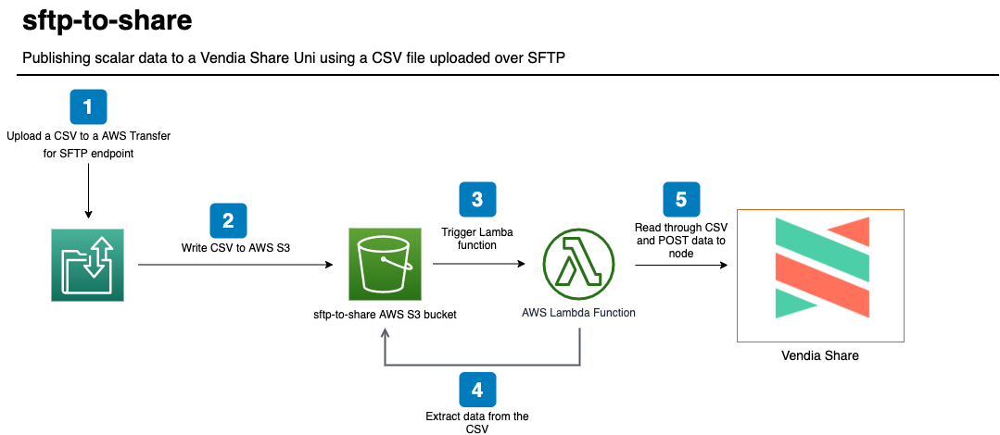

<p align="center">
  <a href="https://vendia.net/">
    
  </a>
</p>

# sftp-to-share

This example will demonstrate how to populate data in a [Vendia Share Uni](https://vendia.net/docs/share/dev-and-use-unis) with a comma-separated value (CSV) file sent over Secure File Transfer Protocol (SFTP).  The point is to illustrate that partners to a Uni do not necessarily need to be familiar with GraphQL queries and mutations to put data to a Uni - _sending CSV files over SFTP can work just fine_.

We will deploy the example using the [Vendia Share Command Line Interface (CLI)](https://vendia.net/docs/share/cli) and the [AWS Serverless Application Model (SAM)](https://docs.aws.amazon.com/serverless-application-model/latest/developerguide/what-is-sam.html).  Serverless resources like a [AWS Transfer for SFTP](https://aws.amazon.com/aws-transfer-family/) endpoint, [AWS S3](https://aws.amazon.com/s3/) bucket and [AWS Lambda](https://aws.amazon.com/lambda/) function will be deployed.  CSV processing with a AWS Lambda function will be triggered by transferring a file to the SFTP endpoint.  The Lambda function parse the CSVs and publish data in CSVs to a node's GraphQL endpoint.



# Pre-requisites

* [Python3](https://www.python.org/download)

* [AWS Serverless Application Model CLI](https://docs.aws.amazon.com/serverless-application-model/latest/developerguide/serverless-sam-cli-install.html)

* [AWS CLI version 2](https://docs.aws.amazon.com/cli/latest/userguide/install-cliv2.html)

* [Docker](https://docs.docker.com/install/)

* [Vendia Share CLI](https://vendia.net/docs/share/cli)

## Clone the Repository

In order to use this example, you'll first need to clone the respository.

### Clone with SSH

```bash
git clone git@github.com:vendia/examples.git
```

### Clone with HTTPS

```bash
git clone https://github.com/vendia/examples.git
```

### Change to the sftp-to-share Directory

```bash
cd examples/share/sftp-to-share
```

# Deploying the Example Uni

This example will create a Uni to store attributes regarding shipments.

If not already logged in to the share service do so by running [`share login`](https://vendia.net/docs/share/cli/commands/login):

```bash
share login
```

The `share uni create` command can be used to deploy our Uni.  You will need to copy the file `registration.json.sample` to `registration.json`.  Pick a unique `name` for your uni that begins with `test-` - by default all Unis share a common namespace so here is your chance to get creative.  Update the `userId` attribute of each node to reflect your Vendia Share email address.

```bash
cd uni_configuration
share uni create --config registration.json
```

The Uni will take approximately 5 minutes to deploy.  We can check on its status in the Vendia Share web application or with the `share` CLI.

**NOTE:** The name of your Uni will be different.  Adjust as appropriate.

```bash
share get --uni test-sftp-to-share
```

Make note of the **Shipper** node's graphqlApi `httpsUrl` and `apiKey`.  Our serverless application will interact with **Shipper** using this information.

Once the Uni is deployed we can deploy our serverless application to parse the uploaded CSV and publish data to our **Shipper** node.

# Deploying the Serverless Application

The default serverless application deploys a [AWS Transfer for SFTP](https://aws.amazon.com/aws-transfer-family/) endpoint with a default AWS-provided name.

You will need to provide a SSH public key when deploying the application.  If you do not have a SSH keypair, or would like to create one specifically for this example, please use the [ssh-keygen command](https://man7.org/linux/man-pages/man1/ssh-keygen.1.html) to create it.

## Build

```bash
cd .. # If in the uni_configuration directory
sam build --use-container
```

## Deploy

```bash
sam deploy --guided
```

You will be prompted to enter several pieces of data:

* *sftp-to-share* as the stack name.  If you use a different name you will need to update the `STACK_NAME` variable in the [cleanup.sh](cleanup.sh) script.

* *AWS Region* should match the same region as the **Shipper** Vendia Share node

* *ShareGraphqlUrl* from the **Shipper** Vendia Share node

* *ShareGraphqlApiKey* from the **Shipper** Vendia Share node

* *SftpUsername* will default to **sftp-to-share** but you can change it

* *SftpUserPublicKey* to match the **public** SSH key.

Subsequent deployments can use the command `sam deploy`.  The values stored in *samconfig.toml* will be used.

The stack output will include the command to use to connect to the newly created SFTP endpoint.

# Testing the Solution

## Verify There Is No Data in the Uni

Once the serverless application is deployed, let's verify there is no data stored in our Uni.  Execute the following query from the **Shipper** GraphQL Explorer.

```graphql
query listAllShipments {
  listShipments {
    Shipments {
      id
      orderDate
      shipperName
      shipperAddress
      shipperCity
      shipperState
      shipperPostalCode
      shipperCountry
      carrierName
      carrierEmail
      carrierPhone
      consigneeName
      consigneeAddress
      consigneeCity
      consigneeState
      consigneePostalCode
      consigneeCountry
      goods {
        sku
        itemDescription
        reference
        quantity
      }
    }
  }
}
```


## Transfer a Valid CSV File to the SFTP Server

You can upload the [test-shipment-data.csv](test-shipment-data.csv) file to your SFTP server.  This will trigger a AWS Lambda function to parse it and POST it to the **Share** GraphQL endpoint.

You will need to use the *private* key portion of the public key specified when creating the serverless application.  For convenience, this can be done using the `ssh-add` command.

```bash
ssh-add /path/to/the/private/key/file
```

**NOTE:** If you added a passphrase when you created the key you will be prompted to enter it.

Once you've run the `ssh-add` command you can use the `sftp` command to transfer the [test-shipment-data.csv](test-shipment-data.csv) file.

```bash
brian@local sftp-to-share % sftp sftp-to-share@sftp-id.server.transfer.aws-region.amazonaws.com
The authenticity of host 'sftp-id.server.transfer.aws-region.amazonaws.com (1.2.3.4)' can't be established.
RSA key fingerprint is SHA256:qVvrSFZlD9nyAyWlcDaKVTOFgrbV8ARXjhz5aacmXzw.
Are you sure you want to continue connecting (yes/no/[fingerprint])? yes
Warning: Permanently added 'sftp-id.server.transfer.aws-region.amazonaws.com,1.2.3.4' (RSA) to the list of known hosts.
Connected to sftp-id.server.transfer.aws-region.amazonaws.com.
sftp> put test-shipment-data.csv
Uploading test-shipment-data.csv to /sftp-to-share-123456789012/home/sftp-to-share-demo/test-shipment-data.csv
test-shipment-data.csv                                                                                                                                            100% 2282    62.8KB/s   00:00    
sftp> quit
```

## Verify There Is Data in the Uni

Now that we've sent over our CSV, we should have updated results in our Uni.  Execute the same query we ran earlier from the **Shipper** GraphQL Explorer.

```graphql
query listAllShipments {
  listShipments {
    Shipments {
      id
      orderDate
      shipperName
      shipperAddress
      shipperCity
      shipperState
      shipperPostalCode
      shipperCountry
      carrierName
      carrierEmail
      carrierPhone
      consigneeName
      consigneeAddress
      consigneeCity
      consigneeState
      consigneePostalCode
      consigneeCountry
      goods {
        sku
        itemDescription
        reference
        quantity
      }
    }
  }
}
```


# Cleaning Up the Solution

Run the `cleanup.sh` script to remove all artifacts related to the solution, including the Vendia Share Uni.

```bash
# Replace with proper values
./cleanup.sh test-sftp-to-share \
--profile your_aws_iam_profile --region region_you_deployed_to
```
