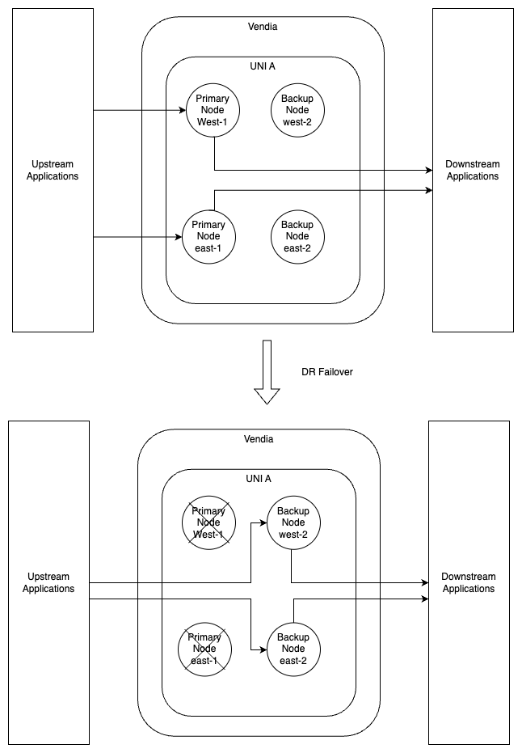
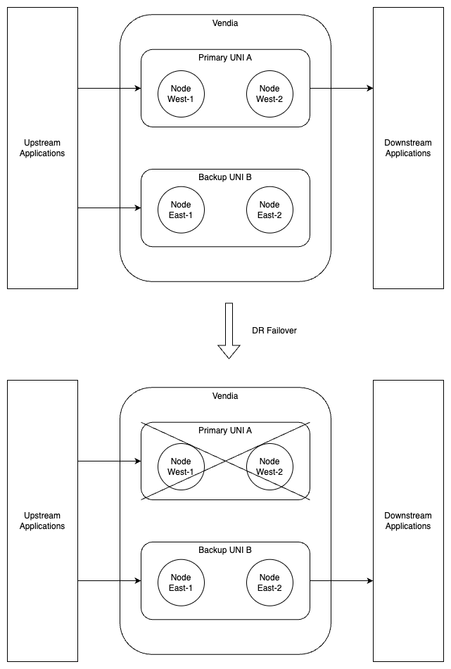
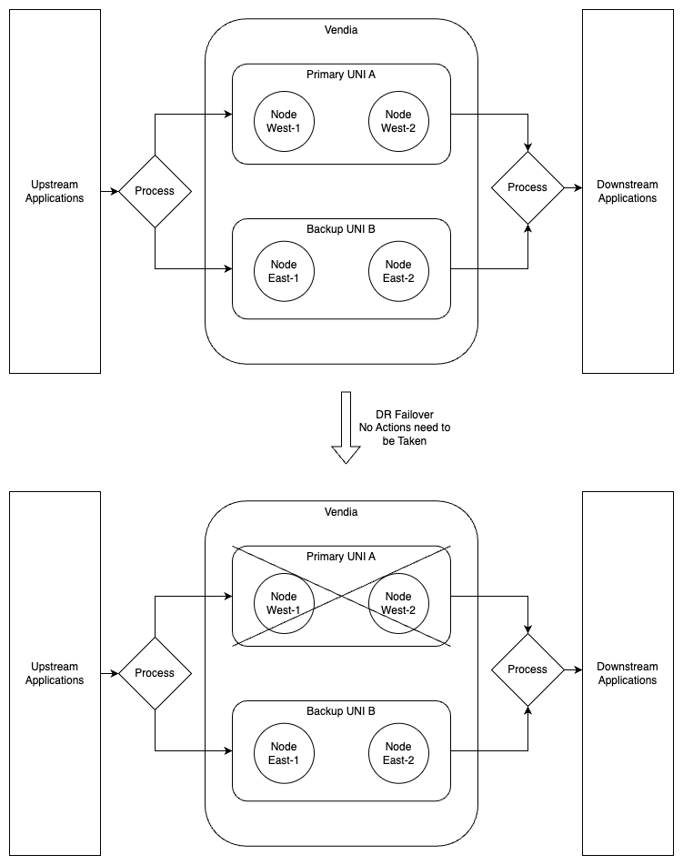

  

# Vendia Share DR Mitigation Options

## Purpose
This is a guide to talk about potential options to further mitigate DR incidents.

# Introduction
This document provides an overview of best practices when building on Vendia Share to ensure the architecture is resilient in the face of outages or other unplanned disasters.

Vendia is also continuously expanding its product offering to offer alternative Disaster Recovery ("DR") and Resilience features.

AWS experienced a total outage on June 13, 2023 in their east region. The outage impacted Vendia Share. While Vendia works on its high availability feature, we came up with a DR plan to mitigate future outages before our multi-region resilience feature becomes generally available. We are taking the extra step to help mitigate the issue if our customer has a higher need of the currently offered 99.99% availability SLA.

# Current Availability

Vendia Share comes with built-in availability that is standard as part of any customer’s setup on the platform.  

Below is a summary of key availability resiliency objectives and what is offered as part of Vendia Share.

* Recovery Point Objective (RPO) - maximum acceptable age for your backups.
* Recovery Time Objective (RTO) - maximum acceptable amount of time from when a disaster occurs until operations are restored.

These objectives are taken into consideration before applying additional changes to expand DR mitigation methods.

For Enterprise accounts, Vendia offers 99.9% SLA based on the SLAs guaranteed by the platform’s underlying cloud service provider(s). 

Before implementing any of the recommeded "DR" best practices, below are some key metrics to remember when choosing the appropriate architectural paths for building additional resiliency and recovery scenarios: :
* Recovery from any AWS-based region outage is expected to be around 30 minutes
* AWS already has an extensive data backup process under the hood.

Below are the set of guiding questions to ask of yourself when implementing a resilient architecture to establish proper requirements:
* How much time is allowed for recovery?
* Will the recovery process be greater than 30 minutes?
* How much data can be lost in extreme cases during downtimes?
* Are the  cost and effort in setting up additional DR processes and architectures recommended for certain outcomes given the existing standard "DR" SLAs?

# Types of Setups
The below are a series of recommended architectural setups for expanded resiliency and recovery.

## Backup Node
This is a unique approach to Vendia’s architecture. The idea is to create a backup node for each involved participant in a different region. **This approach does not provide full functionality in case of a DR. But rather, it will allow continued read capability during an incident**. 

For instance, say we have Uni A with 2 nodes:
* "west", in AWS west-1 region
* "east", in AWS east-1 region

We then create 2 additional nodes as their backups: 

* "west-2", in AWS west-2 region 
* "east-2", inAWS east-2 region

In this scenario, we can then have 2 backup nodes to failover to if west-1 and east-1 regions are off the grid. 

The setup will look something like this:

The pros:
* Everything is within 1 uni. No need to worry about managing another uni
* Easy to set up. You just have to ensure that each backup node has the same access as its primary. And others have the same access to the backup node as the primary node
* Ledgers will eventually be in sync after affected regions recover
* Entities will preserve the same id
* Nodes will have "local" read and write in-tact to see data added by the same node using async or node_committed syncModes

The cons:
* There could be potentially a performance hit when too many nodes are being added
* Uni ledged mutations will fail until affected regions recover, meaning write mutations are not available to other nodes in the uniduring DR
* There could be a period of catch-up to ledger all queued mutations after recovery
* Distance between the nodes could potentially cause performance impact

This approach can be implemented alone, or in parallel with the other two setups.

## Active-Passive

This is the most popular DR setup in many enterprise teams with different sets of tools they use. 

For Vendia, it will require 2 separate UNIs: 
* One active uni as "production active" that will be used as part of the production application. 
* A second uni will be used as a backup UNI if the active one goes down due to a disaster event. 

The key is to ensure the nodes in both Unis do not share the same regions to ensure functionality during a downtime. 

For example, say if we have 
* Uni A with 2 nodes in regions as: 
  * "west-1" 
  * "west-2"
* Uni B, also with 2 nodes in any region other than west-1 and west 2, i.e: 
  * "east-1" 
  * "east-2" 

With this setup we can ensure if the west-1 and west-2 regions are down, the backup Uni will still work. 

The setup will look something like this:

The pros:

* Easy to set up. Any ACL can almost be copy and pasted to the backup node
* No performance impact to the primary Uni when having a backup Uni
* If multiple regions are not affected, it is highly likely the backup Uni will be fully functional

The cons:

* Both Unis will not have identical ledger and Entities will not have the same default IDs in both Unis
* A process must be built to duplicate anything that’s been done to the primary production Uni to also be done to the backup Uni 
* Another failover process is needed to revert back to primary Uni after recovery

## Active-Active

In general, active-active setups means both sides will be used in production. A typical reason for such a setup is so that the environment will never go down and loads will be automatically directed to the other side if one side fails. 

In Vendia’s architecture, this only makes sense if all nodes in each Uni are in different regions. For example, 

* all nodes in Uni A are in the west
* all nodes in Uni B are in the east. 

If it’s required that at least one Uni is always fully functional, with an Active-Active setup, a failover process is not needed.

The pros:

* If setup correctly, there is no failover needed as it should be self-healing
* There won’t be any down time unless both Unis fails
* You can load balance your mutations to each Uni to improve performance 

The cons:

* It is hard to set up
* If both are being used as primary, extra steps must be taken to ensure you are reading the right Uni
* If load balancing is not used carefully, it could be a problem when recovering a from an incident

* Conclusion
DRs scenarios are bound to happen, even in the most available environments. With a multi-region setup, Vendia offers unique opportunities to further expand resilience and recovery scenarios to increase availability beyond that which the cloud service providers can offer.It’s important to remember that with any architecture, there is no silver bullet to fully reduce exposure to DR events, but only minimize the occurrence and impact. 

Before deciding on which setup to pick, it’s important to first establish the requirements by **ensuring the RTO and RPO is defined first.**

For questions or assistance in setting up Vendia Share architecture best practices, please do not hesitate to reach out to the team at solutions@vendia.com. 

# Additional Resources

* https://www.vendia.com/legal/share-service-level-agreement/