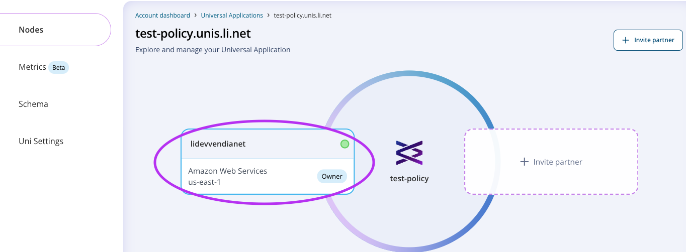
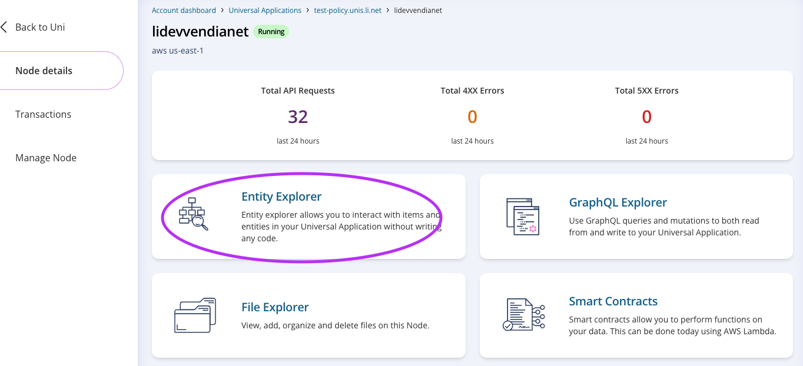
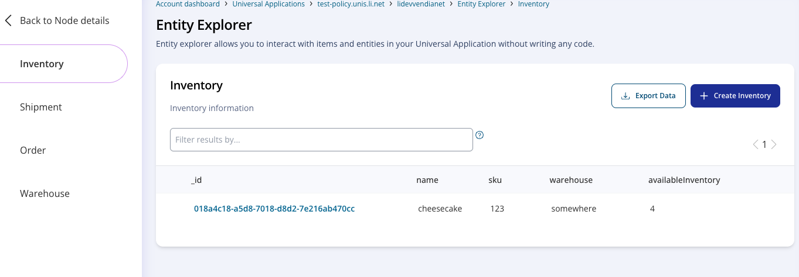
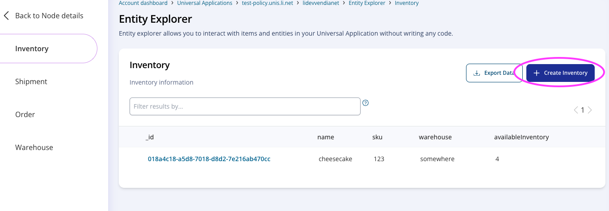
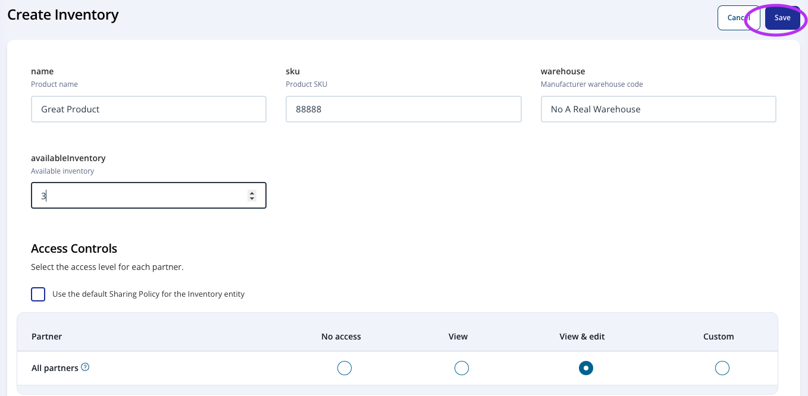
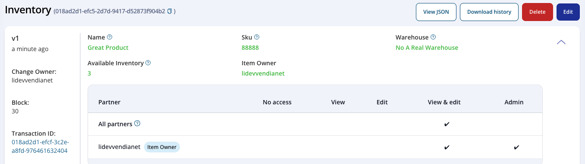
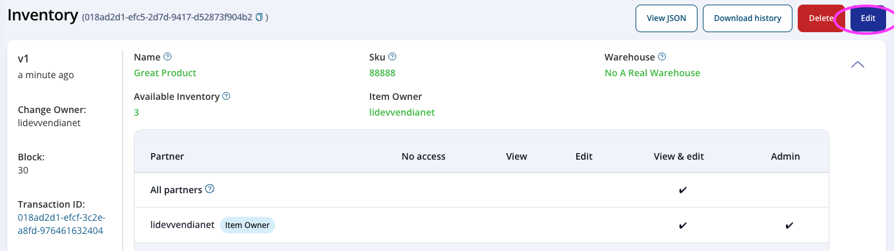
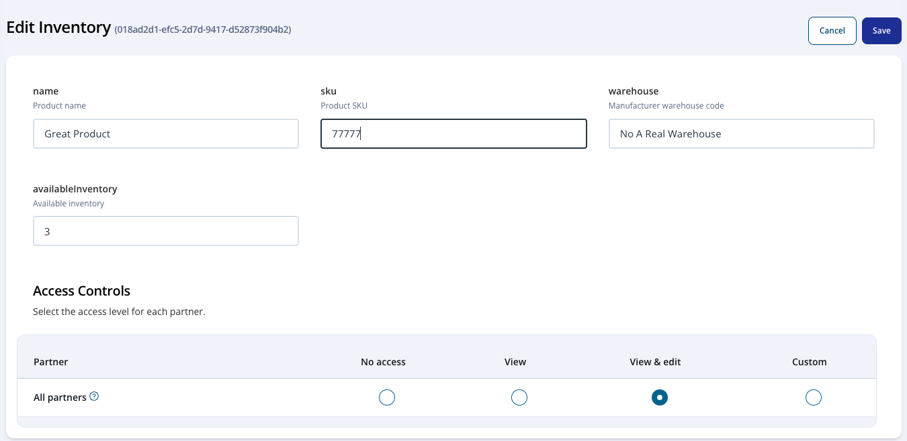
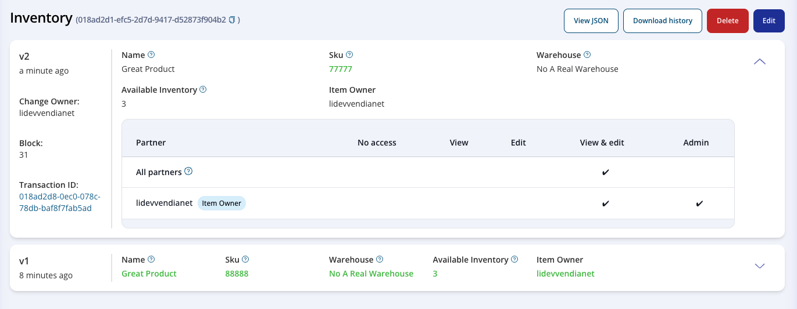
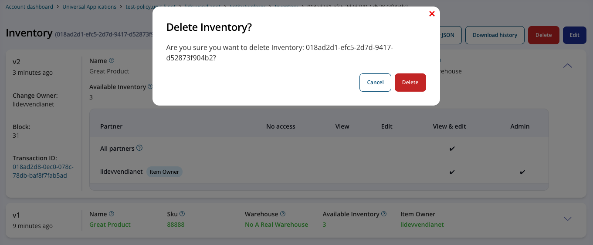

  

# Vendia Share Entity Explorer

## Purpose
This is a guide is for new users to get familiar with Entity Explorer on Vendia Share. Entity Explorer is the UI tool that allows users to perform data actions with no code.

# Prerequisites
* Vendia Share Account
* Previously Created Uni
* Access to at least 1 node to the Uni

## Location
Entity Explorer is located at the top level of your node.
1. From your Account Dashboard, choose the uni of your choice.

2. From the Uni Dashboard, Choose your Node.

3. Finally, you can choose Entity Explorer on your node level UI. 

4. Depending on your Data Model, your entity explorer would look like this: 

## Add Entity

1. Choose the entity type you would like to add and click on the top right create button. 

2. Depending on the schema you defined, the fields might differ. Fill in the needed fields. If needed, you can choose the level of access for other Nodes as needed. Once done, click on Save.

3. Once done, you’ll see the entity was added.

## Update Entity

1. Go to the entity you would like to update and click on Edit.

2. Change any field you’d like. In my case, I changed sku to 77777. Then click Save.

3. You will then see the data was updated. Along with the current data, the entity will also show you all previous versions.

## Delete Entity
Lastly, to delete an entity.

1. Go to the entity you would like to delete on the UI and click Delete on top right. You’ll get a prompt for confirmation.

2. Confirm Deletion and your entity will be deleted.

**IMPORTANT*** Entity deletion does not wipe it out from our ledger as ledgers are immutable. If you are looking for complete erasure of the data, look into Vendia Share Erasure feature.

# Additional Resources

* https://docs.vendia.com/share/erasure
* https://docs.vendia.com/share/graphql