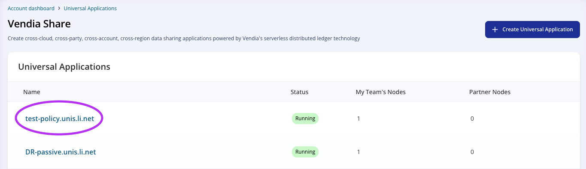

  

# Vendia Share Entity Explorer

## Purpose
This is a guide is for new users to get familiar with Entity Explorer on Vendia Share. Entity Explorer is the UI tool that allows users to perform data actions with no code.

# Prerequisites
* Vendia Share Account
* Previously Created Uni
* Access to at least 1 node to the Uni

## Location
Entity Explorer is located at the top level of your node.
1. From your Account Dashboard, choose the Uni of your choice.

2. From the Uni Dashboard, choose your Node.

3. Choose `Entity Explorer` from your node's UI. 

## Add Entity

1. Choose the entity you would like to add. Then click `Create`. 

2. Fill in the fields. Then click `Save`. 

## Update Entity

1. Go to the entity you would like to update. Then click `Edit`.

2. Change any field you’d like. In my case, I changed sku to 77777. Then click `Save`.

3. After updating an entity, you can view all previous versions.

## Delete Entity

1. Go to the entity you would like to delete. Then click `Delete`.

**IMPORTANT*** Entity deletion does not wipe it out from our ledger as ledgers are immutable. If you are looking for complete erasure of the data, look into Vendia Share Erasure feature.

# Additional Resources

* https://docs.vendia.com/share/erasure
* https://docs.vendia.com/share/graphql