<p align="center">
  <a href="https://vendia.net/">
    
  </a>
</p>


# Vendia Share Entity Explorer


## Purpose
This is a guide is to walkthrough how to use Vendia File API. It is an alternative way to upload files to Vendia Files.

# Prerequisites
* Vendia Share Account
* Access to a node within an active Uni
* Basic AWS knowledge
* AWS S3 access and ability to change S3 policy document
* Completed [Graphql Explorer Guide](../graphql-explorer/README.md) or know where it is
* Completed [File Explorer Guide](../file-explorer/README.md) or know where it is

## Bucket Permission Setting

1. Copy this query and run it in GraphQL explorer:

```
query getNodeAccountInfo {
  getVendia_UniInfo {
    localNodeName
    name
    nodes {
      name
      vendiaAccount {
        accountId
        csp
      }
    }
  }
}
```

2. You will see the account number for all your nodes like below. Copy the account number of the node you plan to add your file for later use.

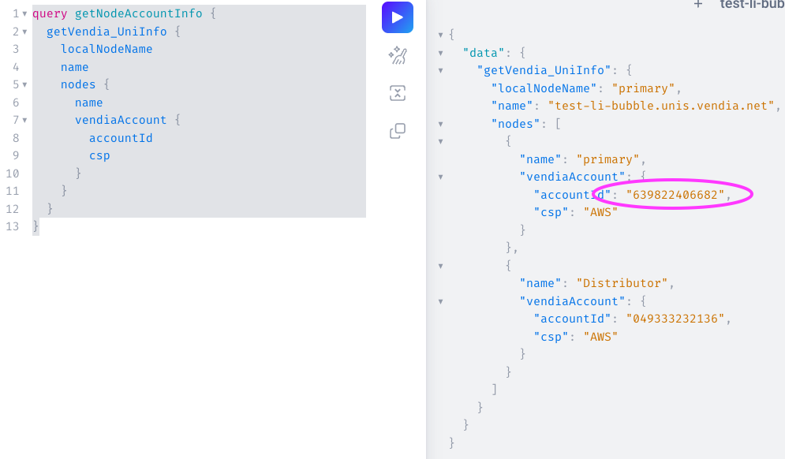

3. Go to your AWS account, search for S3.

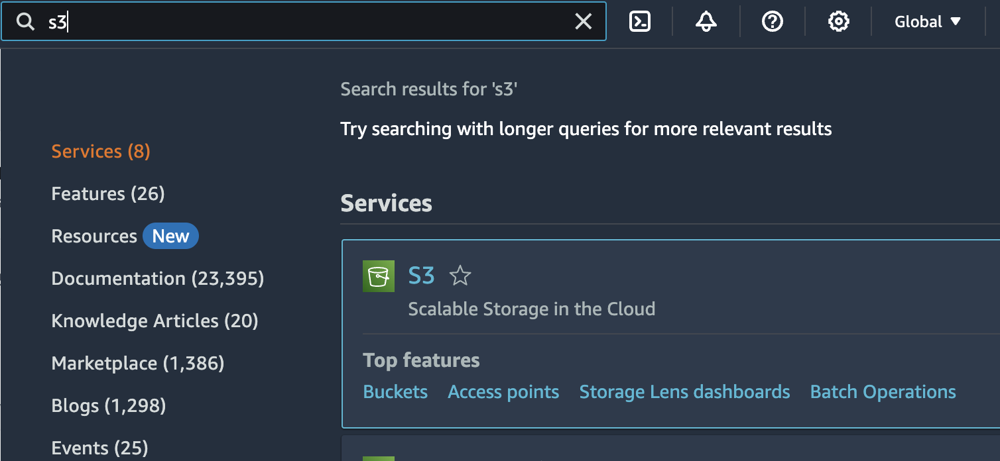

4. Click on `create bucket`

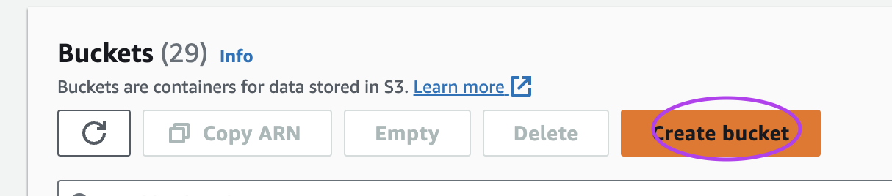

5. Pick the bucket name you desire and choose the region of your preference, leave everything else as default and create the bucket.

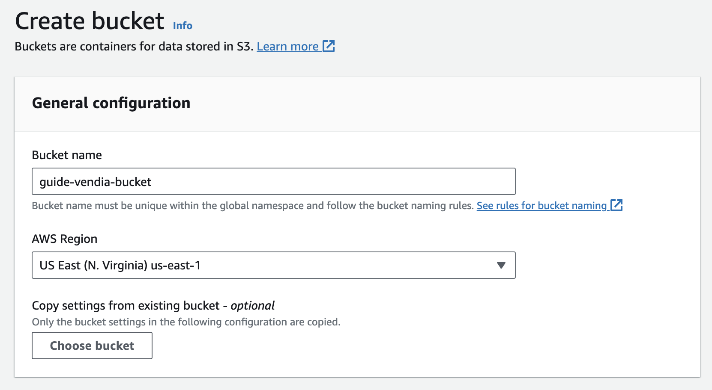

6. Go to your bucket's `Permission tab`, find the `Bucket policy` section and click `Edit`. 

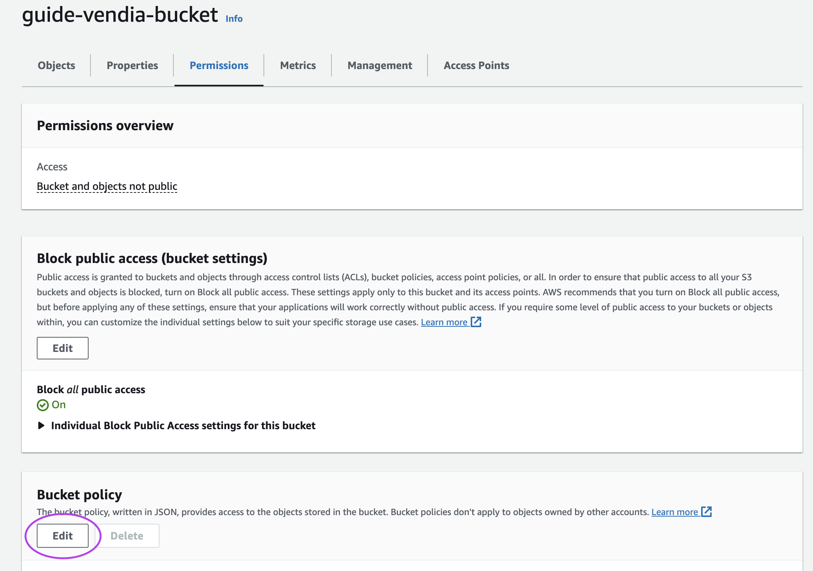

7. Fill in this JSON policy with the info we got:

```
{
  "Version": "2012-10-17",
  "Id": "AllowVendiaToReadFiles",
  "Statement": [{
      "Sid": "AllowBucketInfoRead",
      "Effect": "Allow",
      "Principal": {
        "AWS": "arn:aws:iam::[YOUR NODE ACCOUNT ID]:root"
      },
      "Action": [
        "s3:GetBucketLocation",
        "s3:GetBucketVersioning"
      ],
      "Resource": "arn:aws:s3:::your-bucket-name-here"
    },
    {
      "Sid": "AllowObjectRead",
      "Effect": "Allow",
      "Principal": {
        "AWS": "arn:aws:iam::[YOUR NODE ACCOUNT ID]:root"
      },
      "Action": [
        "s3:GetObject",
        "s3:GetObjectVersion"
      ],
      "Resource": "arn:aws:s3:::your-bucket-name-here/*"
    }
  ]
}
```

8. After filled it in, paste the result into the policy editor and click `Save changes`.

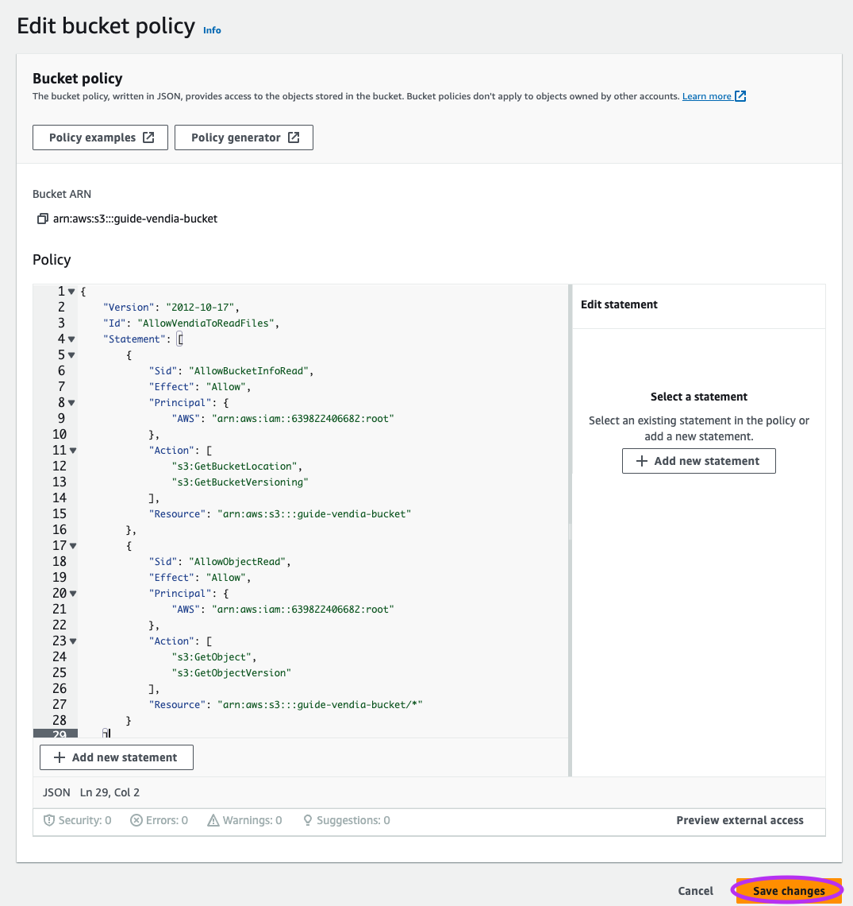

Now you are ready to add file through Graphql API.

## Add File Through API

1. Go to your bucket's `Objects`` tab and click `Upload`.

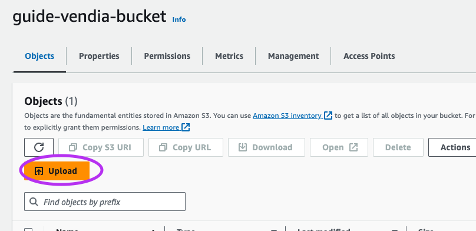

2. Drag any file you'd like to upload to Vendia File through API. And click `Upload`.

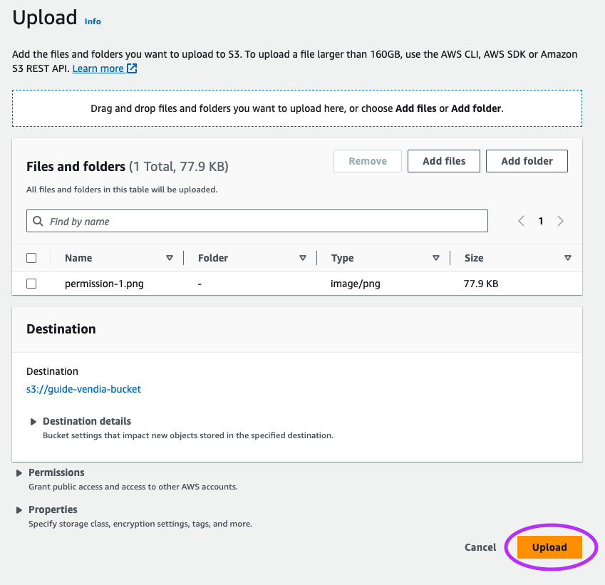

3. Observe your bucket and confirm the file is indeed uploaded to the bucket.

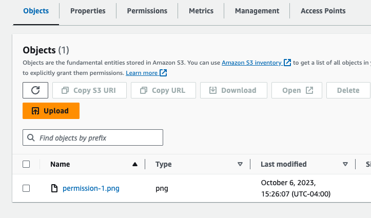

4. Fill in this GraphQL mutation:

```
mutation NewLandscapePhoto {
  addVendia_File(
    input: {
      sourceBucket: "your-bucket-name-here",
      sourceKey: "your-file-name-inthe-bucket",
      sourceRegion: "your-bucket-region",
      destinationKey: "your-file-name-in-Vendia"
    },
    syncMode: ASYNC  
  ) {
    transaction {
      _id
      transactionId
    }
  }
}
```

5. Run the completed mutation in your graphql explorer and you should get a success confirmation.

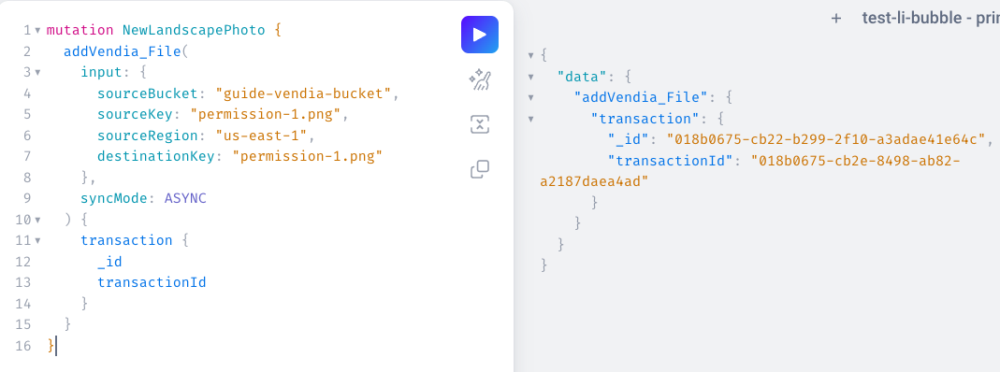

6. Confirm the file is successfully uploaded to Vendia File.

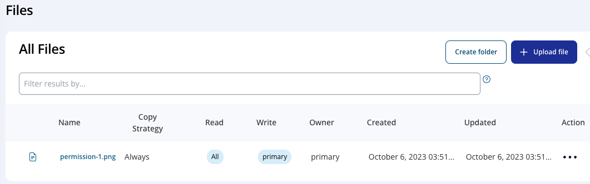

## Add Folder Through API

1. Fill in the mutation below:

```
mutation createFolder {
  addVendia_Folder(
    input: {
      name: "FolderName",
      read: [List of Nodes],
      write: [List of Nodes]
    },
    syncMode: ASYNC
  ) {
    transaction {
      transactionId
    }
  }
}
```

2. Paste the result into `GraphQL explorer`.

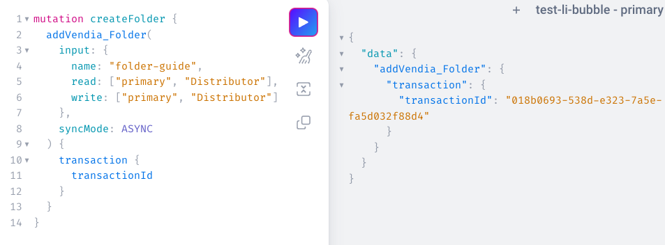

3. Go to `File Explorer` and confirm the folder is indeed created.

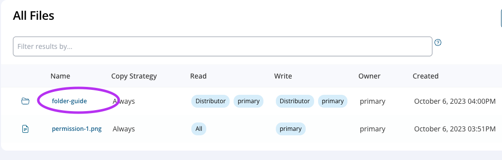

## Add File To A Folder Through API

1. Ensure the folder we created is empty.

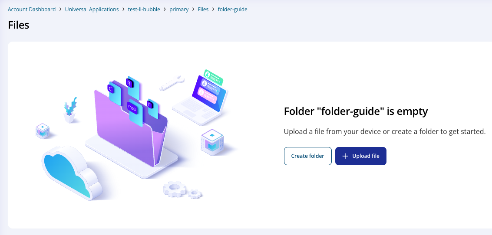


2. Fill in the mutation below:

```
mutation addFileToFolder {
  addVendia_File(
    input: {
      sourceBucket: "<bucket>",
      sourceKey: "<key>",
      sourceRegion: "<region>",
      destinationKey: "my-folder-name/<destination key>"
    },
    syncMode: ASYNC
  ) { transaction { _id } }
}
```

3. Run it inside `GraphQL Explorer`.

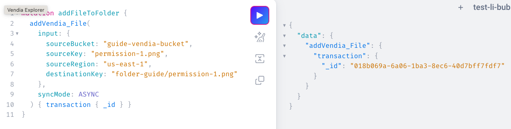

4. Go back to the folder we created and ensure we successfully loaded the file into the folder.

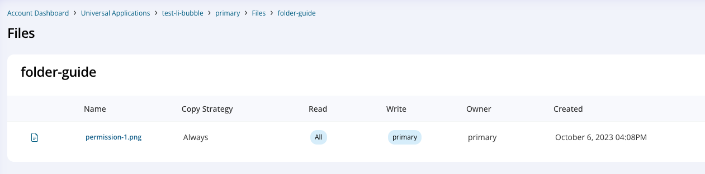

# Additional Resources

* https://docs.vendia.com/share/file-api
* https://docs.vendia.com/share/folder-api