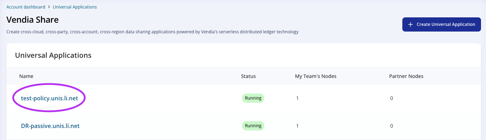
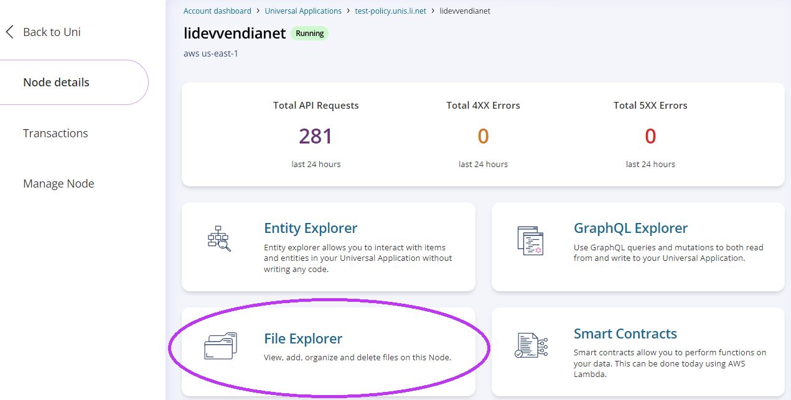
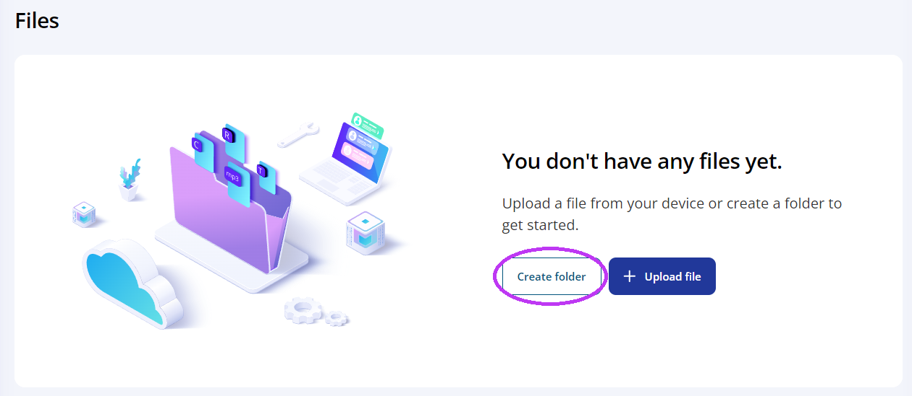
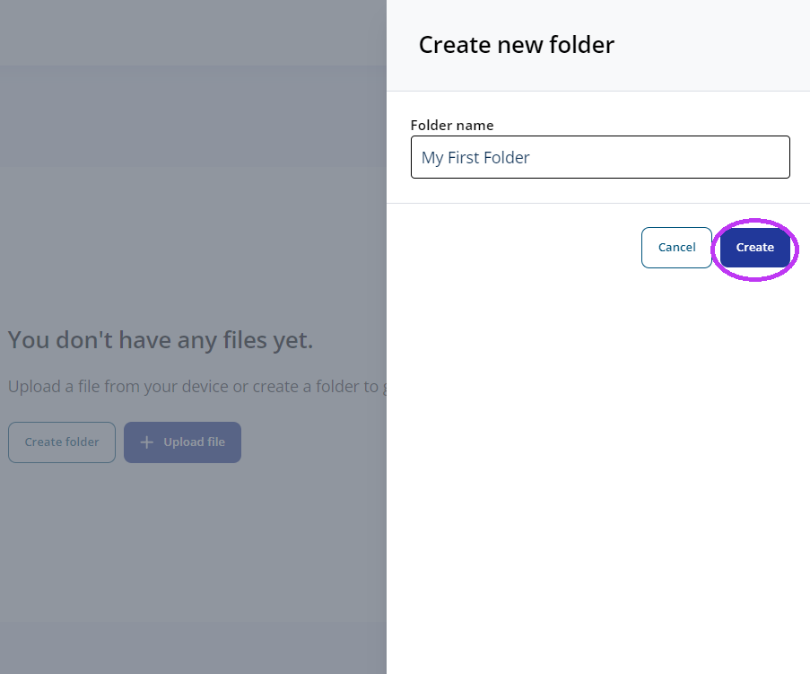
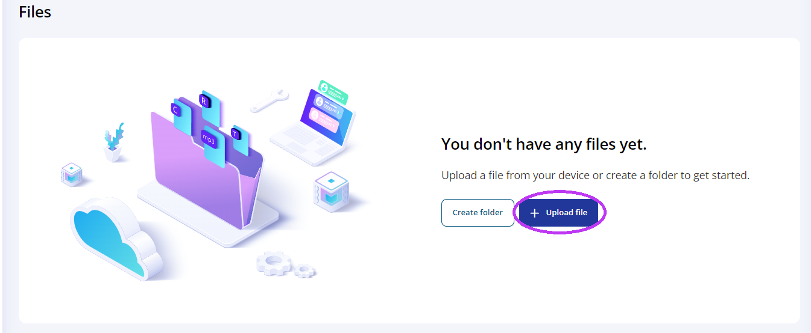
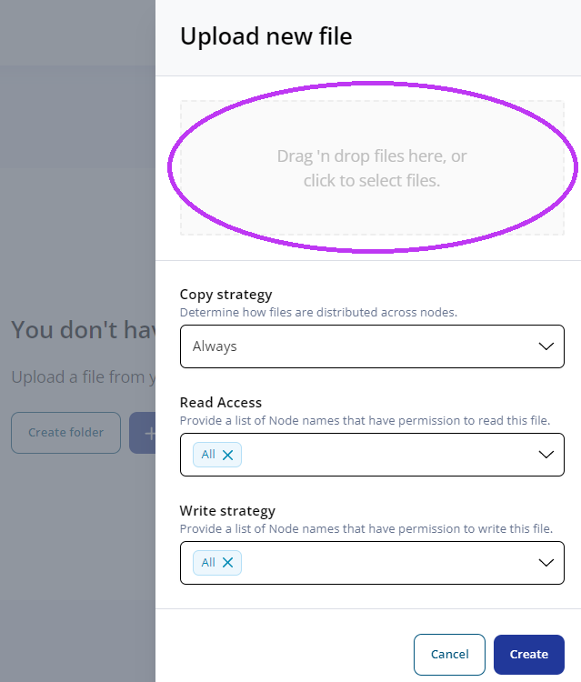
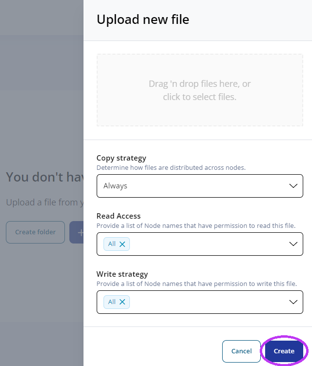

  

# Vendia Share File Explorer

## Purpose
This is a guide is for new users to get familiar with sharing files  on Vendia Share. File Explorer is the UI tool that allows users to store and share files.

# Prerequisites
* Vendia Share Account
* Previously Created Uni
* Access to at least 1 node to the Uni

## Location
File Explorer is located at the top level of your node.
1. From your Account Dashboard, choose the uni of your choice.

2. From the Uni Dashboard, Choose your Node.

3. Finally, you can choose File Explorer on your node level UI. 

## Create Folder

1. Select Create folder. 

2. In the textfield, give your folder a unique name, then select Create.

## Upload File

1. Select Upload file

2. To choose what file you want to upload, you can either click the zone inside the circle or drag your file into the zone.

3. After choosing a file, select Create.

# Additional Resources

* https://docs.vendia.com/share/file-storage