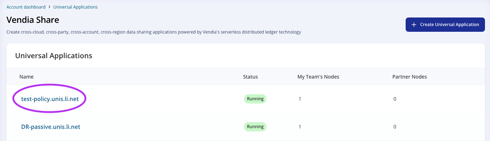
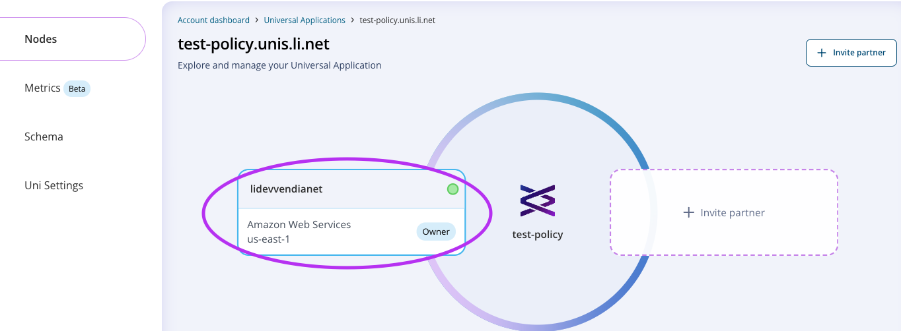
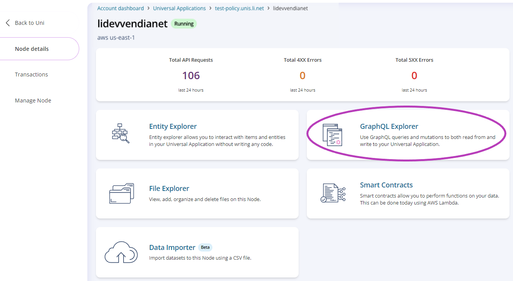
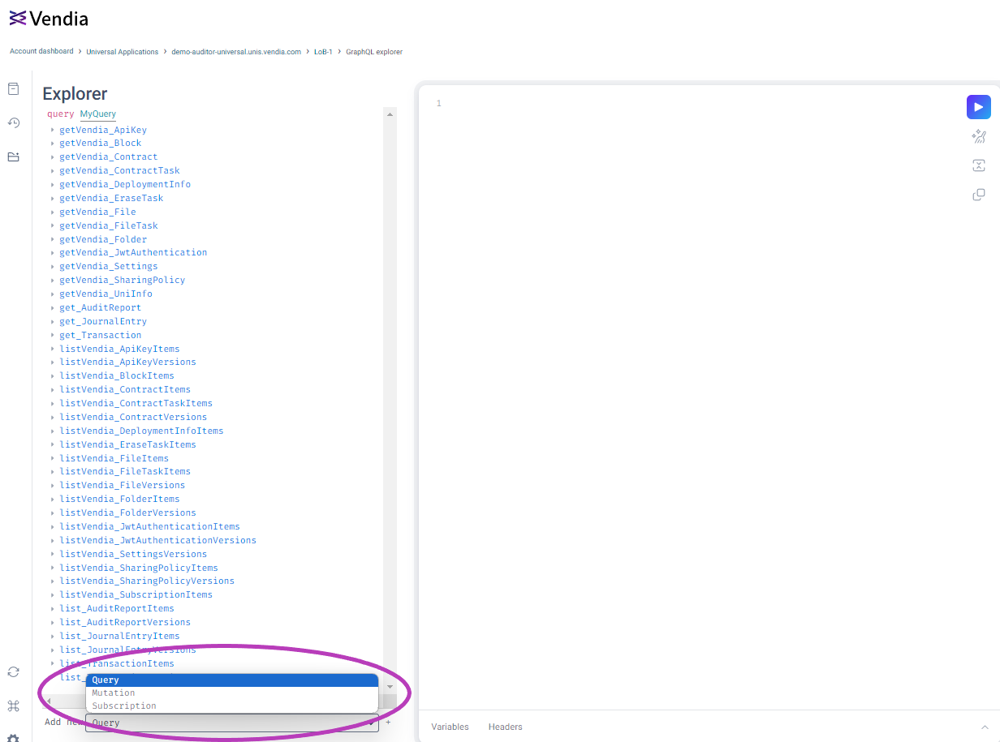
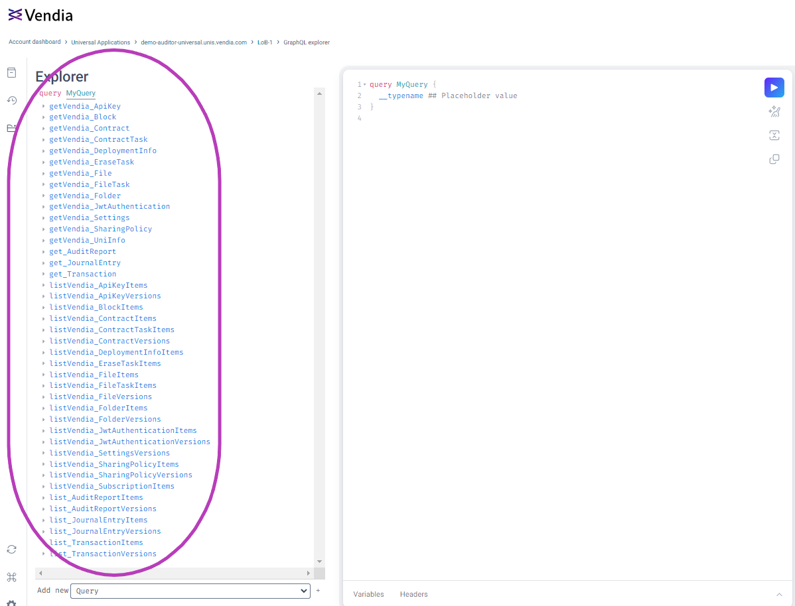
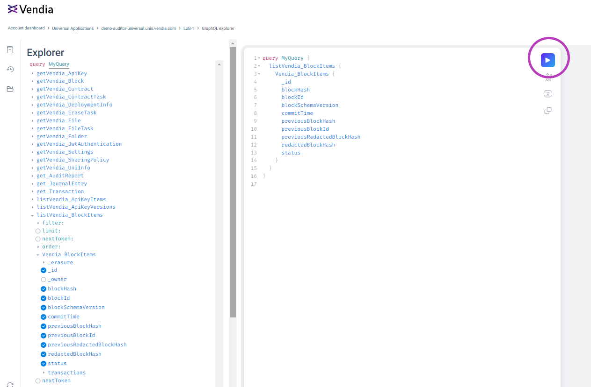
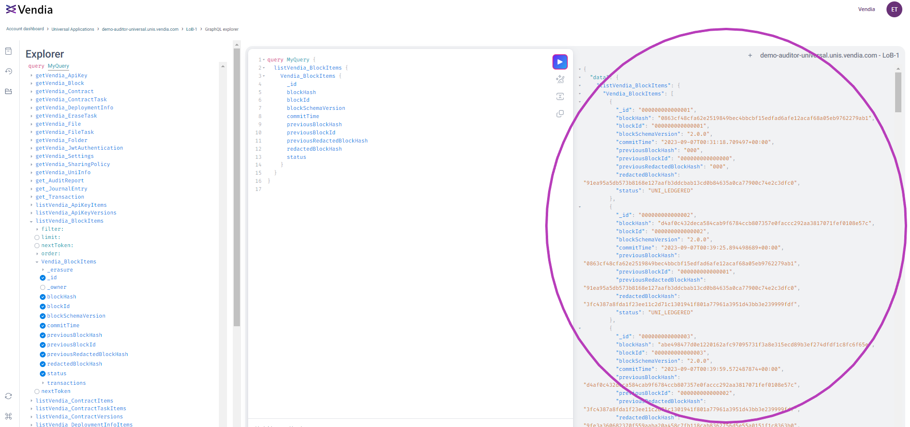

  

# Vendia Share GraphQL Explorer

## Purpose
This is a guide is for new users to get familiar with the GraphQL Explorer on Vendia Share. The GraphQL Explorer is a UI tool that helps you structure and make GraphQL queries and mutations.

# Prerequisites
* Vendia Share Account
* Previously Created Uni
* Access to at least 1 node to the Uni

## Location
GraphQL Explorer is located at the top level of your node.
1. From your Account Dashboard, choose the Uni of your choice.

2. From the Uni Dashboard, choose your Node.

3. Choose `GraphQL Explorer` from your node's UI. 

## Choose between query/mutation

1. To choose between a query (read) or a mutation (write), go to the bottom left and click the dropdown menu.

## Select a query/mutation 

1. To select a specific query/mutation, go to the explorer on the left and click a list item, from there, fill out the fields.

## Execute a query/mutation 

1. To execute a query/mutation, click the play button in the center panel.

## View output 

1. To view the output of your query/mutation, view the right panel.

# Additional Resources

* https://docs.vendia.com/share/graphql