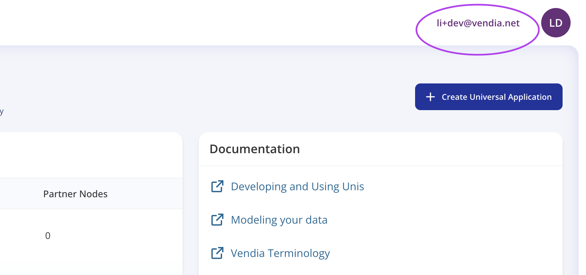
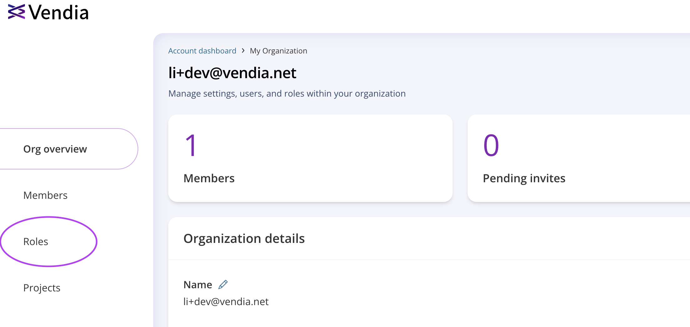
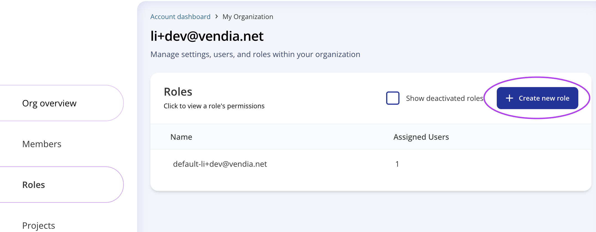
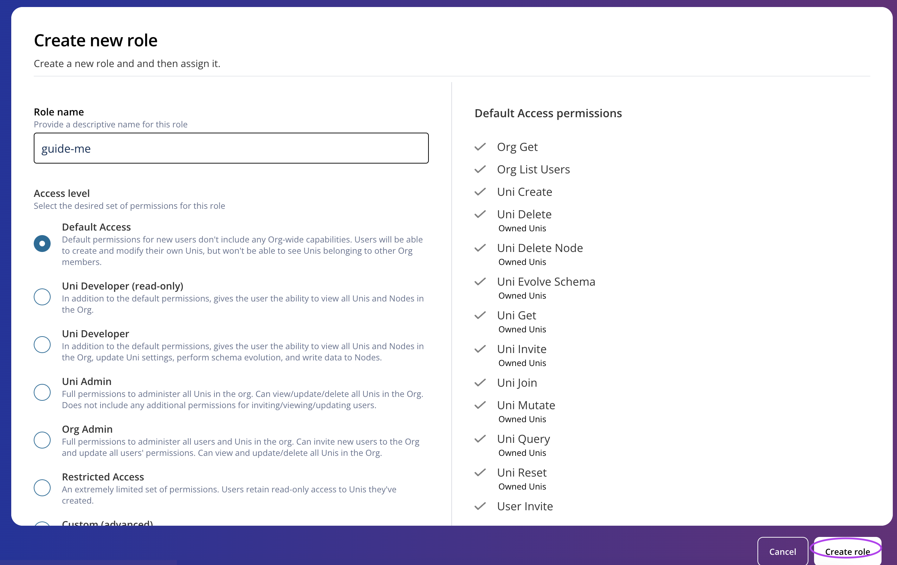
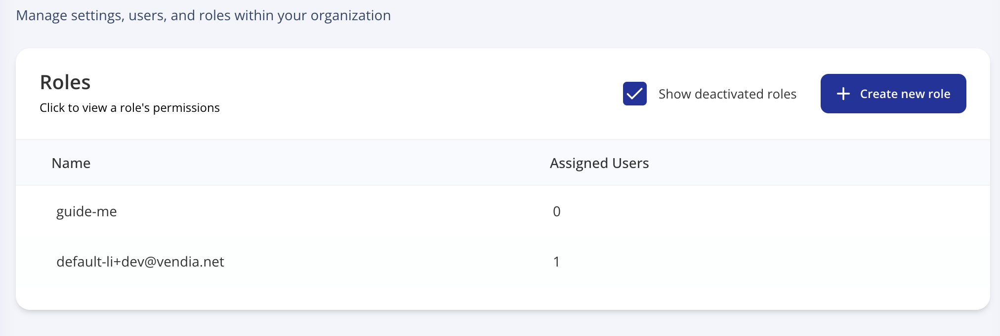
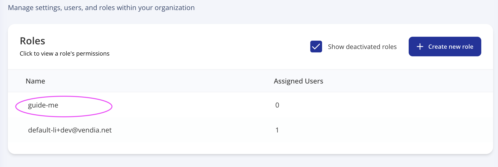
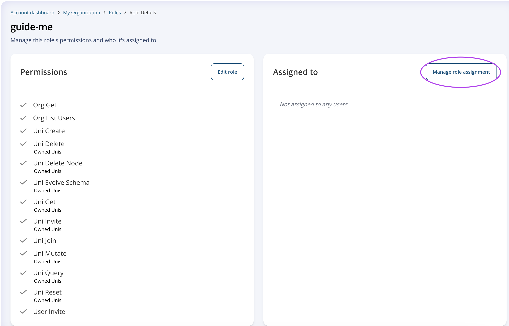
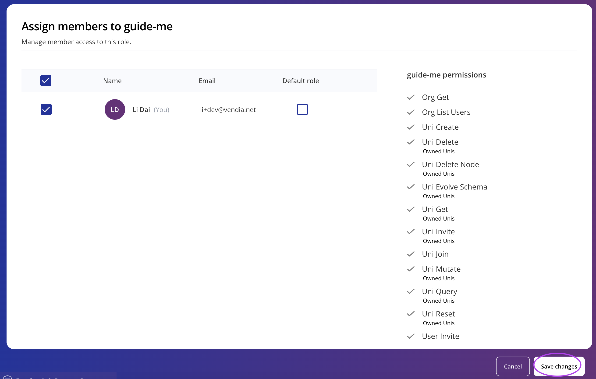
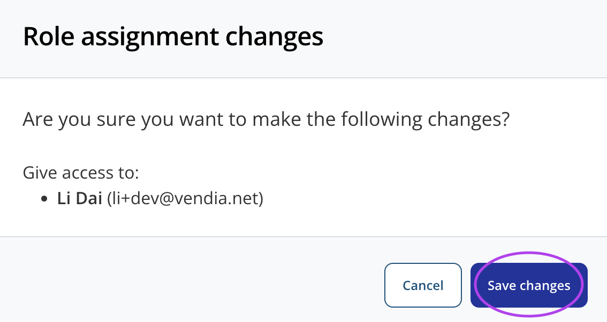
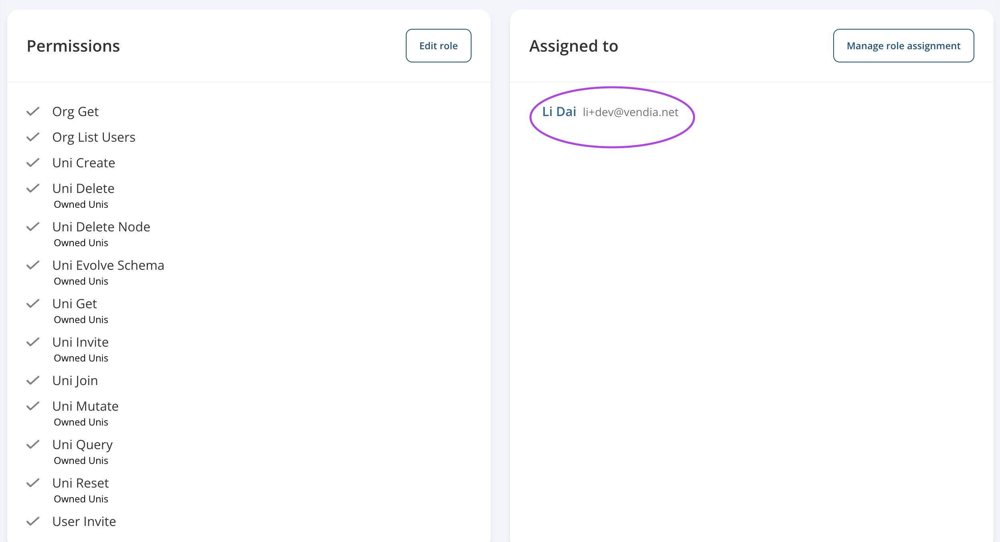

  

# Vendia Share RBAC Basics

## Purpose
This is a guide to show the basics of Vendia Share RBAC system. 

# Prerequisites
* Vendia Share Account
* Org Admin Access on Vendia Share

## Create a role
1. Sign in and go to your Uni Dashboard here: https://share.vendia.net/uni

2. Click at top right on your own username.

3. It will birng you to your organization dashboard. Go to Roles tab.

4. You can see a list of your available roles depending on your access. Then click on `+ Create new role`

5. You can choose the access level needed for this role. Ensure you read through the access included in the templates. For the purpose of this guide, we will choose `Default Access`. Customized Access is not covered in this guide. Click `Create role` to have the role created.

6. Lastly, you will see your new role created under the roles tab.
   

## Assign a role
1. Go to your roles tab. Click on the role name you want to assign to a member.
   

2. Click on `Manage role assignment`

3. Mark the check box of the users you would like to have this role and then click `Save changes`.

4. When prompted, click `Save changes`.

5. Finally, you will see any member who's been assigned this role under the role itself.

## What's Next?
RBAC is much more than just the steps above. The most complicated piece of RBAC is to create and assign proper roles to your members. Check out our additional resources for more details on how the access works in RBAC and other security features Vendia offers.

# Additional Resources

* https://docs.vendia.com/share/rbac
* https://docs.vendia.com/share/fine-grained-data-permissions
