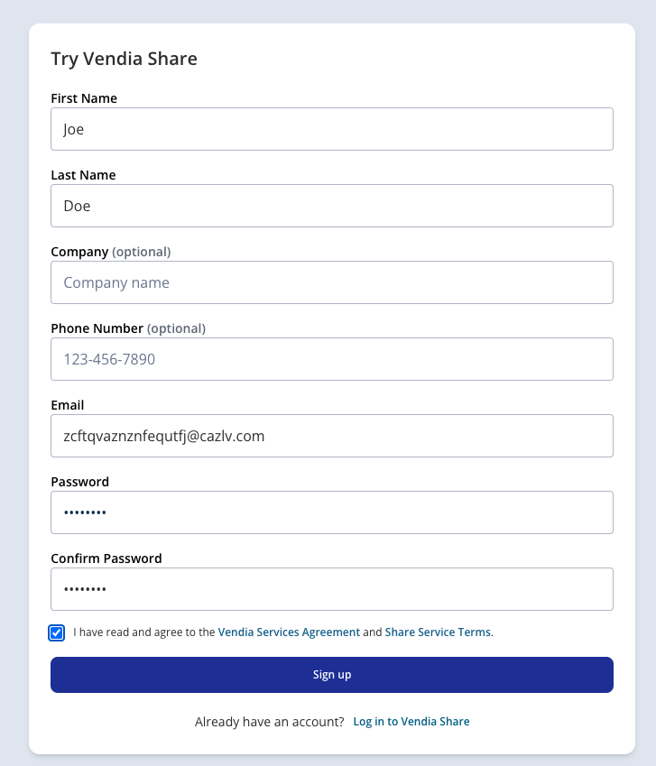
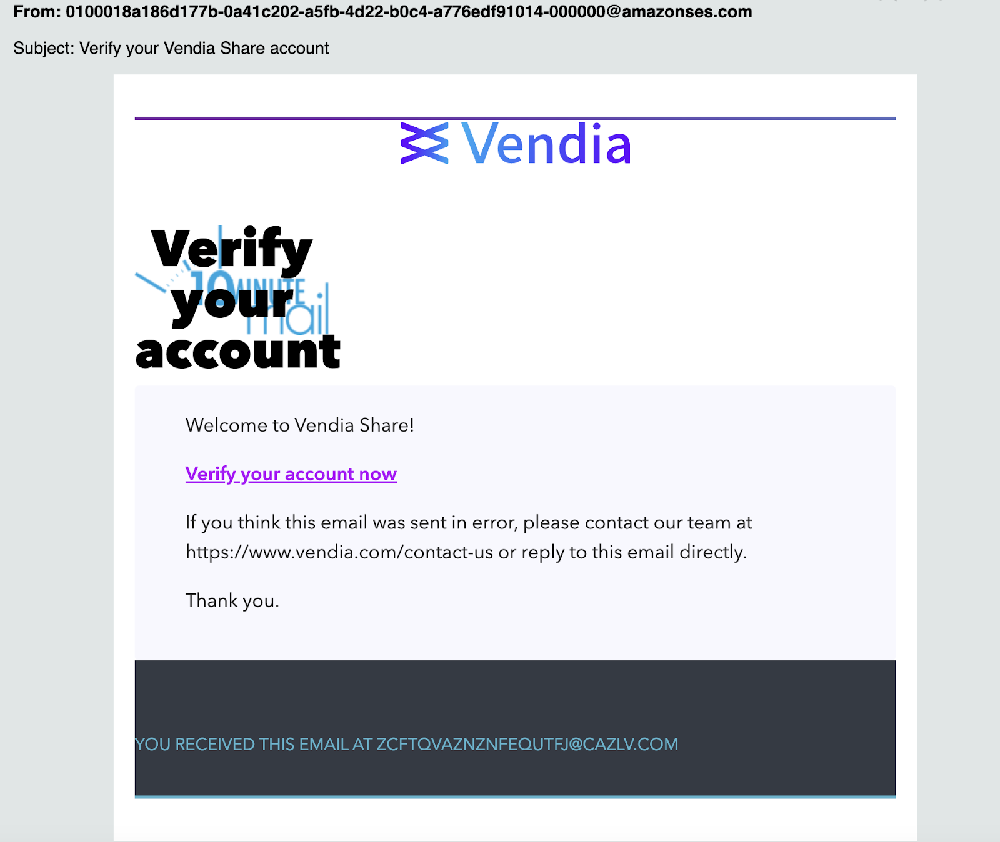
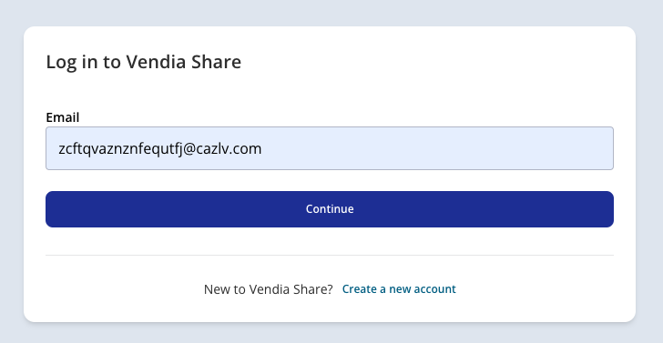
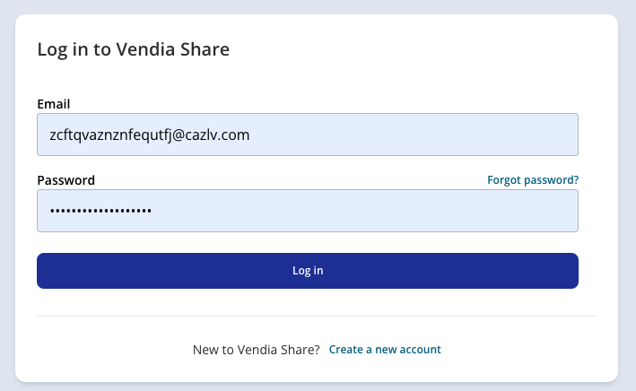
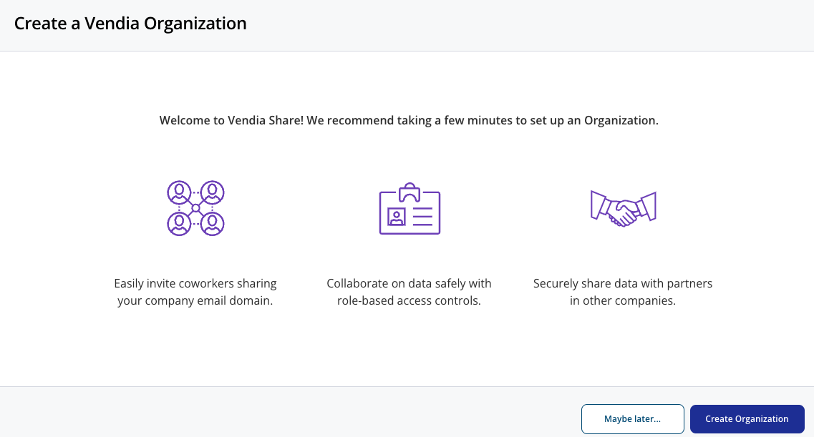
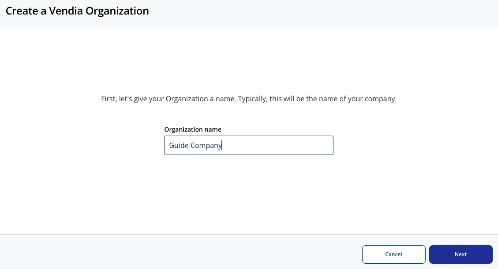
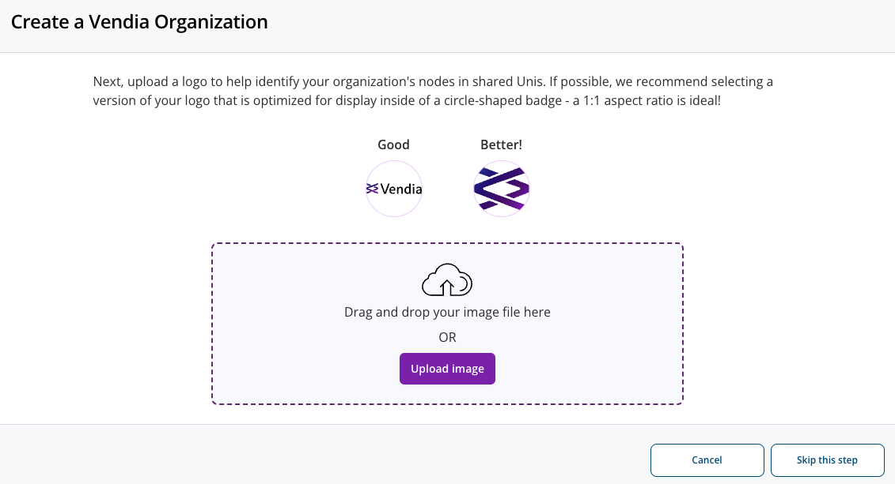
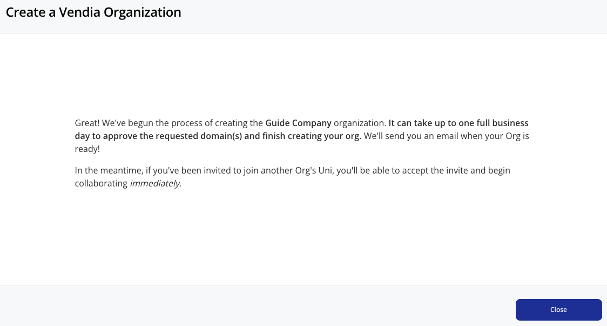

  

# Vendia Share Registration & Organization Creation

## Purpose
This is a guide on how to register Vendia Share, sign in, & create organization on Vendia.

# Prerequisites
* Active company e-mail account
* Modern Browser
* Internet Access

## Registration
1. Go to: https://share.vendia.net/signup

2. Fill out all required fields. To onboard as an enterprise customer with a custom namespace, please register with your company email. I.e. @gmail.com @yahoo.com cannot be used to enable custom namespace.

3. You will receive a verification email. If you don’t see it in your inbox, ensure to check your spam folder in case it was accidentally marked as spam. Below is a sample of the e-mail.

4. Once verified. Your sign up is completed.

## Sign In

1. Go to: https://share.vendia.net/login

2. Enter your email address and click continue.

3. Enter your password and click Log in.

4. You are in!

## Organization Creation

1. Upon your first login, you’ll be prompted to create a Vendia Organization to enable you to control your members' access. This prompt is only available if the domain of the account email was never registered and a Vendia Organization was never created before.

2. Go ahead and enter your organization name and a logo if you’d like.

3. You will then be prompted with the below confirmation page.

4. You are done. Please allow our team some time to enable it for you. We’ll follow up with an email once completed.

**Note:
If you canceled the organization creation step on your first login, you can restart the process by going to your account page at top right.**

# Additional Resources

* https://docs.vendia.com/share/rbac