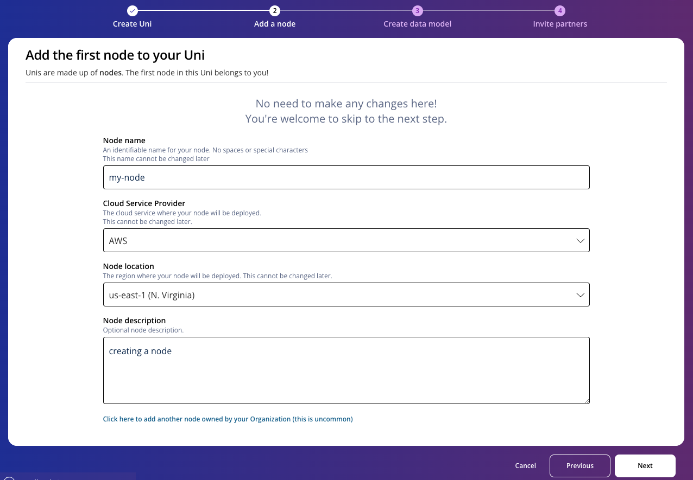
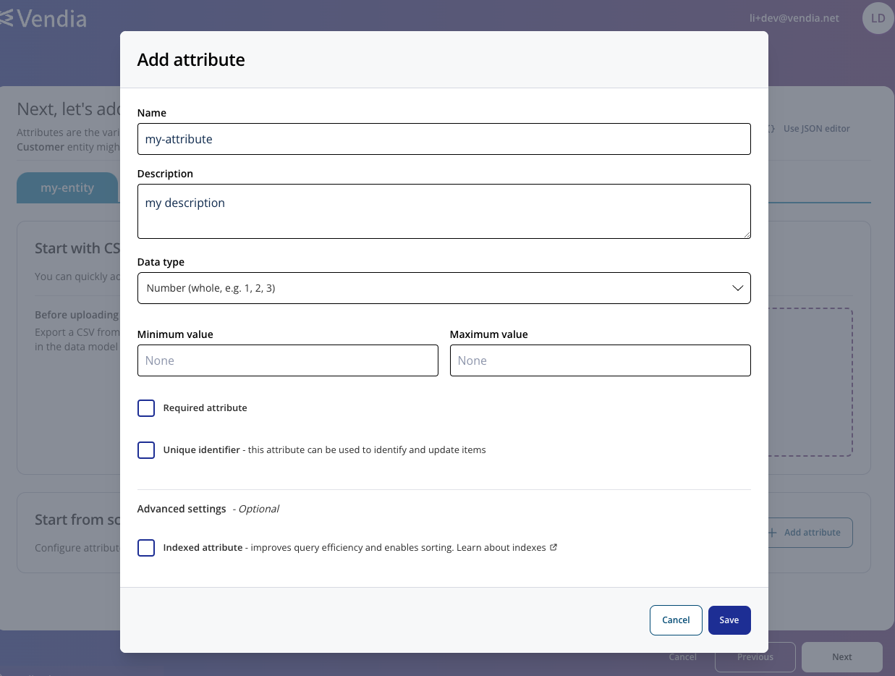

  

# Vendia Share Uni Creation

## Purpose
This is a guide on how to quickly create a Uni on Vendia Share UI.

# Prerequisites
* Vendia Share Account
* Basic access to Uni creation in your custom namespace

## Quick Start
1. Sign in and go to your Uni Dashboard here: https://share.vendia.net/uni

2. Click on top right `+ Create Universal Application`

3. Enter your Uni name and choose the namespace of your choice. Then click `Next`.

4. Enter your leader node's name and choose the desired cloud provider and region. Then click `Next`.

5. For a quick start session, choose any of the pre-set templates at the bottom. Our example chose `Track and Trace`. Then click `Next`.

6. You can see the schema of the preset template you chose. No need to make changes and click `Next`.

7. You'll have a choice whether or not invite your partner at the creation of the Uni. For a quick start guide, that's not needed. Click `Finish`.

8. You now have a live Uni! Wait for around 5 minutes for everything to get spun up.

## Custom Schema Designer

1. Sign in and go to your Uni Dashboard here: https://share.vendia.net/uni

2. Click on top right `+ Create Universal Application`

3. Enter your Uni name and choose the namespace of your choice. Then click `Next`.

4. Enter your leader node's name and choose the desired cloud provider and region. Then click `Next`.

5. For a quick start session, choose any of the pre-set templates at the bottom. Our example chose `Track and Trace`. Then click `Next`.

6. Unlike quick start, you'll have an empty data model where you are expected to add any schema entities you desire. Click `Add entity` to add our first entity in our schema.

7. There will be a pop up. Enter your entity name and click `Save`.

8. If you have a sample csv file, feel free to try out the auto creation feature. For the purpose of this guide, we will add an simple attribute. Click on `Add attribute` inside the `Start from scratch` box.

9. You'll get a pop up to set your attribute. For simplicity of this guide, we chose a number as our data type. click `Save` once ready.

10. you should see your attributed added. Add any other attributes you'd like to test out different options. Once ready, click `Next`.

11. You'll have a choice whether or not invite your partner at the creation of the Uni. For a quick start guide, that's not needed. Click `Finish`.

12. You now have a live Uni! Wait for around 5 minutes for everything to get spun up.

## JSON Editor

You can also skip all the UIs and create a Uni using JSON Editor. But that requries JSON and JSON schema knowledge. You can get familiar with that using our [data model workshop](../../workshops/data-modeling/README.md). Once you have your JSON schema ready, you can simply paste it in the editor and click `Finish`.

## What's Next?
It's time to look into the Uni play around with it. For beginners, follow [Entity Explorer](../entity-explorer/README.md) guide to see how to put data in there manually.

# Additional Resources

* https://docs.vendia.com/share/quickstart
* https://github.com/vendia/examples/blob/main/workshops/data-modeling/README.md