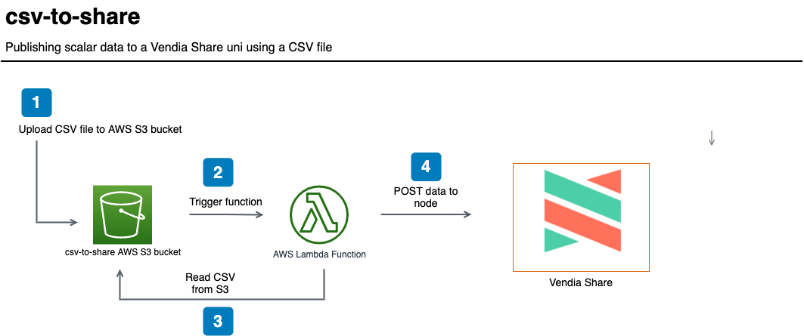

<p align="center">
  <a href="https://vendia.net/">
    
  </a>
</p>

# csv-to-share

This example will demonstrate how to send scalar data from a comma-separated value (CSV) file to a [Vendia Share uni](https://vendia.net/docs/share/dev-and-use-unis).  The point is to illustrate that partners to a uni do not necessarily need to be familiar with GraphQL queries and mutations to put data to a uni - _simple CSVs can work just fine_.

We will deploy the example using the [Vendia Share Command Line Interface (CLI)](https://vendia.net/docs/share/cli) and the [AWS Serverless Application Model (SAM)](https://docs.aws.amazon.com/serverless-application-model/latest/developerguide/what-is-sam.html).  Serverless resources like a [AWS S3](https://aws.amazon.com/s3/) bucket and [AWS Lambda](https://aws.amazon.com/lambda/) function will be deployed.  CSV processing with a AWS Lambda function will be triggered by uploading data to a AWS S3 bucket.  The Lambda function will read through the CSV and publish data to a node's GraphQL endpoint.





# Pre-requisites

* [AWS Serverless Application Model CLI](https://docs.aws.amazon.com/serverless-application-model/latest/developerguide/serverless-sam-cli-install.html)

* [AWS CLI version 2](https://docs.aws.amazon.com/cli/latest/userguide/install-cliv2.html)

* [Docker](https://docs.docker.com/install/)

* [Vendia Share CLI](https://vendia.net/docs/share/cli)

## Clone the Repository

In order to use this example, you'll first need to clone the respository.

### Clone with SSH

```bash
git clone git@github.com:vendia/examples.git
```

### Clone with HTTPS

```bash
git clone https://github.com/vendia/examples.git
```

### Change to the csv-to-share Directory

```bash
cd examples/share/csv-to-share
```

# Deploying the Example Uni

This example will create a simple shared shopping list, not unlike the Vendia Share [Shopping List Quickstart ](https://vendia.net/docs/share/quickstart/shopping-list).  The only differences are the number of parties in the uni and the way that data is populated in the uni.  We will not populate our uni with `initialState` and will, instead, populate our uni with data from [shopping_list.csv](./shopping_list.csv).

If not already logged in to the share service do so by running [`share login`](https://vendia.net/docs/share/cli/commands/login):

```bash
share login
```

The `share uni create` command can be used to deploy our uni.  You will need to copy the file `registration.json.sample` to `registration.json`.  Pick a unique `name` for your uni that begins with `test-` - by default all unis share a common namespace so here is your chance to get creative.  Update the `userId` attribute of each node to reflect your Vendia Share email address.

```bash
cd uni_configuration
share uni create --config registration.json
```

The uni will take approximately 5 minutes to deploy.  We can check on its status in the Vendia Share web application or with the `share` CLI.

**NOTE:** The name of your uni will be different.  Adjust as appropriate.

```bash
share get --uni test-csv-to-share
```

Make note of the **ParentalUnit2** node's graphqlApi `httpsUrl` and `apiKey`.  Our serverless application will interact with **ParentalUnit2** using this information.

Once the uni is deployed we can deploy our serverless application.

# Deploying the Serverless Application

## Build

```bash
cd .. # If you're not already in the root of the csv-to-share example
sam build --use-container
```

## Deploy

Please run the following command for the first deployment of the application.  Save the generated configuration file using the default name *samconfig.toml*.  Use the stack name *csv-to-vendia-share* when prompted.

```bash
sam deploy --guided
```

Enter **csv-to-share** as the stack name.  Specify the same AWS region as **ParentalNode2**.  You will be prompted to enter data for the *ShareNodeUrl* and *ShareNodeApiKey*.  Please use the values from the **ParentalNode2** Vendia Share node.

**NOTE:** The *ShareNodeApiKey* will not be displayed at the input.  This is the intended behavior.

Subsequent deployments can use the command `sam deploy`.  The values stored in *samconfig.toml* will be used.

**NOTE:** The URL of the generated S3 bucket will be listed as an *Output* to our `sam deploy` command.  We will need it when we test our application.

# Testing the Solution

Once the serverless application is deployed, let's verify there is no data stored in our uni.  Execute the following query from the **ParentalUnit2** GraphQL Explorer.

```graphql
query listItems {
  listShoppingLists {
    ShoppingLists {
      id
      item
      quantity
      recommendedLocation
      bought
      timestampAdded
      timestampPurchased
    }
  }
}
```


Let's go ahead and upload our `shopping_list.csv` file to the generated S3 bucket.  Use the `CsvBucket` from our `sam deploy` **Outputs**.

```bash
aws s3 cp ./shopping_list.csv s3://csv-to-share-123456789012-csv-bucket # Update the S3 URL appropriately
```

After the file has been uploaded, you can see the resulting scalar data in your uni. You can also view the CloudWatch logs for the `CsvProcessingFunction` function in order to see the execution details.

Execute the following query from the **ParentalUnit2** GraphQL Explorer.

```graphql
query listItems {
  listShoppingLists {
    ShoppingLists {
      id
      item
      quantity
      recommendedLocation
      bought
      timestampAdded
      timestampPurchased
    }
  }
}
```

It should return the items that were present in `shopping_list.csv`.


Issue the same query against the GraphQL Explorer of **ParentalUnit1**.  You will see the same results.


# Cleaning Up the Solution

Run the `cleanup.sh` script to remove all artifacts related to the solution, including the Vendia Share uni.

```bash
bash cleanup.sh test-csv-to-share --profile AWS_IAM_PROFILE --region AWS_REGION # Replace with proper values
```
