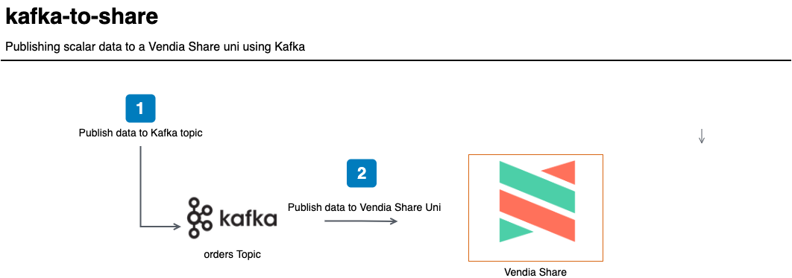

<p align="center">
  <a href="https://vendia.net/">
    
  </a>
</p>

# kafka-to-share

This example will demonstrate how to send scalar data from a [Apache Kafka](https://kafka.apache.org/) topic to a [Vendia Share Uni](https://vendia.net/docs/share/dev-and-use-unis).

Why? Couldn't we just publish data from an application to a Vendia Share Uni directly?

**Absolutely!**

It is possible to use the GraphQL APIs associated with each node of your Uni. However, you may already have an application that is publishing data to Apache Kafka. The purpose of this example is to demonstrate that Vendia Share can plug in to existing systems you may already have deployed in your environment. In our scenario, a **Consignee** is placing an order for goods that should be published to a Uni that is comprised of a **Consignee**, **Shipper**, and **Carrier**. In our scenario, the **Consignee** uses an order system that integrates with Kafka.

We will deploy the example using the [Vendia Share Command Line Interface (CLI)](https://vendia.net/docs/share/cli) along with [Oracle VirtualBox](https://www.virtualbox.org/wiki/Downloads), [Hashicorp Vagrant](https://www.vagrantup.com), and [Ansible](https://www.ansible.com/). Data added to a Kafka topic by a producer will consumed by a consumer that publishes data to a Uni's node.



For this example, we will use a virtual machine that can be deployed to a local computer. The same pattern can be applied to a cloud-hosted virtual machine or on-premise server.

**DISCLAIMER:** The following example uses [Confluent Platform Community Components](https://docs.confluent.io/platform/current/quickstart/cos-quickstart.html) and is used for development environments. Please consult with your security and operations teams to ensure you are conforming to any standards in place set by your organization for your Kafka deployment.

# Pre-requisites

* [Python3](https://www.python.org/download)

* [Docker](https://www.docker.com/products/docker-desktop)

* [Hashicorp Vagrant](https://www.vagrantup.com/downloads)

* [Vendia Share CLI](https://vendia.net/docs/share/cli)

* Ansible (Installed via Pip in the next section automatically)


## Clone the Repository

In order to use this example, you'll first need to clone the respository.

### Clone with SSH

```bash
git clone git@github.com:vendia/examples.git
```

### Clone with HTTPS

```bash
git clone https://github.com/vendia/examples.git
```

### Change to the kafka-to-share Directory

```bash
cd examples/share/kafka-to-share
```

## Installing Python3 Dependencies

```bash
python3 -m venv venv
. ./venv/bin/activate
pip install pip --upgrade
pip install -r requirements.txt
```

# Deploying the Example Uni

This example will create a Uni to store attributes regarding shipments.

If you are not already logged in to the share service you do so by running [`share login`](https://vendia.net/docs/share/cli/commands/login):

```bash
share login
```

The `share uni create` command can be used to deploy our Uni. You will need to copy the file `registration.json.sample` to `registration.json`. Pick a unique `name` for your uni that begins with `test-` - by default all unis share a common namespace so here is your chance to get creative. Update the `userId` attribute of each node to reflect your Vendia Share email address.

```bash
cd uni_configuration
share uni create --config registration.json
```

The Uni will take several minutes to deploy. We can check on its status in the Vendia Share web application or with the `share` CLI.

**NOTE:** The name of your uni will be different. Adjust the name accordingly.

```bash
share get --uni test-kafka-to-share
```

Make note of the **Consignee** node's graphqlApi `httpsUrl` and `apiKey`. Our virtual machine will interact with **Consignee** using this information.

Once the Uni is deployed we can deploy our Vagrant virtual machine.

# Deploying the Virtual Machine

Vagrant and Ansible are used to deploy a `ubuntu/focal64` VirtualBox virtual machine image with the necessary services to run Kafka.

**NOTE:** You will need to copy the file `kafka-to-share/roles/kafka/vars/main.yml.sample` to `kafka-to-share/roles/kafka/vars/main.yml` and update the `share_node_url` and `share_node_api_key` variables in the file `kafka-to-share/roles/kafka/vars/main.yml` before running the commands below. Failure to do so will prevent data from being published from the Kafka virtual machine to the **Consignee** node in Vendia Share.

```bash
cd .. # If you're not already in the root of the kafka-to-share example
vagrant up kafka
```

In a few minutes, a Vagrant virtual machine named `kafka` will be available. You can run the following command to confirm it is up and available.

```bash
vagrant status kafka
```

You can connect to the virtual machine using the following command if you'd like:

```bash
vagrant ssh kafka
```

## What Just Happened?

We used Ansible and Vagrant to:

* Create an `ubuntu/focal64` virtual machine

* Install the `confluent-community` package

* Install the requisite Python3 packages

* Start the Zookeeper and Kafka services

* Create an `orders` Kafka topic

* Copy over the producer and consumer scripts

# Testing the Solution

## Verify There Is No Data in the Uni

Once our Uni is deployed, let's verify there is no data stored in it. Execute the following query from the **Consignee** GraphQL Explorer.

```graphql
query listShipments {
  listShipments {
    Shipments {
      id
      orderDate
      dueDate
      shipmentStatus
      shipperName
      shipperAddress
      shipperCity
      shipperState
      shipperPostalCode
      shipperPhone
      shipperEmail
      consigneeName
      consigneeAddress
      consigneeCity
      consigneeState
      consigneePostalCode
      consigneePhone
      consigneeEmail
      purchaseOrder
      location
    }
  }
}
```


## Publish and Consume Orders on our Kafka Server

We will connect to our `kafka` virtual machine and run our *consumer.py* script. This script will collect orders that are published to our **orders** Kafka topic and publish them to our Uni.

```bash
# From our workstation
vagrant ssh kafka 

# From our kafka virtual server
python3 consumer.py 
```

In a second shell, we will connect to  our `kafka` virtual machine and run our *producer.py* script. This script will generate fake order data.

```bash
# From our workstation
vagrant ssh kafka 

# From our kafka virtual server
python3 producer.py 
```

We should be able to see output in our `consumer` window indicating that data is being published to our Uni.

**NOTE:** The data below is _representative_ of what you will see. Your actual output will be different.

```bash
vagrant@kafka-to-share:~$ python3 consumer.py 
Put shipment with purchase order PO EQJu80380438 to https://xgmbcuijcb.execute-api.us-west-2.amazonaws.com/graphql/: {'addShipment': {'transaction': {'_id': '0179d4d9-b34b-37e8-c355-56e3fac5ec24'}}}
{'addShipment': {'transaction': {'_id': '0179d4d9-b34b-37e8-c355-56e3fac5ec24'}}}
Put shipment with purchase order PO DdXg50383085 to https://xgmbcuijcb.execute-api.us-west-2.amazonaws.com/graphql/: {'addShipment': {'transaction': {'_id': '0179d4d9-c6b4-4b5c-412d-412d37474fdc'}}}
{'addShipment': {'transaction': {'_id': '0179d4d9-c6b4-4b5c-412d-412d37474fdc'}}}
Put shipment with purchase order PO OhDa63672964 to https://xgmbcuijcb.execute-api.us-west-2.amazonaws.com/graphql/: {'addShipment': {'transaction': {'_id': '0179d4d9-da2b-0b1e-e4b5-6f03fa53a37c'}}}
{'addShipment': {'transaction' : {
```

## Verify There Is Data in the Uni

Now that we've sent over to our **orders** topic, we should have updated query results in our Uni. Execute the same query we ran earlier from the **Consignee** GraphQL Explorer.

```graphql
query listShipments {
  list_ShipmentItems {
    _ShipmentItems {
      _id
      orderDate
      dueDate
      shipmentStatus
      shipperName
      shipperAddress
      shipperCity
      shipperState
      shipperPostalCode
      shipperPhone
      shipperEmail
      consigneeName
      consigneeAddress
      consigneeCity
      consigneeState
      consigneePostalCode
      consigneePhone
      consigneeEmail
      purchaseOrder
      location
    }
  }
}
```


# Cleaning Up the Solution

Run the `cleanup.sh` script from your workstation to destroy the `kafka` virtual machine and the Vendia Share Uni.

```bash
# Replace test-kafka-to-share with the name of your Uni
./cleanup.sh test-kafka-to-share
```
