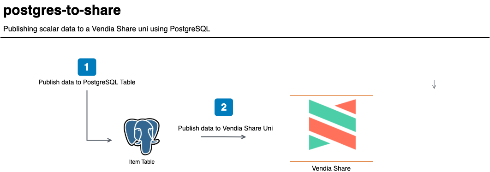

<p align="center">
  <a href="https://vendia.net/">
    
  </a>
</p>

# postgres-to-share

This example will demonstrate how to send scalar data from a [PostgreSQL](https://www.postgresql.org/) database to a [Vendia Share Uni](https://vendia.net/docs/share/dev-and-use-unis).  

Why?  Couldn't we just publish data from an application to a Vendia Share Uni directly?

**Absolutely!**

It is possible to use the GraphQL APIs associated with each node of your Uni.  However, you may already have an application that is publishing data to an existing data store like PostgreSQL.  The purpose of this example is to demonstrate that Vendia Share can complement existing data stores - there is no need to perform a wholesale migration to take advantage of the benefits of Vendia Share.

We will deploy the example using the [Vendia Share Command Line Interface (CLI)](https://vendia.net/docs/share/cli) along with [Oracle VirtualBox](https://www.virtualbox.org/wiki/Downloads), [Hashicorp Vagrant](https://www.vagrantup.com), and [Ansible](https://www.ansible.com/).  Data changes to a PostgreSQL table - inserts, updates, deletes - will be trigger a local [Pl/Python](https://www.postgresql.org/docs/current/plpython.html) function to publish the change to a Uni's node.



For this example, we will use a virtual machine that can be deployed to a local computer.  The same pattern can be applied to a cloud-hosted virtual machine or on-premise server.

**DISCLAIMER:** The following code is to be used for illustrative purposes.  Please consult with your security and operations teams to ensure you are conforming to any standards in place set by your organization.


# Pre-requisites

* [Python3](https://www.python.org/download)

* [Oracle VirtualBox](https://www.virtualbox.org/wiki/Downloads)

* [Hashicorp Vagrant](https://www.vagrantup.com/downloads)

* [Ansible](https://www.ansible.com/)

* [Vendia Share CLI](https://vendia.net/docs/share/cli)


## Installing Python3 Dependencies

```bash
python3 -m venv venv
. ./venv/bin/activate
pip install pip --upgrade
pip install -r requirements.txt
```


## Clone the Repository

In order to use this example, you'll first need to clone the respository.


### Clone with SSH

```bash
git clone git@github.com:vendia/examples.git
```


### Clone with HTTPS

```bash
git clone https://github.com/vendia/examples.git
```


### Change to the postgres-to-share Directory

```bash
cd examples/share/postgres-to-share
```


# Deploying the Example Uni

This example will create a shared inventory, not unlike the Vendia Share [Inventory Management Quickstart](https://www.vendia.net/docs/share/quickstart/inventory-management).  We will not populate our Uni with `initialState` and will, instead, populate our Uni with data from the [populate_dynamo.py](populate_dynamo.py).

If you are not already logged in to the share service you do so by running [`share login`](https://vendia.net/docs/share/cli/commands/login):

```bash
share login
```

The `share uni create` command can be used to deploy our uni.  You will need to copy the file `registration.json.sample` to `registration.json`.  Pick a unique `name` for your uni that begins with `test-` - by default all unis share a common namespace so here is your chance to get creative.  Update the `userId` attribute of each node to reflect your Vendia Share email address.

```bash
cd uni_configuration
share uni create --config registration.json
```

The uni will take approximately 5 minutes to deploy.  We can check on its status in the Vendia Share web application or with the `share` CLI.

**NOTE:** The name of your uni will be different.  Adjust as appropriate.

```bash
share get --uni test-postgres-to-share
```

Make note of the **DistributionCenter** node's graphqlApi `httpsUrl` and `apiKey`.  Our virtual machine will interact with **DistributionCenter** using this information.

Once the Uni is deployed we can deploy our Vagrant virtual machine.


# Deploying the Virtual Machine

Vagrant and Ansible are used to deploy a `hashicorp/bionic64` VirtualBox virtual machine image with a PostgreSQL database.

**NOTE:** You will need to copy the file `postgres-to-share/roles/postgres/vars/main.yml.sample` to `postgres-to-share/roles/postgres/vars/main.yml` update the `share_node_url` and `share_node_api_key` entries in the file `postgres-to-share/roles/postgres/vars/main.yml` before running the commands below.  Failure to do so will prevent data from being published from the PostgreSQL virtual machine to the **DistributionCenter** node in Vendia Share.


```bash
cd .. # If you're not already in the root of the postgres-to-share example
vagrant up postgres
```

In a few minutes, a Vagrant virtual machine named `postgres` will be available.  You can run the following command to confirm it is up and available.

```bash
vagrant status postgres
```

You can connect to the virtual machine using the following command if you'd like:

```bash
vagrant ssh postgres
```

## What Just Happened?

We used Ansible and Vagrant to:

* Create an `ubuntu/focal64` virtual machine

* Create a PostgreSQL database `vagrant`

* Create a PostgreSQL database user `vagrant`

* Create a `item` table in the `vagrant` database

* Add the `plpython3u` database extension

* Create PostgreSQL triggers and functions so that GraphQL queries against your Vendia Share **DistributionCenter** node are run when data is added, updated, or deleted in the `item` table

* Added 3 SQL scripts to make our data changes easy to run

## Viewing Database Information

Once you have SSHd to the `postgres` virtual machine, you can run the following commands to verify what the Ansible playbook did:

```bash
vagrant@postgres-to-share:~$ psql -d vagrant
psql (12.6 (Ubuntu 12.6-0ubuntu0.20.04.1))
Type "help" for help.

vagrant=> \dt
        List of relations
 Schema | Name | Type  |  Owner   
--------+------+-------+----------
 public | item | table | postgres
(1 row)

vagrant=> \d item
                             Table "public.item"
    Column    |            Type             | Collation | Nullable | Default 
--------------+-----------------------------+-----------+----------+---------
 name         | text                        |           |          | 
 sku          | text                        |           | not null | 
 quantity     | integer                     |           |          | 
 last_updated | timestamp without time zone |           |          | 
Indexes:
    "item_pkey" PRIMARY KEY, btree (sku)
Triggers:
    add_to_share AFTER INSERT ON item FOR EACH ROW EXECUTE FUNCTION add_to_share()
    remove_from_share BEFORE DELETE ON item FOR EACH ROW EXECUTE FUNCTION remove_from_share()
    update_in_share BEFORE UPDATE ON item FOR EACH ROW EXECUTE FUNCTION update_in_share()

vagrant=> \q
vagrant@postgres-to-share:~$ 
```


# Testing the Solution

Once the database and Uni are deployed, let's verify there is no data stored in either.

Run the following commands to list all items in the `item` PostgreSQL table:

```bash
vagrant@postgres-to-share:~$ psql -d vagrant
psql (12.6 (Ubuntu 12.6-0ubuntu0.20.04.1))
Type "help" for help.

vagrant=> SELECT * FROM item;
 name | sku | quantity | last_updated 
------+-----+----------+--------------
(0 rows)

vagrant=> \q
vagrant@postgres-to-share:~$ 
```

Execute the following query from the **DistributionCenter** GraphQL Explorer in your Vendia Share Uni.

```graphql
query listItems {
  listInventoryItems {
    InventoryItems {
      id
      name
      sku
      quantity
      lastUpdated
    }
  }
}
```

You should see the following result:

```json
{
  "data": {
    "listInventoryItems": {
      "InventoryItems": []
    }
  }
}
```


## Adding Data

Let's go ahead and publish data to our PostgreSQL `item` table.  We have 3 scripts in the `vagrant` user's home directory `/home/vagrant`.  Run the following command from the `postgres-to-share` host:

```bash
vagrant@postgres-to-share:~$ psql -d vagrant < 01-insert-items.sql 
INSERT 0 1
INSERT 0 1
INSERT 0 1
vagrant@postgres-to-share:~$ 
```

If we connect to the database and run the same `SELECT` query we ran earlier, we should see 3 items have been added.

```bash
vagrant@postgres-to-share:~$ psql -d vagrant
psql (12.6 (Ubuntu 12.6-0ubuntu0.20.04.1))
Type "help" for help.

vagrant=> SELECT * FROM item;
      name      | sku | quantity |        last_updated        
----------------+-----+----------+----------------------------
 Awesome Item 1 | aa1 |      100 | 2021-05-04 13:49:48.025468
 Awesome Item 2 | aa2 |      200 | 2021-05-04 13:49:49.126964
 Awesome Item 3 | aa3 |      300 | 2021-05-04 13:49:49.664787
(3 rows)

vagrant=> \q
vagrant@postgres-to-share:~$ 
```

Let's go ahead and run the same GraphQL query we ran earlier to list inventory items.

```graphql
query listItems {
  listInventoryItems {
    InventoryItems {
      id
      name
      sku
      quantity
      lastUpdated
    }
  }
}
```

This time, we should have data in our Uni as well.  The **name**, **sku**, **quantity**, and **lastUpdated** values should match the data we put into our `item` PostgreSQL table.  The **id** attribute is automatically created by Vendia Share.

```json
{
  "data": {
    "listInventoryItems": {
      "InventoryItems": [
        {
          "id": "017937a4-5f58-44cc-af38-3e4d5e4f8a04",
          "name": "Awesome Item 1",
          "sku": "aa1",
          "quantity": 100,
          "lastUpdated": "2021-05-04T13:49:48Z"
        },
        {
          "id": "017937a4-6233-587b-9e97-0b85393f852c",
          "name": "Awesome Item 2",
          "sku": "aa2",
          "quantity": 200,
          "lastUpdated": "2021-05-04T13:49:49Z"
        },
        {
          "id": "017937a4-6438-d114-9b61-17f5f7eb6839",
          "name": "Awesome Item 3",
          "sku": "aa3",
          "quantity": 300,
          "lastUpdated": "2021-05-04T13:49:49Z"
        }
      ]
    }
  }
}
```

## Updating Data

Let's go ahead and update data in our PostgreSQL `item` table.  Run the following command from the `postgres-to-share` host:

```bash
vagrant@postgres-to-share:~$ psql -d vagrant < 02-update-items.sql
UPDATE 1
UPDATE 1
UPDATE 1
vagrant@postgres-to-share:~$ 
```

If we connect to the database and run the same `SELECT` query we ran earlier, we should see the quantity for each of our items has been multiplied by 10.

```bash
vagrant@postgres-to-share:~$ psql -d vagrant
psql (12.6 (Ubuntu 12.6-0ubuntu0.20.04.1))
Type "help" for help.

vagrant=> SELECT * FROM item;
      name      | sku | quantity |        last_updated        
----------------+-----+----------+----------------------------
 Awesome Item 1 | aa1 |     1000 | 2021-05-04 15:15:52.168557
 Awesome Item 2 | aa2 |     2000 | 2021-05-04 15:15:53.116449
 Awesome Item 3 | aa3 |     3000 | 2021-05-04 15:15:54.777716
(3 rows)

vagrant=> \q
vagrant@postgres-to-share:~$ 
```

Let's go ahead and run the same GraphQL query we ran earlier to list inventory items.

```graphql
query listItems {
  listInventoryItems {
    InventoryItems {
      id
      name
      sku
      quantity
      lastUpdated
    }
  }
}
```

The data update is reflected in our Uni as well.  The **quantity** for each item should match the values in our `item` PostgreSQL table.

```json
{
  "data": {
    "listInventoryItems": {
      "InventoryItems": [
        {
          "id": "017937ee-fa49-411a-cb3f-5c6b1f25c2e1",
          "name": "Awesome Item 1",
          "sku": "aa1",
          "quantity": 1000,
          "lastUpdated": "2021-05-04T15:15:52Z"
        },
        {
          "id": "017937ee-fd61-8f2b-99c2-94feada6e8c5",
          "name": "Awesome Item 2",
          "sku": "aa2",
          "quantity": 2000,
          "lastUpdated": "2021-05-04T15:15:53Z"
        },
        {
          "id": "017937ee-ffd6-58d4-5ca0-15c13e8592c4",
          "name": "Awesome Item 3",
          "sku": "aa3",
          "quantity": 3000,
          "lastUpdated": "2021-05-04T15:15:54Z"
        }
      ]
    }
  }
}
```


## Deleting Data

Let's go ahead and remove one of the records in the PostgreSQL `item` table - in this case, the item with the sku `aa1`.  Run the following command from the `postgres-to-share` host:

```bash
vagrant@postgres-to-share:~$ psql -d vagrant < 03-remove-items.sql 
DELETE 1
vagrant@postgres-to-share:~$
```

If we connect to the database and run the same `SELECT` query we ran earlier, we should see that the item named `Awesome Item 1` has been removed.

```bash
vagrant@postgres-to-share:~$ psql -d vagrant 
psql (12.6 (Ubuntu 12.6-0ubuntu0.20.04.1))
Type "help" for help.

vagrant=> SELECT * FROM item;
      name      | sku | quantity |        last_updated        
----------------+-----+----------+----------------------------
 Awesome Item 2 | aa2 |     2000 | 2021-05-04 14:18:50.116449
 Awesome Item 3 | aa3 |     3000 | 2021-05-04 14:18:50.777716
(2 rows)

vagrant=> \q
vagrant@postgres-to-share:~$ 
```

Let's go ahead and run the same GraphQL query we ran earlier to list inventory items.

```graphql
query listItems {
  listInventoryItems {
    InventoryItems {
      id
      name
      sku
      quantity
      lastUpdated
    }
  }
}
```

The data update is reflected in our Uni as well.  The item with the **name** `Awesome Item 1` should no longer exist in our Uni.

```json
{
  "data": {
    "listInventoryItems": {
      "InventoryItems": [
        {
          "id": "017937a4-6233-587b-9e97-0b85393f852c",
          "name": "Awesome Item 2",
          "sku": "aa2",
          "quantity": 2000,
          "lastUpdated": "2021-05-04 14:18:50.116449"
        },
        {
          "id": "017937a4-6438-d114-9b61-17f5f7eb6839",
          "name": "Awesome Item 3",
          "sku": "aa3",
          "quantity": 3000,
          "lastUpdated": "2021-05-04 14:18:50.777716"
        }
      ]
    }
  }
}
```


# Summary

You can continue to use your existing data stores, like PostgreSQL, without needing to migrate data to take advantage of the ability to share data in a controlled manner with multiple parties.


# Cleaning Up the Solution

Run the `cleanup.sh` script to remove all artifacts related to the solution, including the Vendia Share uni.

```bash
# Replace with proper values
./cleanup.sh test-dynamo-to-share \
--profile your_aws_iam_profile --region region_you_deployed_to
```

# References

* [plpython Github Project](https://github.com/postgres/postgres/tree/master/src/pl/plpython)
