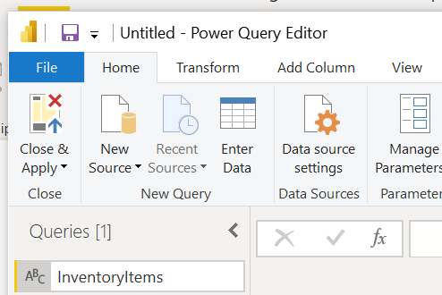
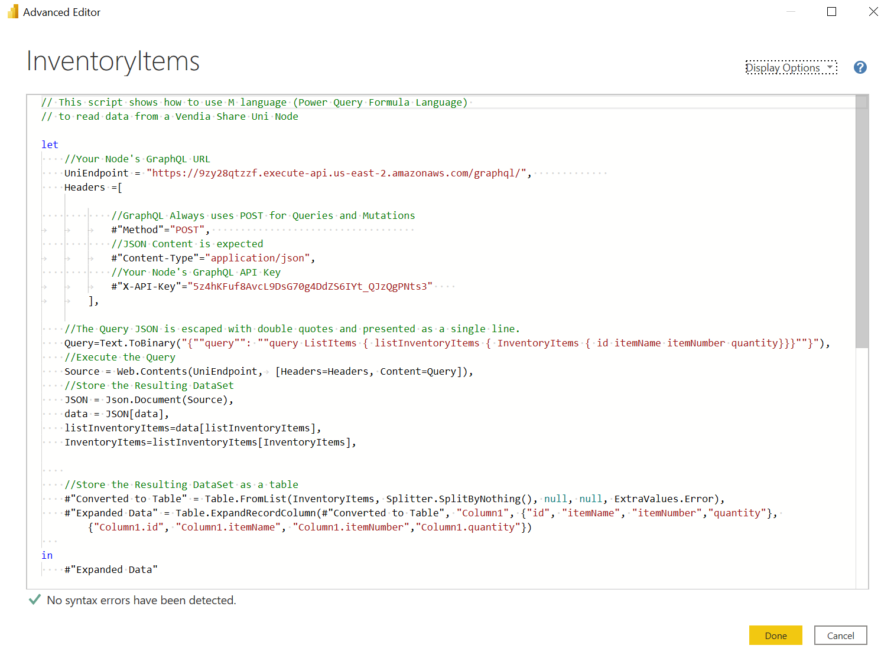
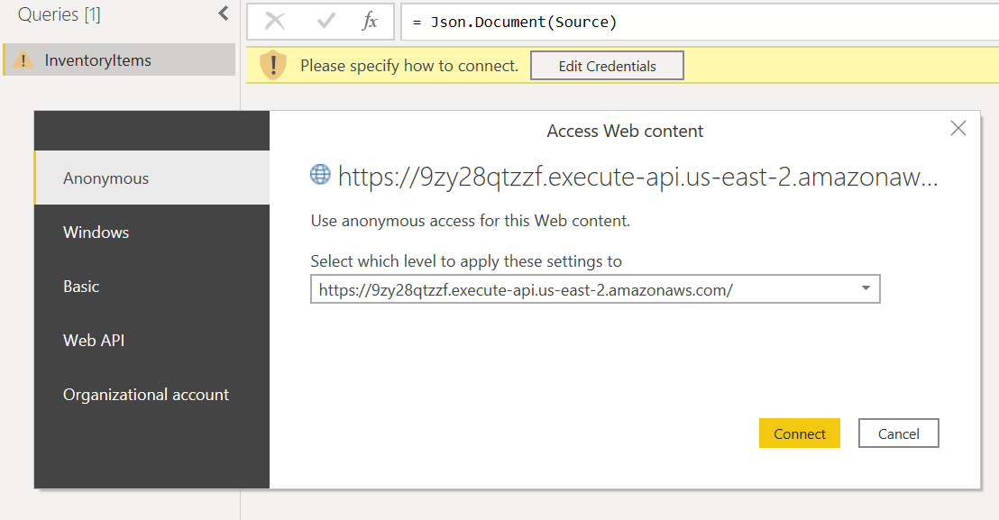
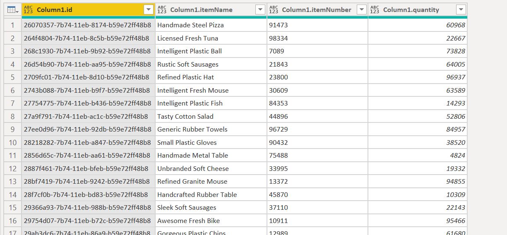

  

# Reading from a Uni with Microsoft Power BI
Vendia Share makes sharing data easy and provides a platform upon which applications can be built using a zero-code GraphQL API.  The power and flexibility of an API based on your data model is amazing, but what if you haven't used graphql before? What if you don't have access to software developers to build atop of the API? Fortunately there are a number of data visualization and reporting applications that work very well with Uni data. This example demonstrate how to use Microsoft Power BI with a Vendia Share Uni to create reports and visualizations of data read from the Uni's GraphQL API.

## How It Works
Data visualization and reporting tools leverage common interfaces, like APIs, to retrieve data. These applications often provide mechanisms to transform data and familiar reporting controls like charts and tables.  In this example, Power BI is connected to a Uni using  M language (Power Query Formula Language) to query the Uni's GraphQL API.  Additional M language functions then transform the JSON data returned by the API into a data table.  Once in table form, Power BI tools can be used to create tables, charts, and more for visualizing and sharing Uni data with the Power BI Platform.

## Pre-requisites

**Exiting Uni**
This example assumes that you already have a functioning Uni with data.  Please refer to our [Quick Start Documentation](https://vendia.net/docs/share/quickstart) to learn how to quickly create a Uni. If you would like to follow along using queries from this example, you may create a uni with the matching [Example Schema](example_schema.json).  

**Important** Once your Uni is Running, add some data using the addInventoryItem_async mutation. Otherwise, there will be no data to visualize in later steps.

**Microsoft Power BI**
This example requires [Microsoft Power BI](https://powerbi.microsoft.com/en-us/). The example demonstrates the use of the desktop version of the software but is compatible with the web-application as well.

## Getting Started

### Step 1 - Obtain the GraphQL Connection Attributes
To connect Power BI to the Uni Node, you must obtain the ***GraphQL URL*** and ***GraphQL API Key*** values of a Node in your Uni. You can access these values by visiting the [Uni Dashboard](https://share.vendia.net/)

### Step 2 - Create a Power BI Query
Power BI does not have a native GraphQL connector. As such, you must create a [Blank Query](https://docs.microsoft.com/en-us/power-bi/transform-model/desktop-query-overview).  You can do so by clicking the ***Get data*** toolbar icon from the Home toolbar menu as shown

With the Power Query Editor window open, you can rename the query by right-clicking on it in the queries toolbar (left) and selecting rename. For the purposes of this example, the first query will be named InventoryItems as shown

Switch to the [Advanced Editor View](https://docs.microsoft.com/en-us/power-bi/transform-model/desktop-query-overview#advanced-editor) by clicking the View menu and selecting the Advanced Editor toolbar button.

Replace the query text using the [example_inventory_item_query Example](example_inventory_item_query.pqfl) as a template. This template defines a query for InventoryItems that are defined in the [Example Schama](example_schema.json) as shown

If prompted by a message indicating "Please Specify How To Connect" press the Edit Credentials button and choose Anonymous (which should be the default setting). Anonymous authentication is used as the x-api-key header in the script carries the identification for the request.

If the request worked successfully, a data table should be displayed

To complete the query setup save the Query and the Workbook

### Step 3 - Add a control

With the query saved, you can start visualizing the data. Try adding a Table control from the Visualizations Panel. Populate it by selecting it and clicking the "Value" property of InventoryItems in the Fields Panel as shown

### Step 4 - Transforms

Sometimes data returned from List operations is not formatted such that it can be visualized for all controls. Transforms allow for manipulation of the data after it is retrieved. Add a new transform by clicking the Data Transformation toolbar item from the Home menu.

Click the "Count Rows" transformation in the query editor to easily transform the list of Inventory Items into an aggregate Count of rows.

Save the query and re-visit the table.

Update the table by selecting the new aggregate field and clicking the "fix this" button on the table.

## Conclusions

Congrats! At this point, you have created a Uni with data, queried it using the GraphQL API, and then interpreted the results in Power BI. Next, try exploring other visualizations and extending the example with new data from the Orders data also present in the schema.

