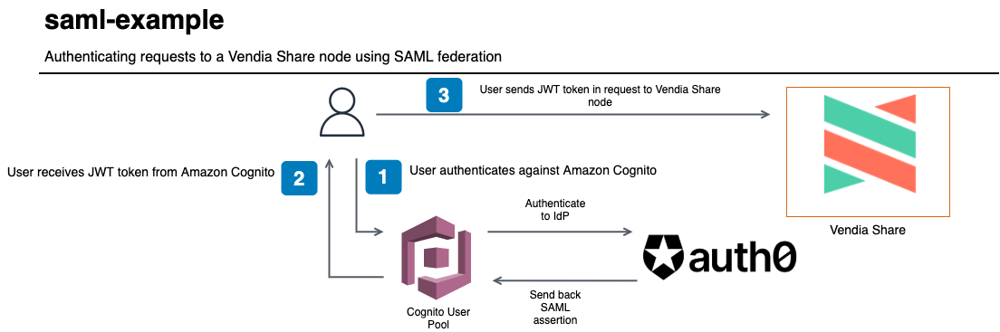

<p align="center">
  <a href="https://vendia.net/">
    
  </a>
</p>

# saml-example

This example will demonstrate how to authenticate requests to a [Vendia Share Uni](https://vendia.net/docs/share/dev-and-use-unis) using a SAML identity provider (IdP). The point is to illustrate that partners to a Uni can take advantage of existing IT investments like [Okta](https://www.okta.com/), [Ping Identity](https://www.pingidentity.com/), or [Active Directory Federation Services](https://docs.microsoft.com/en-us/windows-server/identity/active-directory-federation-services) without needing to upset existing practices.

[Auth0](https://www.auth0.com) will function as our SAML IdP in this example. We will demonstrate how Amazon Cognito can be configured to federate SAML and issue JWT tokens that are used to authenticate requests to Vendia Share.



# Pre-requisites

* [Vendia Share CLI](https://vendia.net/docs/share/cli)

* Administrative permissions to an AWS account

## Clone the Repository

In order to use this example, you'll first need to clone the respository.

### Clone with SSH

```bash
git clone git@github.com:vendia/examples.git
```

### Clone with HTTPS

```bash
git clone https://github.com/vendia/examples.git
```

### Change to the saml-example Directory

```bash
cd examples/share/saml-example
```

Now that we've cloned the repository, [let's set up Auth0 as a SAML identity provider with an Amazon Cognito user pool](create-cup.md).


# Creating a 

This example will create a Uni to store a very simple product catalog.

If not already logged in to the share service do so by running [`share login`](https://vendia.net/docs/share/cli/commands/login):

```bash
share login
```

The `share uni create` command can be used to deploy our Uni.  You will need to copy the file `registration.json.sample` to `registration.json`.  Pick a unique `name` for your uni that begins with `test-` - by default all Unis share a common namespace so here is your chance to get creative.  Update the `userId` attribute of each node to reflect your Vendia Share email address.

```bash
cd uni_configuration
share uni create --config registration.json
```

The Uni will take approximately 5 minutes to deploy.  We can check on its status in the Vendia Share web application or with the `share` CLI.

**NOTE:** The name of your Uni will be different.  Adjust as appropriate.

```bash
share get --uni test-saml-example
```

Make note of the **DistributionCenter** node's graphqlApi `httpsUrl` and `apiKey`. We will use this information to issue queries against our Uni.

# Working with Data in Our Uni

## Reading Data From Our DistributionCenter Node

The default serverless application deploys a [AWS EventBridge](https://aws.amazon.com/eventbridge/) bus with a rule to trigger a Lambda function when a new order is added from a fictitious source application, consignee.orderapp.

## Writing Data To Our DistributionCenter Node


# Cleaning Up the Solution

Run the `cleanup.sh` script to remove all artifacts related to the solution, including the Vendia Share Uni.

```bash
# Replace with proper values
./cleanup.sh test-eventbridge-to-share \
--profile your_aws_iam_profile --region region_you_deployed_to
```
