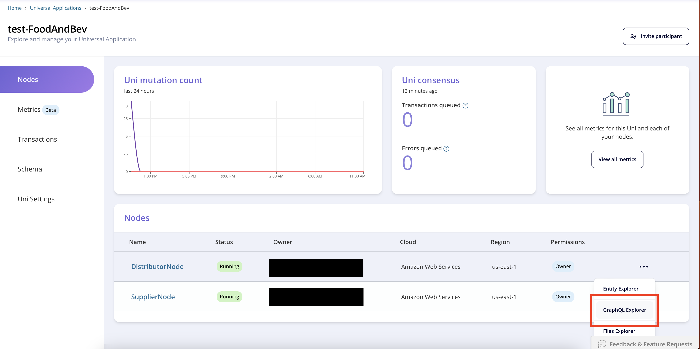

# Milestone 2 - GraphQL In Vendia Share
The GraphQL API alluded to in previous milestones makes web and mobile app development on top of Vendia Share extremely simple.  Your second milestone in this workshop is to use the [Vendia Share web application](https://share.vendia.net) to build up the Supplier's product inventory.


#### GraphQL Explorer
The GraphQL Explorer can be used to interact with a node.  It can serve as a helpful tool if you're new to GraphQL and want to experiment with forming queries, mutations, and subscriptions as you develop an application powered by Vendia Share.

Here are a few examples to help you get started.  Feel free to build your own queries but please refrain from updating the data for now (i.e. no mutations just yet).

Open the `GraphQL Explorer` of the **SupplierNode**. To do this from the Share UI, select the meatball button on the right in the row pertaining to the node you want to access. An image is included below.



Once the GraphQL Explorer is open for the Supplier Node, remove any existing content from the middle pane.  Copy and paste the query below and then execute the query.

```
query listProducts {
  list_ProductItems {
    _ProductItems {
      _id
      _owner
      category
      description
      name
      price
      sku
      supplier
      promotionalContent
    }
  }
}
```

You will see all available products, which were returned by the GraphQL interface of the **SupplierNode**.

_________________________________
## Using Entity Explorer
The Entity Explorer view of the Vendia Share web application is one of several views we'll use in this section of the workshop.  It is used to directly manage the data stored in Vendia Share.

### Add a Product
The Uni created in Milestone 1 included some initial products.  Let's add another using the Entity Explorer.

* Open the `Entity Explorer` of the **SupplierNode**
* Select `Product` in the left navigation pane
  * The products displayed should be identical to those you saw in Milestone 1 using the GraphQL Explorer and should also be identical to the data you reviewed in `initial-state.json`
* Select `+ Create Product` in the upper right corner of the product listing
* Create a new product by completing this form
  * **sku** - Enter `00007` to maintain our previous product sku sequence
    * In a real-world situation, the sku values would likely come from another source and be referenced by the product
  * **name** - Enter `Apple Juice`, or something clever
  * **description** - Enter `100% Juice`, or something clever
  * **price** - Enter `0.99`, or another numeric value
  * **supplier** - Enter `Essential Everyday` for consistency with other products
  * **category** - Select `conventional`
    * The drop-down provided is thanks to the `enum` we defined in our `schema.json` file
* Click `Save`
  * You'll see a status message indicating the product was successfully saved

**Note:** While we're using the Vendia Share web app in this section, we could just as easily have used a custom web application.  Building a new web application is quick and easy thanks to Vendia Share's auto-generated API Gateway, GraphQL API, and storage layer.

### Update a Product
One of the benefits of Vendia Share's decentralized ledger capability is the ability to see history for an item, in this case a product, over time.  Share not only allows updates to a product, but it provides a complete history of _all_ updates to a product for its lifetime.

* From the `Entity Explorer` view of the **SupplierNode**
* Select the `Sheep's Milk Feta` product by clicking on its `_id` value
* Click the `Edit` button to view the product's current values
* Modify the price to another value (let's say there's been a run on feta and the price just spiked)
* Click `Save` to confirm the price adjustment
* Wait for the confirmation that the update has been applied
* Now click on `View history` for the item
* You'll see the `Sheep's Milk Feta` history includes two versions - the original and our just-updated version
  * There's a much richer set of data available through the Share GraphQL API, which allows you to see the blocks and transactions of the ledger.  The Entity Explorer interface exposes just a small subset of what's available.

### Review Purchase Orders and Deliveries
From the `Enity Explorer` you can also click on the `PurchaseOrder` and `Delivery` items in the left pane. 

## Key Takeaways
Congratulations.  You've successfully reached Milestone 2!

In this section you:

* Used the Entity Explorer to add a product and update a product
* Viewed complete product history for an updated product 

Next up, [Milestone 3](README-Milestone3.md), where we'll cover GraphQL Queries and Mutations.
