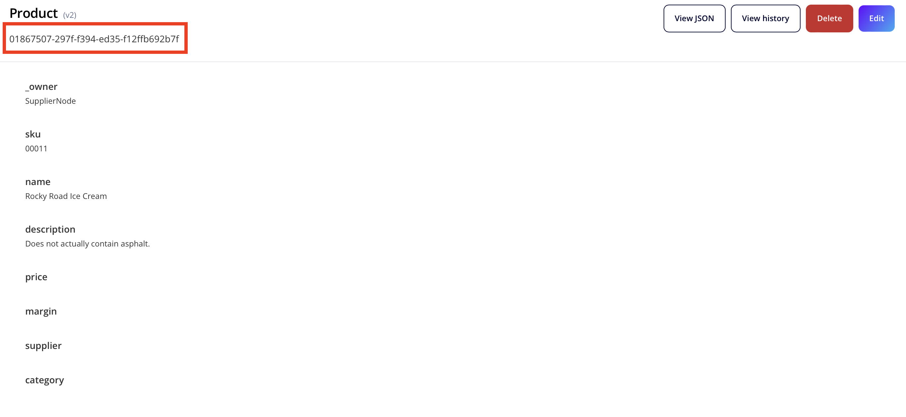

# Milestone 3 - Queries and Mutations
Over the course of the previous milestone, we took a look at a high level at Vendia's GraphQL explorer and ran some basic, sample queries to show you how to read and write data. In this section, we'll be taking a deeper look at both Queries and Mutations, and what the full capability of both are.

## GraphQL Queries

Queries in GraphQL are used to fetch data, similar to a GET request from a REST API. However, Queries go one step further in that you can set conditions and fetch specific fields, similar to a database query language. 

### __Filters__

By allowing a caller to dictate the fields to be returned, along with optional filters and limits, you're able to get to exactly the data you want.  This can be especially helpful as you create a new web or mobile application powered by Vendia Share, as you can tailor the data retrieved to exactly match the data needed for a component or view.

Here's a query with filters that only returns the `name`, `description`, and `price` of all Products supplied by `Wild Harvest`. In order to execute this query, navigate to the GraphQL explorer inside of the Supplier node and copy the text below.

```
query listProducts {
  #Fun fact - queries can have comments as well!
  list_ProductItems(filter: {supplier: {eq: "Wild Harvest"}}) {
    _ProductItems {
      ... on Self_Product {
      	name
        description
      	price
      }
    }
  }
}
```

### __Variables__

This query is useful, but it's hard-coded. Static queries can be limiting in the field, where often we need to run queries using dynamic values provided to us. GraphQL supports these cases as well. If we want to write a generic version of the query above, with a variable describing our supplier, we would do it the following way:

```
query listVariableProducts($supplier: String) {
  #Here, our supplier is a variable we set.
  list_ProductItems(filter: {supplier: {eq: $supplier}}) {
    _ProductItems {
      ... on Self_Product {
      	name
        description
      	price
      }
    }
  }
}
```

You'll notice an error, saying the variable isn't declared anywhere. At the bottom of the screen, click the `Variables` button, and add the following:

```

{
  supplier: "Wild Harvest"
}

```

Run the query and notice that it's the same results as our earlier one, but this time we've made it modular.


### __Limits__

One of the main benefits of GraphQL is that you can offload processing of data to the query itself, instead of post-processing the data. Lets use our previous query as an example, including only the top result. 

Inside the GraphQL Explorer, lets run the following query. Note how we only get one result back, as we set the limit to only return one Product.

```
query listFirstVariableProduct($supplier: String) {
  #Here, our supplier is a variable we set.
  list_ProductItems(filter: {supplier: {eq: $supplier}}, limit:1) {
    _ProductItems {
      ... on Self_Product {
      	name
        description
      	price
      }
    }
  }
}
```

If it was just limited to querying, GraphQL would already be a powerful tool that would save organizations both time and money. However, GraphQL offers just as much granularity when it comes to keeping data up to date. 

## GraphQL Mutations

In this section, we'll be adding data via mutations and modifying it, exploring how we can manipulate data in Vendia. We will be remaining in the Supplier Node, and adding new Products to it. 

### __Adding Data__

Open a new query in the SupplierNode GraphQL Explorer, and run the following. 

```
mutation AddIceCream {
  add_Product(input: {
    name: "Rocky Road Ice Cream"
    description: "Does not actually contain asphalt."
    sku: "00011"
  }) {
    result {
      ... on Self_Product {
        name
        description
        sku
      }
    }
  }
}
```

Here, we add some Rocky Road Ice Cream to the list of Products. The `result` portion of the mutation returns what we added, as a way to validate that the mutation was executed properly.

### __Modifying Data__

Lets use the Entity Explorer to see the status of the Rocky Road ice cream inside of the Node. Pay attention to the unique ID which is contained in the red rectangle in the image below, we'll need it for later. __This is a unique ID for every instance of an entity - remember to copy your unique one!__



We see that we have the Rocky Road Ice Cream accounted for and present, but that we're missing a few fields. Important to note that unless the data schema you're using notes something as a mandatory field, you're able to partially fill in data.

Let's fix our data integrity and fill in the rest of the fields with another query. Navigate back to the GraphQL Explorer for the Supplier Node, and try the following query. __Remember to set your id to your unique UUID!__

```
mutation ModifyIceCream {
  update_Product(id: [YOUR ID GOES HERE], input: {
    price: 10
    margin: 2
    supplier: "DPW Foods"
    category: specialty
  }) {
    result {
    	... on Self_Product {
        sku
        name
        description
        price
        margin
        supplier
        category
    	}
    }
  }
}
```

Here, we added information for the `price`, `marign`, `supplier`, and `category` fields. Our result query returns every field for the product, so we know that our query executed properly. 

We can also modify the information that already exists for a given object. Run the following query, and compare it with our previous result:

```
mutation ModifyIceCream {
  update_Product(id: [YOUR ID GOES HERE], input: {
    price: 12
  }) {
    result {
    	... on Self_Product {
        sku
        name
        description
        price
        margin
        supplier
        category
    	}
    }
  }
}
```

Notice how now the price has been updated to 12.

## Pagination

The final topic we are going to cover today is Pagination. So far in these milestones, we've been executing queries while limiting our results in order to be able to parse our results object-by-object. 

All **list_*** functions, defined at the time of Uni deployment (based on your schema), can return a `nextToken`. They also can *take* a `nextToken`. If your query has to pull a large number of objects, the `nextToken` returned will define the spot where the next run of the same query will pick up (if it is applied to the query). If all results can be returned in the initial query, then `nextToken` will be set to null.

Let's take a look at this in practice- rerun this query from earlier:

```
query listProducts {
  list_ProductItems {
    _ProductItems {
      _id
      _owner
      category
      description
      name
      price
      sku
      supplier
      promotionalContent
    }
  }
}
```

Notice that we get a list of our Products returned back at us. This is an easy list to manage when we have <10 Products, but running a query like this in a production environment can quickly turn into a headache when we have to parse through all our results. This is where Pagination comes in.

Lets run a modified version of the above query. In this modified query, we added a `limit` to help keep our results more manageable. We also both take and return a `nextToken`. 

For this first query execution, leave the `nextToken` field blank.

'''
query listProducts {
  list_ProductItems(limit: 2, nextToken: "") {
    _ProductItems {
      _id
      _owner
      category
      description
      name
      price
      sku
      supplier
      promotionalContent
    }
    nextToken
  }
}
'''

Notice that we have our `nextToken` returned. Copy that value, then rerun the query, substituting in the value at the top of the query where it is currently an empty string, and re-run it.

Notice that we have the next two Products!


### __Takeaways__

GraphQL is a powerful tool that can be leveraged to streamline the process of data ingress of egress with Vendia. In this section, we:

* Covered the basics of GraphQL queries, outlining how we can fetch data. 
* Discussed how variables can be used in GraphQL queries to help programmatically utilize them
* Explored GraphQL mutations, including adding and modifying data. 
* Understood how to page through our response, improving our ability to parse large datasets.

If you want to dive deeper beyond what we covered here today, we recommend checking out the official [GraphQL docs](https://graphql.org/learn/).


With this milestone reached, you've completed the basics of GraphQL with Vendia. In the next sections, we'll tackle some more advanced, Vendia-specific features as well as some examples of more robust queries and mutations. 

When you're ready, you can move on to [Milestone 4](README-Milestone4.md).
