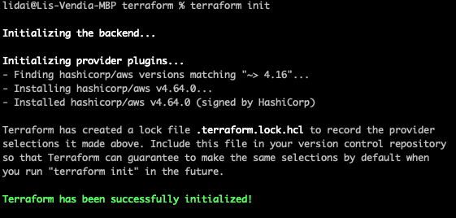
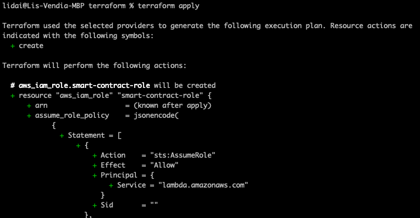
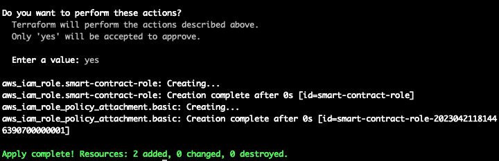

# Milestone 10 - Manage Role with Terraform

## Goal
We will use a provided terraform script to create a iam role on our AWS account.

## Initial Terraform Code
```
terraform {
  required_providers {
    aws = {
      source  = "hashicorp/aws"
      version = "~> 4.16"
    }
  }

  required_version = ">= 1.2.0"
}

provider "aws" {
  region  = "us-east-1"
}

resource "aws_iam_role" "smart-contract-role" {
  name = "smart-contract-role"

  assume_role_policy = jsonencode({
    "Version": "2012-10-17",
    "Statement": [
      {
        "Action": "sts:AssumeRole",
        "Principal": {
          "Service": "lambda.amazonaws.com"
        },
        "Effect": "Allow",
        "Sid": ""
      }
    ]
  })
}

resource "aws_iam_role_policy_attachment" "basic" {
  policy_arn = "arn:aws:iam::aws:policy/service-role/AWSLambdaBasicExecutionRole"
  role       = aws_iam_role.smart-contract-role.name
}
```

Examine the above code, we are using aws provider to create resources through terraform. 

The 2 `resource` section are to create the necessary roles for our lambda functions. You can see it has the basic role policy we had with our previous default lambda roles and the basic lambda execution role that allows cloud watch logging.

Paste the code in a file called `main.tf` and place it in a folder of your choice to follow along with our exercise.

On your commandline, `cd` to the folder where your `main.tf` file is, then do `terraform init` to start initial state.



Then do `terraform apply` and you'll get a prompt asking for input, enter `yes` to start resource creation.





Once you get the message above, your roles are created in your AWS environment. Now go to your AWS account to confirm it's existence. Note that our sample role name is `smart-contract-role`.

## Do it on your own
Go to your AWS IAM console and search a role called `smart-contract-role`. Ensure the attributes of it matches to what we defined in our code.

## Key Takeaways

* Roles and policies can be created through terraform
* You must do `terraform init` in a folder with your terraform code to start the process
* `terraform apply` will apply your code or change to your environment

Next up, [Milestone 11](README-Milestone11.md).