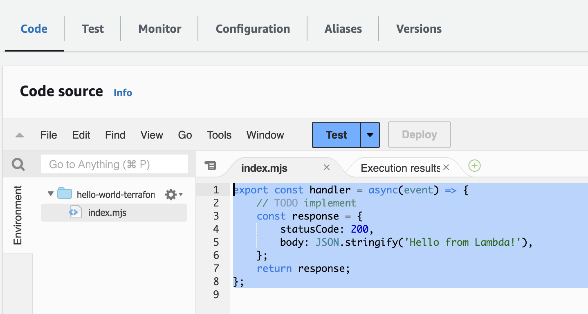
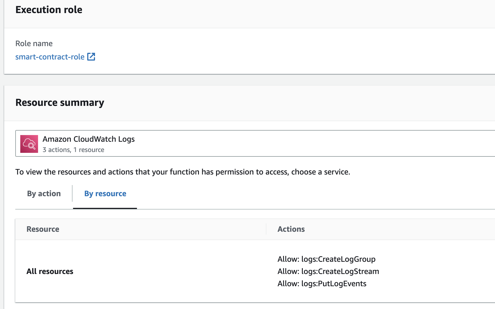

# Milestone 11 - Manage Lambda Function with Terraform

## Goal
We will create a lambda function and attach it with the roles and policies we created in the last milestone.

## Additional Codes For Lambda creation
Here's the terraform code to create lambda function with what we had before:

```
resource "aws_lambda_function" "hello-world-terraform" {
  # (resource arguments)
  filename      = "./index.mjs.zip"
  function_name = "hello-world-terraform"
  handler       = "index.handler"
  role          = aws_iam_role.smart-contract-role.arn
  publish       = true

  source_code_hash = filebase64sha256("./index.mjs.zip")

  runtime = "nodejs18.x"

  # Leaving environment section for potential future use
  environment {
    variables = {
      foo = "bar"
    }
  }

}
```

Node that the role specified are connected to what we had before.  You must also provide a zip js file with the name `index.mjs.zip` inside the same folder.

Here's the hello world code:
```
export const handler = async(event) => {
    // TODO implement
    const response = {
        statusCode: 200,
        body: JSON.stringify('Hello from Lambda!'),
    };
    return response;
};
```

Create an empty file named index.mjs and paste the above code into it. Then create a zip file with it and put it in the same folder as your `main.tf` file.

Once you have everything ready, do `terraform apply` again. If you didn't change your previous resources, you should see 1 additional resource to be added.

## Do it on your own
Once you get a `Apply complete!` prompt, go to your AWS console and ensure everything is correctly deployed.

Check the content of your lambda:


and the role your lambda function has:


If everything matches, our deployment was successful.

Take a look at official [terraform documentation](https://registry.terraform.io/providers/hashicorp/aws/latest/docs/resources/lambda_function) on creating lambda as it provides much more info.

## Key Takeaways

* We can deploy lambda functions and attach the roles we created before using terraform

Next up, [Milestone 12](README-Milestone12.md).