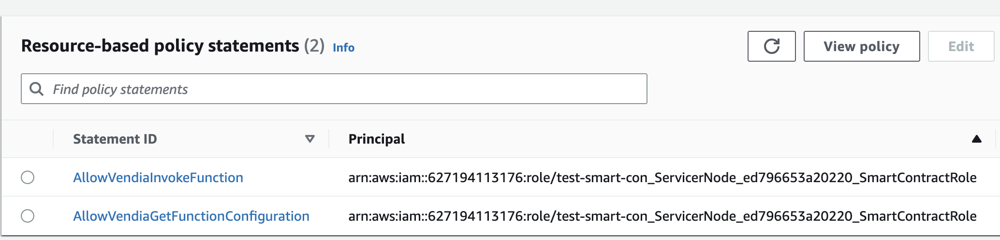

# Milestone 12 - Manage Lambda Permission with Terraform

## Goal
We will continue to build on top of our previous code. For this milestone, we will add necessary permissions to our lambda function

## Additional Codes For Permission Creation
Adding below code snippet to our existing terraform code to add permissions to our lambda function. So we have the proper access to create smart contract.

```
resource "aws_lambda_permission" "allow_vendia_smart_contract_invoke" {
  statement_id  = "AllowVendiaInvokeFunction"
  action        = "lambda:InvokeFunction"
  function_name = aws_lambda_function.hello-world-terraform.function_name
  principal     = "<place-holder-for-vendia-smart-contract-role>"
  qualifier     = aws_lambda_function.hello-world-terraform.version
}

resource "aws_lambda_permission" "allow_vendia_smart_contract_get_config" {
  statement_id  = "AllowVendiaGetFunctionConfiguration"
  action        = "lambda:GetFunctionConfiguration"
  function_name = aws_lambda_function.hello-world-terraform.function_name
  principal     = "<place-holder-for-vendia-smart-contract-role>"
  qualifier     = aws_lambda_function.hello-world-terraform.version
}
```

Note the placeholder above needs to be found on your Vendia node. It's under node resources tab of your Vendia UI or you can use Vendia CLI to find the role arn. A sample looks like this: `arn:aws:iam::XXXXXXXX:role/test-smart-con_ServicerNode_edXXXXXXXX_SmartContractRole`

Once you put the code snippet in there and replaced the placeholder, go ahead and do `terraform apply` again and update your resources.

## Do it on your own
Go to your lambda console and check the lastest version has the access we put in. It should look something like this:



## Key Takeaways

* Lambda permission can be added by terraform
* The smart contract role is found under your Vendia node resource page

Next up, [Milestone 13](README-Milestone13.md).