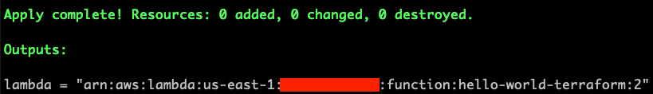

# Milestone 13 - Retrieve Lambda ARN with Terraform

## Goal
In this milestone, we will modify our terraform script to get the ARN we need to create smart contract on Vendia Share.

## Output Variables in Terraform
Terraform has the ability to return our resource ARNs when they are created. One thing we haven't used is the `output` key word in our script. We can now create a new file called `output.tf` in the save folder as `main.tf` and paste below code snippet in it:

```
output "lambda" {
  value = aws_lambda_function.hello-world-terraform.qualified_arn
}
```
The code snipper basically declares a `ouput` called `lambda` and has the value `aws_lambda_function.hello-world-terraform.qualified_arn` in it. Note the value is related to our lambda function resource in our `main.tf`. The last `qualified_arn` is an attribute provided by `aws_lambda_function`. If you need other attributes, you can find them [here](https://registry.terraform.io/providers/hashicorp/aws/latest/docs/data-sources/lambda_function#qualified_arn).

Lastly, do `terraform apply` again in the same folder and input yes for the update. Once it's completed, you'll see that no additional resources are added. But a new output now becomes available. 



If you don't remember the ARN or lost track of it in the future, simply do `terraform output` and it will provide us all the outputs defined by us.

## Do it on your own
Now we have everything we need to create a share smart contract. Let's do it. If you don't remember how to create share smart contract, refer to [milestone 5](README-Milestone5.md).

## Key Takeaways

* Terraform can provide outputs based on our configuration
* Do `terraform output` if we lost previous output
