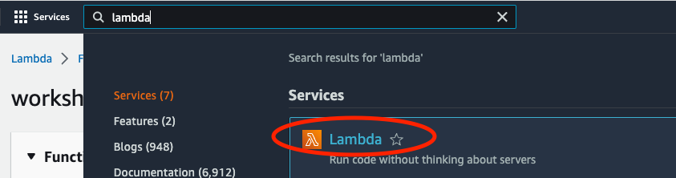
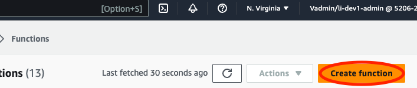
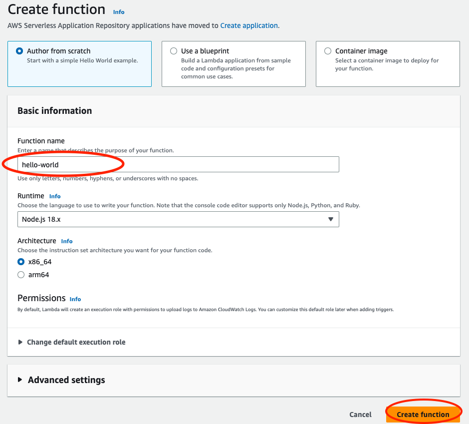
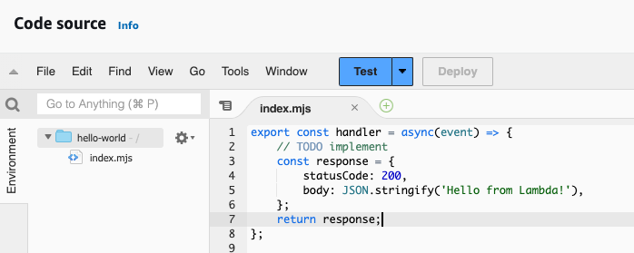
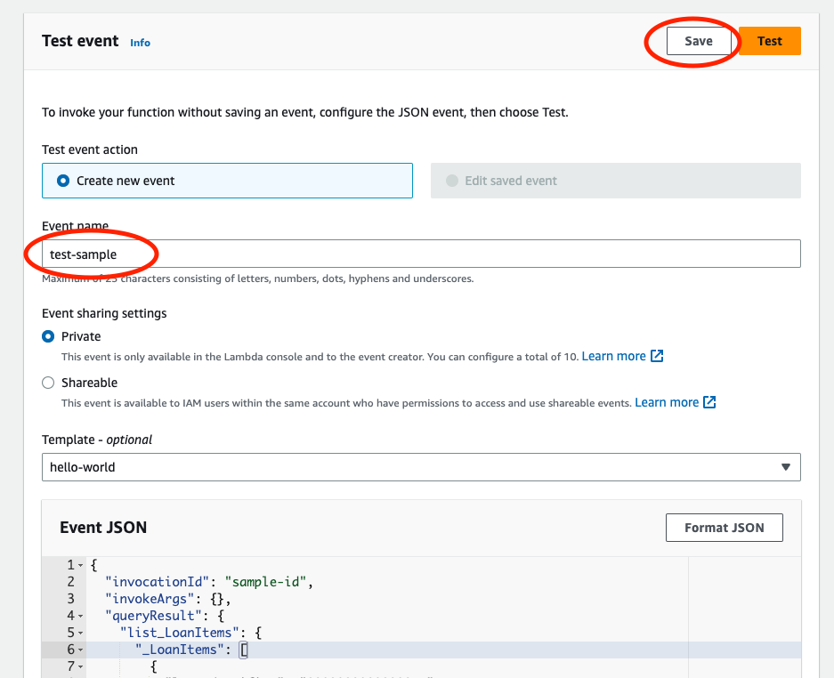

# Milestone 3 - Create an hello world Lambda Function

## Goal
In this milestone, we will create a hello world AWS lambda function through UI. And then modify it to our needs.

## Creating a hello world function
AWS lambda function is where we run our business logic in code. Whether it's going to be enrichment, computation, or validation of our data, we need lambda function to do those work for us. But now, let's create a simple hello world function through AWS UI following these steps:

1. Search `lambda` and click on Lambda


2. Click on `Create function` at top right of the page


3. Enter any name you'd like. In our case, we chose `hello-world`. Leave the rest fields as it is. Then click on `Create function` at bottom right.


4. Once it's created, you can see that the function has some hello world code in it. It simply return a dummy response.


This function currently has no value as a smart contract. But it can still be used if we were to use the hardcoded input query and output mutation. That is because we know this hello world program won't fail and thus it will run our smart contract correctly.

## Event & Response
So, say if we want to use the queries and mutations with variables, what do we have to consider?

Let's examine the default code snippet and see the 2 pieces that connects with our input query and output mutation: `event` and `response`.

When we invoke a smart contract, the data we get from input query will be returned to our lambda function inside this `event` variable. Anything we would like to do with the data in there must be accessed here. And our return `response` is what's being passed over to output mutation in our smart contract. Note that the things it's currently returning is meaningless to our smart contract. But if we want to make it useful for our mutation with variable, we should return something like this:

```
    return {
        input1: loan1,
        input2: loan2
    }
```

and where loan1 and loan2 will be defined as something similar to:

```
const loan1 = {
  loanIdentifier: "0000000000000011",
  portfolioIdentifier: "AAAA2222",
  loanToValuePercent: 72,
  unpaidPrincipalBalance: 352108,
  interestRatePercent: 5.2,
  originationDate: "2021-04-11",
  borrowerCreditScore: 760,
  numberOfUnits: 2,
  delinquencyStatus: "CURRENT",
  validationStatus: "PENDING"
}
```

## Setting up testing cases for your lambda
Testing is crucial part of any development. So it's important that we have testing events that mimic what's being sent from our input query. You can also gather  this information with logger and cloud watch so you can see what's coming from upper stream. For convenience, here's sample event passed by input query to aws lambda:

```
{
  "invocationId": "sample-id",
  "invokeArgs": {},
  "queryResult": {
    "list_LoanItems": {
      "_LoanItems": [
        {
          "loanIdentifier": "0000000000000011",
          "portfolioIdentifier": "AAAA2222",
          "loanToValuePercent": 72,
          "unpaidPrincipalBalance": 352108,
          "interestRatePercent": 5.2,
          "originationDate": "2021-04-11",
          "borrowerCreditScore": 760,
          "numberOfUnits": 2,
          "delinquencyStatus": "CURRENT",
          "validationStatus": "PENDING"
        }
      ]
    }
  }
}
```

For inputs like above, you might have to loop through the array to get things you need.

On AWS lambda, go to `test` tab and paste the above event as your testing Event JSON. Then save it for future testing purposes. Name it however you want.


Note that if you test your lambda function with this event JSON, it'll be successful. But since it's never used, it really has no value.

## Do it on your own
If you followed along, you should now have a hello world lambda function and event JSON for testing. 

## Key Takeaways
* how to create a lambda function through UI
* proper return format
* proper event format for testing
* setting up lambda test case

Next up, [Milestone 4](README-Milestone4.md).