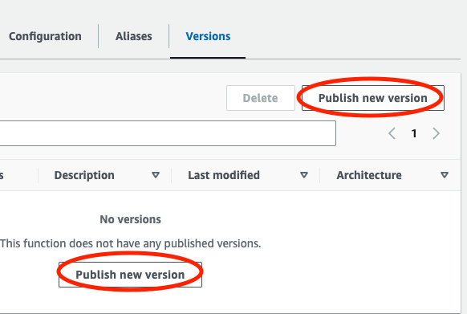
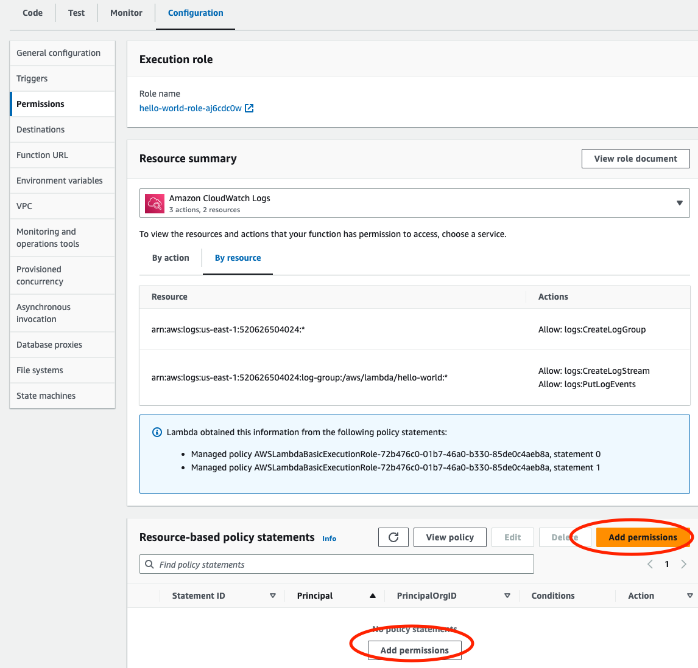
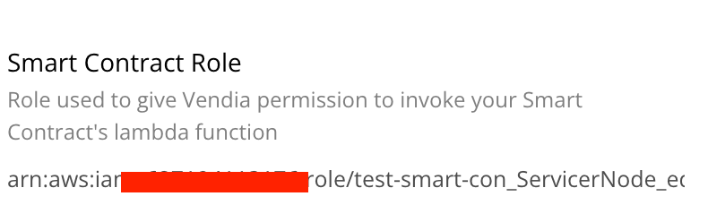
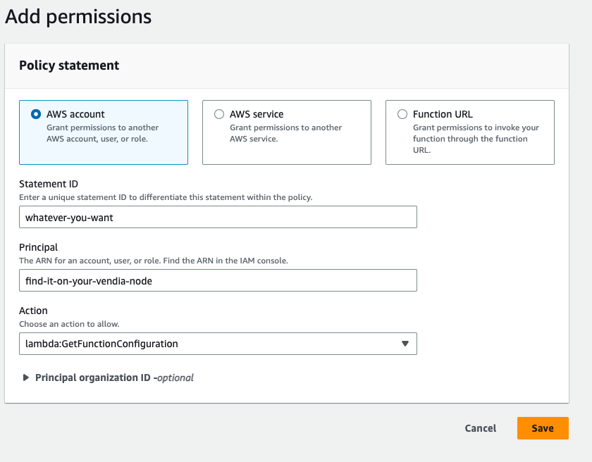
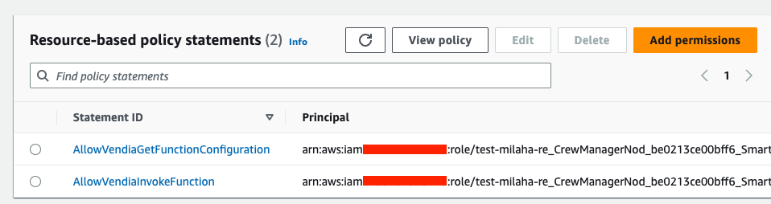

# Milestone 4 - Adding Permission to Lambda Function

## Goal
We will publish our lambda function and add necessary permissions to it so it can be properly invoked by Vendia Smart Contract.

## Publish Lambda Function
Previously we had a working lambda function with a simple test case available. But it's not ready for Smart Contract creation because it's not yet published. Vendia Smart Contract requires a version id of a lambda function.

Luckily, it's super easy to do. Simply go to `Version` tab of your lambda function, click on `Publish new version`. There are 2 of them, you can click on either one.

Once published, you will see your new version under `Versions` tab. This is important because Vendia Smart Contract requires version for your function ARN. A sample function ARN looks like this: `arn:aws:lambda:us-east-1:XXXXXXXXX:function:hello-world:1`. The last number, in this case 1 is needed for smart contract creation.

## Add Necessary Permissions to Lambda Function
One more thing we need for a proper vendia smart contract creation is to allow Vendia Share to invoke your lambda function and see it's configurations. Therefore, there are 2 permissions we need:

* lambda:GetFunctionConfiguration
* lambda:InvokeFunction

So, let's go to your lambda functions `configuration` tab and `permissions` sub tab to add necessary permissions. Click on `Add permissions` as the image below:

You will then have to enter `statement ID`, `Principal`, and `Action`. For `statement ID`, you can enter anything you want, but they must be unique in your lambda function. `Principal` is what you will find under resource tab in the node where you want to create your smart contract. It looks like this:

And finally you will choose one of the actions mentioned above. So it will look something like this:

Note that you have to do this twice because you need both permissions to create smart contract.

After you are done, your permission would look something like this:

## Do it on your own
If you followed along, you should now have a published lambda function with 2 permissions attached to it.

## Key Takeaways
* Vendia Smart Contract requires you to publish your smart contract
* Your lambda function must have both `lambda:GetFunctionConfiguration` and `lambda:InvokeFunction` permissions for Vendia to create a smart contract with it.

Next up, [Milestone 5](README-Milestone5.md).