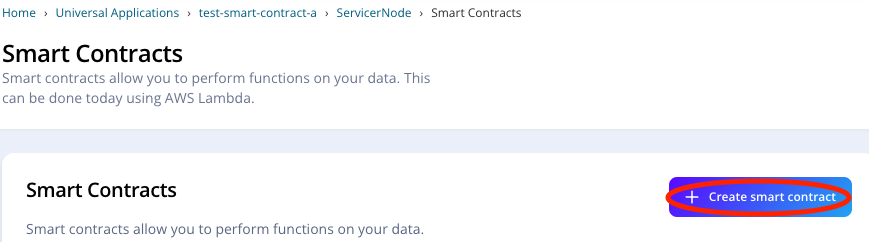
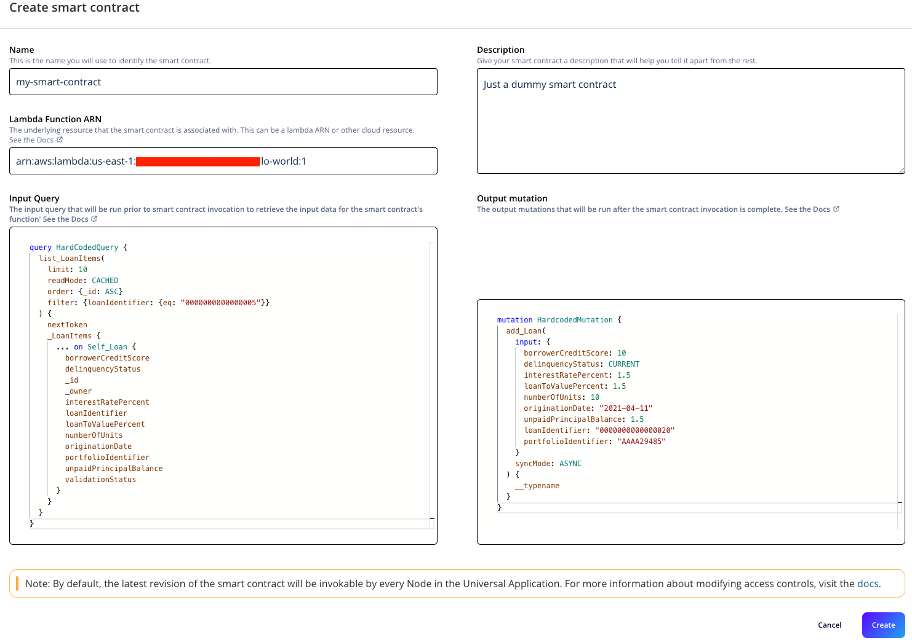
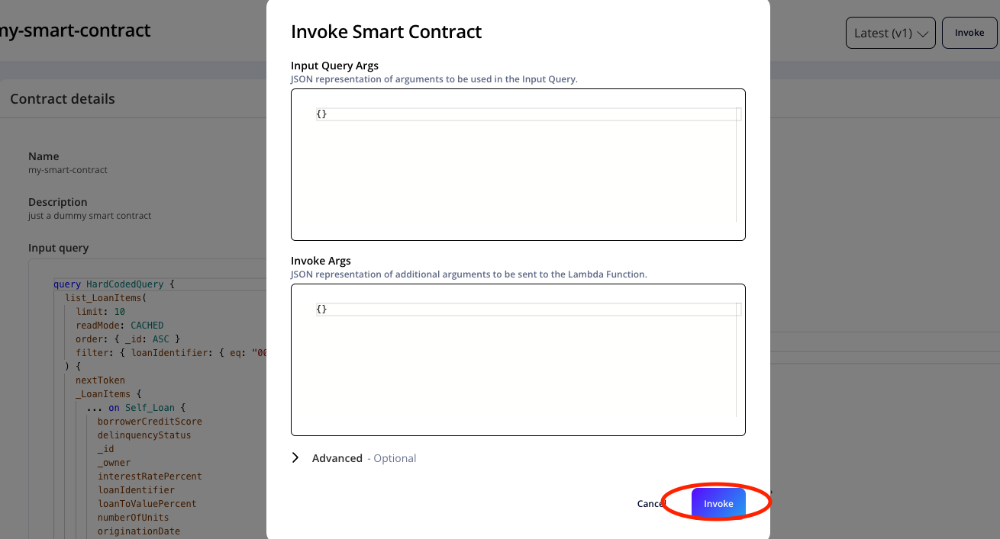
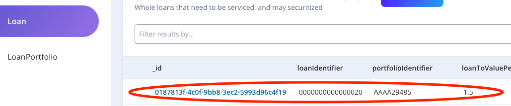
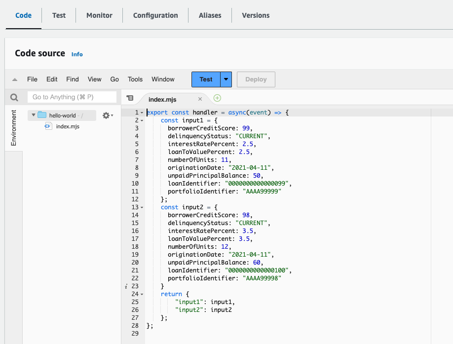
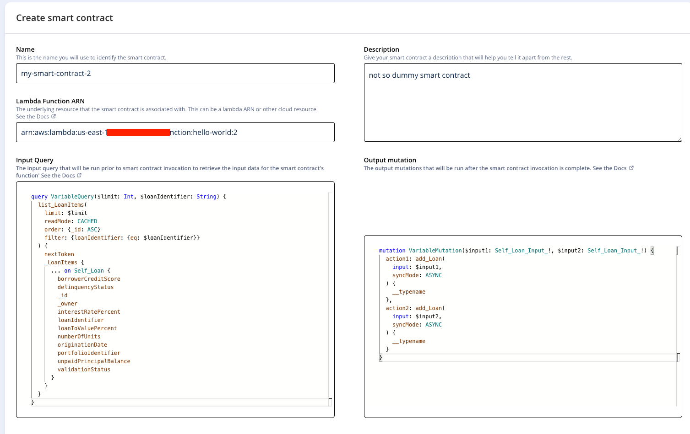
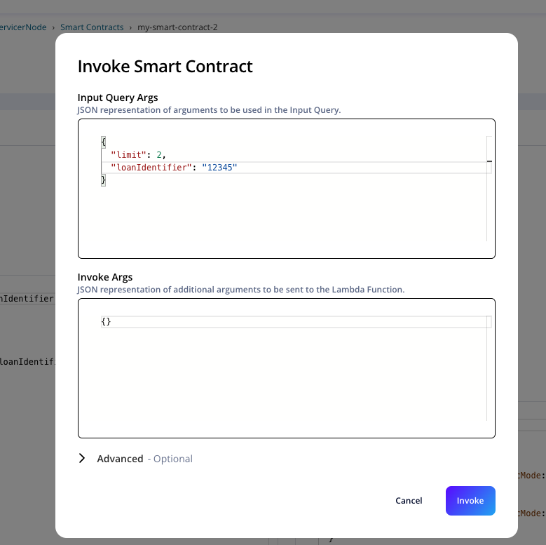
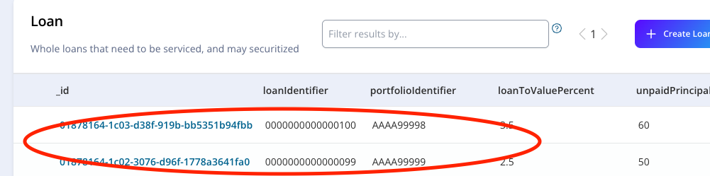

# Milestone 5 - Create Smart Contraction on Vendia

## Goal
Finally, we have everything we needed to create our smart contract on Vendia Share. So in this milestone, we will use everything we created previously to create working smart contracts.

## Create a dummy smart contract
For milestones 1 & 2, we have both hardcoded and flexible queries and mutations. To create a dummy smart contract, we will reuse what we made there and use the hello world function we deployed in last milestone. Note that although the response from our function is not a proper graphql argument JSON, it does not affect our result as our hardcoded mutation does not require variables.

Have below info ready:
* The hardcoded input query
* The hardcoded output mutation
* Your Lambda Function ARN

Go to your servicer node's smart contract page and click on `+ Create Smart Contract`. The page looks like this:


Fill in all the information required and click on create.


You now have a smart contract. Go ahead and try to invoke it through UI by click on invoke once the creation is completed.



Since our mutation is hardcoded, regardless of what has been returned from the input query and lambda function, a Loan wit the hardcoded information are now created in our ledger.

Find the record generated by your smart contract in Entity Explorer.



That's it. Congrats on creating your first Vendia Smart contract!

## Create a more powerful smart contract
Obviously, the dummy smart contract we created above doesn't really have much real world value. So now let's create a smart contract using the query and mutation with variables. For this section, we will use the queries in milestone 1 & 2 solutions file. (The solution to your exercise section).

On top of that, we have to make minor adjustments to our lambda function because the object we return does not match the input requirement for our output mutation. In this case we must return a JSON argument that has `input1` and `input2`  in it.

Below is a sample lambda code that creates 2 variables `input1` and `input2`. It then returns a JSON containing them both which is the proper way to pass Graphql variables.
```
export const handler = async(event) => {
    const input1 = {
      borrowerCreditScore: 99,
      delinquencyStatus: "CURRENT",
      interestRatePercent: 2.5,
      loanToValuePercent: 2.5,
      numberOfUnits: 11,
      originationDate: "2021-04-11",
      unpaidPrincipalBalance: 50,
      loanIdentifier: "0000000000000099",
      portfolioIdentifier: "AAAA99999"
    };
    const input2 = {
      borrowerCreditScore: 98,
      delinquencyStatus: "CURRENT",
      interestRatePercent: 3.5,
      loanToValuePercent: 3.5,
      numberOfUnits: 12,
      originationDate: "2021-04-11",
      unpaidPrincipalBalance: 60,
      loanIdentifier: "0000000000000100",
      portfolioIdentifier: "AAAA99998"
    }
    return {
        "input1": input1,
        "input2": input2
    };
};
```

Go ahead and paste them into your AWS lambda source code window.



Then go to `Versions` tab and publish your new lambda function.

Once published, you have to go to the version and again, add the permissions like we did in milestone 4. Note that each version has different permissions so you must do it again.

Finally, we can go to smart contract page again to create our flexible smart contract:



Wait until the creation is completed, then let's invoke our smart contract.



This time you will see Vendia automatically generate some fields for you because we have variables in our input query.

Lastly, let's confirm our smart contract by checking the 2 Loans we created.



Once you see them there, our whole flow is completed.

## Things to consider
If you followed along the steps, you too should have 2 working smart contracts. Couple questions to test the reader's understanding:

* What does our input query do? and how are we using the data we got from it?
* If I want my loans to have values based on my input, what changes do I have to make?
* What if I invoke my smart contract with different argument values?

## Key Takeaways
* smart contract is as useful as we make them to be
* we must return proper objecst that matches what's in output mutation
* if we don't use the values from input queries, it becomes pointless
* we need to set permissions for each new lambda function versions published

So far, all our samples are for learning purposes and has little to none real world value. Now that we have completed all the basics of creating a smart contract, starting next milestone we will talk about the 3 categories of real world use cases of Vendia Smart Contracts.

Next up, [Milestone 6a](README-Milestone6a.md).